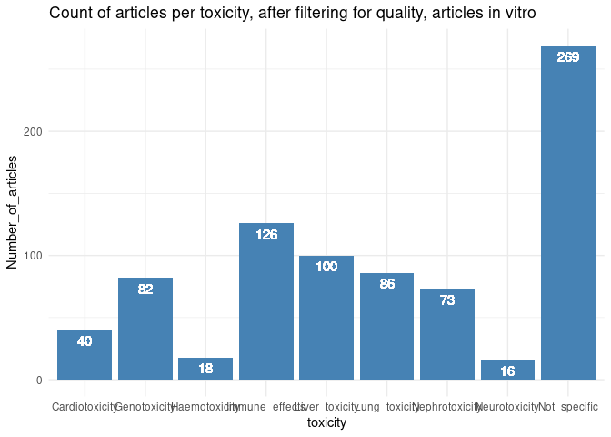
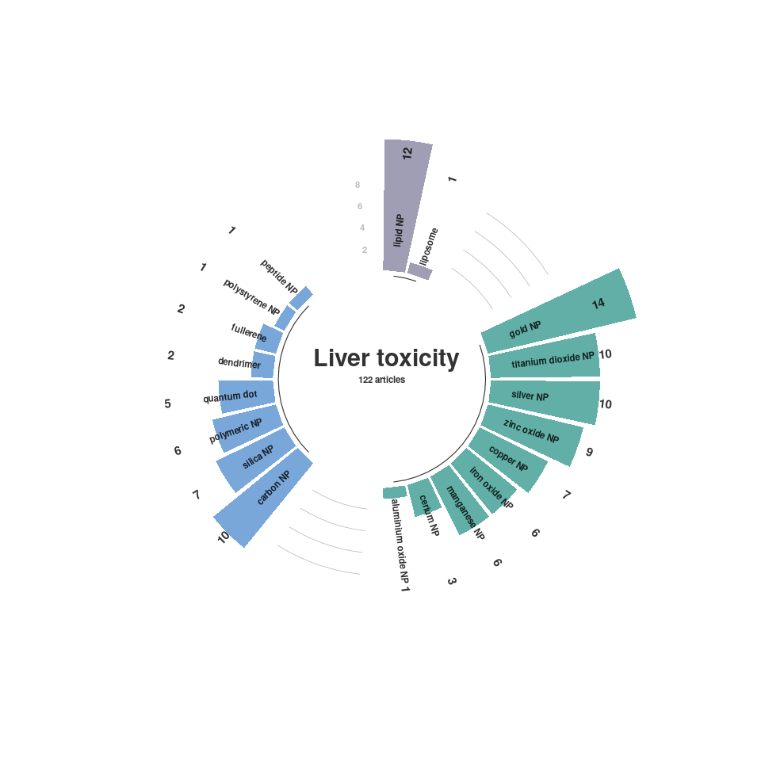
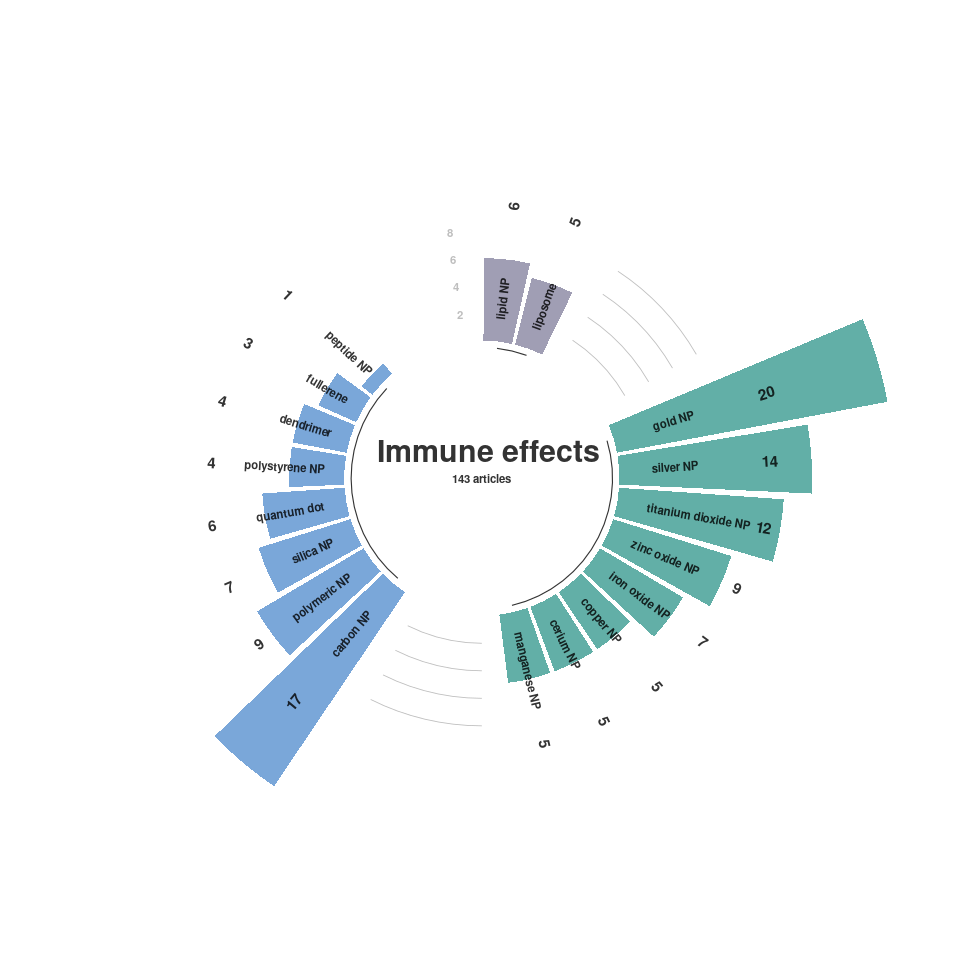
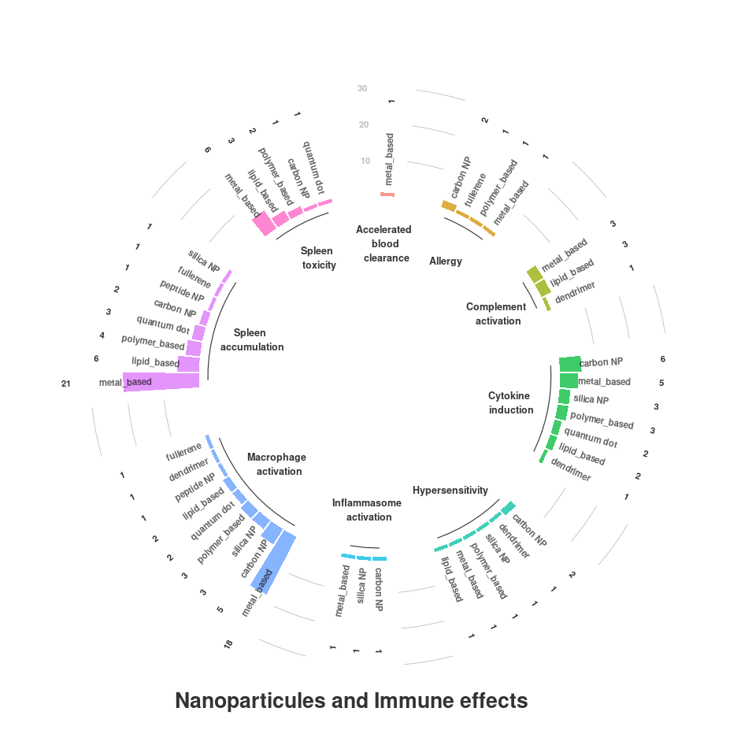
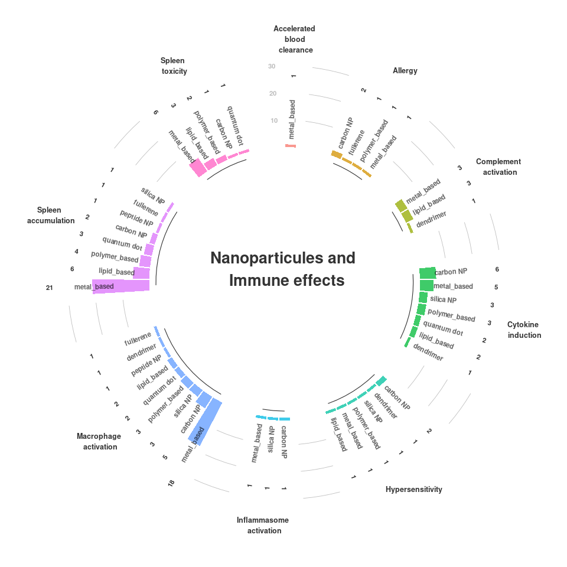
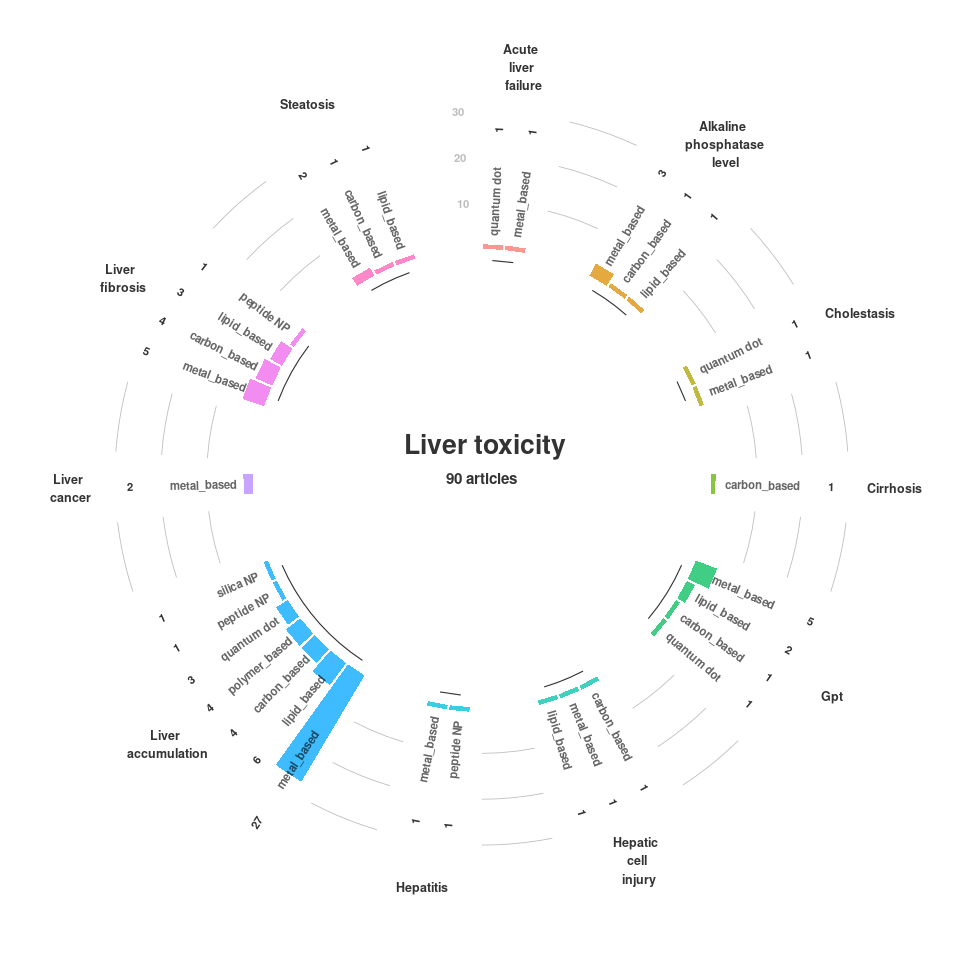
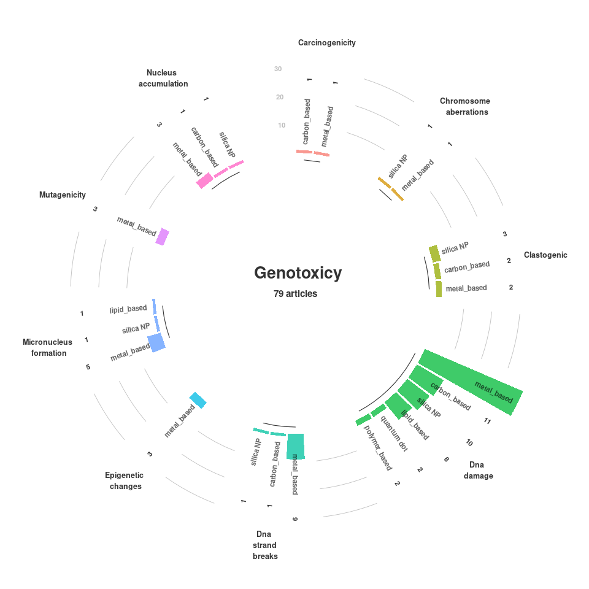
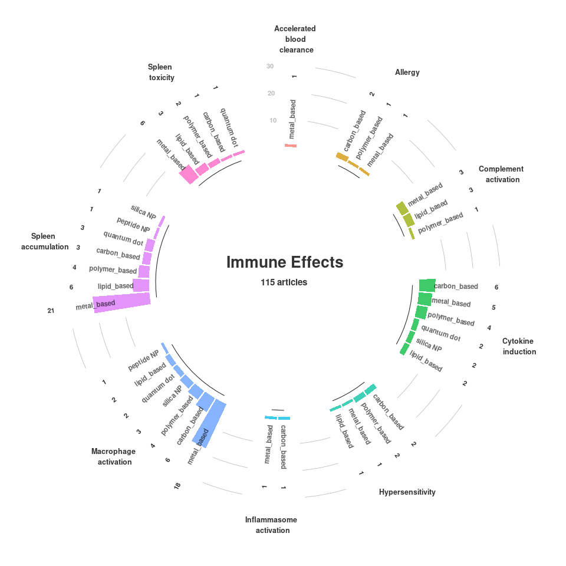
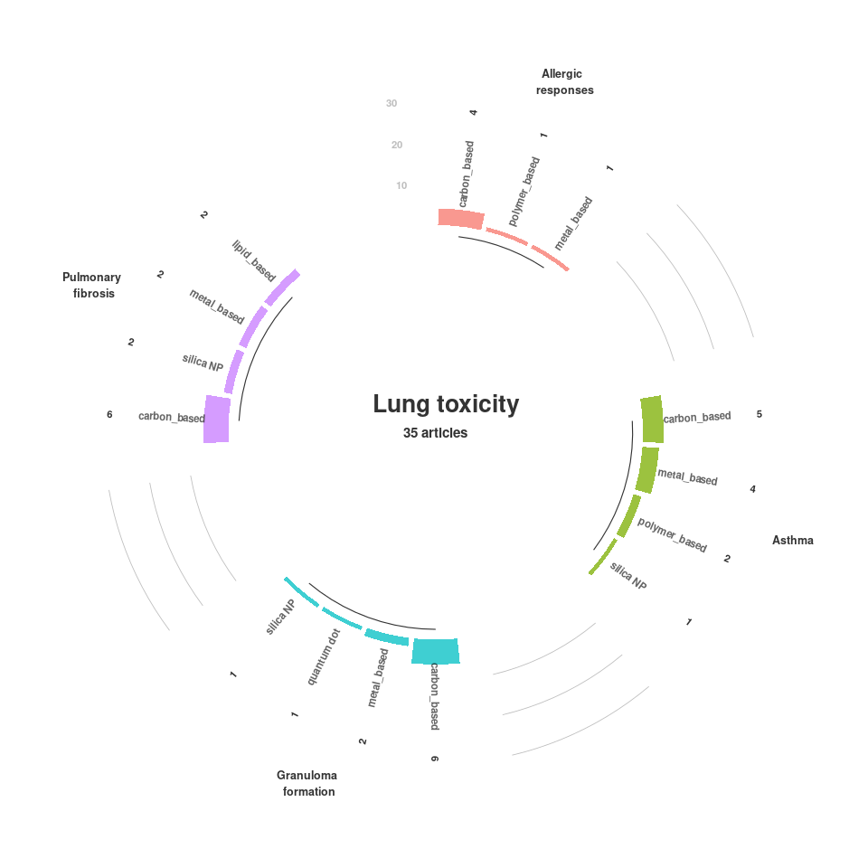
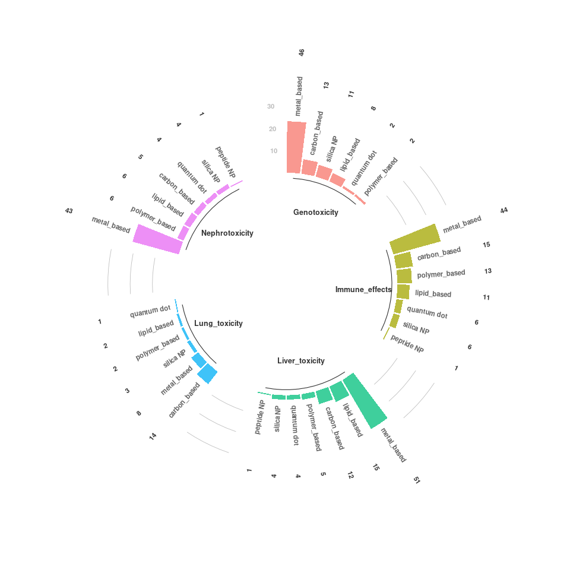

Results\_mining
================
Etienne Rolland
11/02/2020

# Ranking of the material and method section

``` r
create_quality_df <- function(material_characterisation) {
  #this function create the dataframe quality_evaluation that store the informations
  #of the quality evalution assessment
  
  #nb_technical_aspect<-length(material_characterisation)
  technical_aspect<-names(material_characterisation)
  names_columns<-c("Article_name", technical_aspect)
  names_columns<-c("Folder_name", technical_aspect)

  
  quality_evaluation_df<-as.data.frame(matrix(ncol=length(names_columns), 
                                              byrow=TRUE))
  
  colnames(quality_evaluation_df)<-names_columns
  
  return(quality_evaluation_df)
}

init_quality_df <- function(quality_evaluation_df, pdf_name, folder_name) {
  #create empty dataframe is such a pain in R
  #initiate the quality_df dataframe, i.e., add zero everywhere and the pdf name,
  #for the first iteration of the loop
  quality_evaluation_df[["Article_name"]]<-pdf_name
  quality_evaluation_df[["Folder_name"]]<-folder_name
  quality_evaluation_df[is.na(quality_evaluation_df)] = 0
  
  return(quality_evaluation_df)
}

is_double_space <- function(word) {
  res<-str_split(word, "\\s")[[1]]
  if (length(res)==3) {
    return(TRUE)
  }
  return(FALSE)
}

is_space <- function(word) {
  res<-str_split(word, "\\s")[[1]]
  if (length(res)==2) {
    return(TRUE)
  }
  return(FALSE)
}

is_not_space <- function(word) {
  res<-str_split(word, "\\s")[[1]]
  if (length(res)==1) {
    return(TRUE)
  }
  return(FALSE)
}

cut_word <- function(word) {
  res<-str_split(word, "\\s")[[1]]
  return(res)
}

attribute_ranking_split_word <- function(x, i, quality_evaluation_df, technical_aspect, word) {
  res<-cut_word(word)
  first_word<-res[1]
  second_word<-res[2]
  idx<-which(x$lemma==first_word) #firstword
  
  if (length(idx)>0) { #if the word is present as lemma
    for (id in idx) {   #if several times the word, simply
      if (x[(id+1),]$lemma==second_word) {
        quality_evaluation_df[i,][[technical_aspect]]<-1
      }
    }
  }
  
  return(quality_evaluation_df)
}

attribute_ranking <- function(x, i, quality_evaluation_df, technical_aspect, word) {
  idx<-which(x$lemma==word)
  if (length(idx)>0) { #if the word is present as lemma
    for (id in idx){
      sentence<-x[id,]$sentence
    }
    quality_evaluation_df[i,][[technical_aspect]]<-1
    # if (word=="size") {
    #   print(x[idx,]$sentence)
    # }
  }
  return(quality_evaluation_df)
}

quality_assessment <- function(x, i, pdf_name, quality_evaluation_df, ontology_material_characterisation, folder_name) {
  if (first_iteration(i)) {
    quality_evaluation_df<-init_quality_df(quality_evaluation_df, pdf_name, folder_name)
  } else {
    quality_evaluation_df<-rbind(quality_evaluation_df, c(0))
    quality_evaluation_df[i,]$Article_name<-pdf_name
    quality_evaluation_df[i,]$Folder_name<-folder_name
  }
  for (technical_aspect in names(ontology_material_characterisation)) { #Size, surface area, etc
    for (word in ontology_material_characterisation[[technical_aspect]]) { #Diameter
      if (is_space(word)) {
        quality_evaluation_df<-attribute_ranking_split_word(x, i, quality_evaluation_df, technical_aspect, word)
      }
      else {
        quality_evaluation_df<-attribute_ranking(x, i, quality_evaluation_df, technical_aspect, word)
      }
    }
  }
  
  return(quality_evaluation_df)
}

first_iteration <- function(i) {
  if (i==1) {
    return(TRUE)
  }
  return(FALSE)
}

biological_condition <- function(x, i, quality_evaluation_df, condition, word) {
  idx<-which(x$lemma==word | x$token==word) #firstword
  if (length(idx)>0) { #if the word is present as lemma
    quality_evaluation_df[i,][[condition]]<-"Yes"
    # if (word=="size") {
    #   print(x[idx,]$sentence)
    # }
  }
  return(quality_evaluation_df)
}

biological_condition_split_word <- function(x, i, quality_evaluation_df, condition, word) {
  res<-cut_word(word)
  first_word<-res[1]
  second_word<-res[2]
  idx<-which(x$lemma==first_word | x$token==first_word) #firstword
  
  if (length(idx)>0) { #if the word is present as lemma
    for (id in idx) {   #if several times the word in the article
      if (x[(id+1),]$lemma==second_word | x[(id+1),]$token==second_word) {
        quality_evaluation_df[i,][[condition]]<-"Yes"
      }
    }
  }
  
  return(quality_evaluation_df)
}

biological_condition_double_space_word <- function(x, i, quality_evaluation_df, condition, word) {
  res<-cut_word(word)
  first_word<-res[1]
  second_word<-res[2]
  third_word<-res[3]
  idx<-which(x$lemma==first_word | x$token==first_word) #firstword
  
  if (length(idx)>0) { #if the word is present as lemma
    for (id in idx) {   #if several times the word in the article
      if (x[(id+1),]$lemma==second_word | x[(id+1),]$token==second_word) {
        if (x[(id+2),]$lemma==third_word | x[(id+2),]$token==third_word) {
          quality_evaluation_df[i,][[condition]]<-"Yes"
        }
      }
    }
  }
  
  return(quality_evaluation_df)
}

biological_condition_assessment <- function(x, i, pdf_name, quality_evaluation_df, ontology_in_vitro_in_vivo) {
  if (first_iteration(i)) {
    quality_evaluation_df$In_vitro<-"No"
    quality_evaluation_df$In_vivo<-"No"
  } else {
    quality_evaluation_df[i,]$In_vitro<-"No"
    quality_evaluation_df[i,]$In_vivo<-"No"
  }
  
  for (condition in names(ontology_in_vitro_in_vivo)) { 
    for (word in ontology_in_vitro_in_vivo[[condition]]) { 
      if (is_double_space(word)){
        quality_evaluation_df<-biological_condition_double_space_word(x, i, quality_evaluation_df, condition, word)
      }
      else if (is_space(word)) {
        quality_evaluation_df<-biological_condition_split_word(x, i, quality_evaluation_df, condition, word)
      }
      else if (is_not_space(word)){
        quality_evaluation_df<-biological_condition(x, i, quality_evaluation_df, condition, word)
      }
    }
  }
  
  return(quality_evaluation_df)
}
```

``` r
run_assesment <- function(rds_list, ontology_material_characterisation, ontology_in_vitro_in_vivo) {
  i<-0
  quality_evaluation_df<-create_quality_df(ontology_material_characterisation)
  for (rds in rds_list) {
    i<-i+1
    x<-readRDS(file = paste0("~/Dev_pdf_poppler_output/", rds))
    pdf_name<-strsplit(rds, "/")[[1]][3]
    folder_name<-strsplit(rds, "/")[[1]][1]
    pdf_name<-str_replace_all(pdf_name, ".rds", "")
    quality_evaluation_df<-quality_assessment(x, i, pdf_name, quality_evaluation_df, ontology_material_characterisation, folder_name)
    quality_evaluation_df<-biological_condition_assessment(x, i, pdf_name, quality_evaluation_df, ontology_in_vitro_in_vivo) 
    if (first_iteration(i)) {
      quality_evaluation_df$Size_mm_section<-0 #size material and methods
    }
    quality_evaluation_df[i,]$Size_mm_section<-length(unique(x$sentence))
    }
  #compute the score
  quality_evaluation_df$Ranking<-rowSums(quality_evaluation_df[, names(ontology_material_characterisation)])
  return(quality_evaluation_df)
}
```

Below are the ontologies of terms used to rank the articles for the
differents categories.

``` r
#ontology of terms
ontology_material_characterisation <- list( Size = c("diameter", "size", "dimension", "radius", "nm"), 
                                   Surface_area = c("surface area"), 
                                   Surface_charge = c("zeta potential", "surface charge", "mv"),
                                   Chemical_composition = c("chemical composition", "coating", "core",
                                                            "shell", "content", "configuration", 
                                                            "molecular ratio"),
                                   # Concentration = c("final concentration", "dilution", "diluted", "mM"),
                                   Aggregation = c("aggregation", "aggregate", "polydisperse", "monodisperse",
                                                   "stability", "agglomeration", "stable", "agglomerate") #,
                                   # Wavelenght = c("wavelenght", "excitation wavelenght", "excitation", "emission",
                                   #                "emission wavelenght")
                                   )


ontology_in_vitro_in_vivo <- list( In_vitro = c("incubation temperature", "incubator", "incubated", "viability",
                                                "cells/ml", "cells/mL",  "cells/well", "cells per well", 
                                                "cultured", "culture", "medium", "media", "penicillin", "% of CO",
                                                "streptomycin", "well plates", "well plate", "cell line", "cells"), 
                                   
                                  In_vivo = c("age", "year old", "month old", "year-old", "month-old", 
                                              "cage", "holding rooms", "housed", "facility", "diet", "ad libitum",
                                              "dark cycle", "light cycle", "euthanized", "acclimate",
                                              "acclimatized", "body weight", "administration route", 
                                              "dose in mg/kg"))
```

``` r
rds_list<-list.files(path="~/Dev_pdf_poppler_output/", pattern = "\\.rds$", recursive=TRUE)

quality_evaluation_df<-create_quality_df(ontology_material_characterisation)

quality_evaluation_df<-run_assesment(rds_list, ontology_material_characterisation, ontology_in_vitro_in_vivo)
```

# Mining of the results

## Ontologies and functions

``` r
#Ontology and stuff
ontology_classification <- list(Not_specific = c("inflammation", "pro-inflammatory", "oxydative stress", 
                                               "ROS production ", "nitrosative stress", "apoptosis", 
                                               "apoptotic death", "autophagic death",
                                               "autophagy", "accumulation", "organ accumulation", 
                                               "organ distribution", "organ uptake", "organ take up", "necrosis"),
                                      
                               Cardiotoxicity = c("cardiac toxicity", "cardiomyopathies", "cardiotoxicity",
                                                    "cardiovascular effect",
                                                     "heart parameters", "heart failure", "creatine kinase", "oedema",
                                                     "myofibrilis", "bradycardia", "arrhythmia", "heart attack",
                                                   "accumulation heart", "myocardial fibrosis"),
                                  
                                  Genotoxicity = c("mutagenicity", "genetic toxicity", "mutation", "DNA damage", 
                                                   "DNA strand breaks", " carcinogenicity", "genotoxicity",
                                                   "chromosome aberrations", "clastogenic",
                                                   "aneugenic effects", "micronucleus formation", 
                                                   "epigenetic changes"),
                                  
                                  Haemotoxicity = c("thrombosis", "thrombogenicity", "plasma coagulation", 
                                                    "anti-coagulant", "haemotoxicity",
                                                    "pro-coagulant fibrin", "platelet activation", "haemolysis", 
                                                    "coagulopathies"),
                                  
                                  Immune_effects = c("spleen toxicity", "immune effect", "immune response", 
                                                     "immune reaction",  "complement activation", 
                                                      "hypersensitivity", "CARPA", "anaphylaxis", 
                                                     "macrophage uptake", "macrophage take up",
                                                     "immunosuppression", "cytokine induction", "cytokine storm", "pyrogenicity",
                                                     "inflammasome activation", "MPS uptake", "macrophage activation", "immunogenicity",
                                                     "antigenicity", "accelerated blood clearance", "ABC", "allergy", "spleen accumulation"),
                                  
                                  
                                  Lung_toxicity = c("pulmonary toxicity", "lung injury", "pulmonary injury",  "lung toxicity",
                                                    "airway remodelling", "asthma", "allergic responses",  
                                                    "thickening alveolar walls", "granuloma formation", 
                                                    "lung accumulation", "pulmonary fibrosis"),
                                  
                                  Liver_toxicity = c("hepatotoxicity", "liver injury", "liver damage", "hepatitis", 
                                                     "cholestasis", "steatosis", "acute liver failure", 
                                                     "glutamic pyruvic transaminase level", "liver toxicity",
                                                     "alkaline phosphatase level",
                                                     "hepatic cell injury", "liver accumulation", "cirrhosis"),
                                  
                                  Nephrotoxicity = c("renal toxicity", "kidney injury",
                                                     "kidney toxicity", "interstitial nephritis", 
                                                     "glomerulonephritis", "glomerular lesion", "nephrotoxicity",
                                                     " glomerular damage", "creatinine clearance",
                                                     "creatinine level", "urea level", "swelling proximal tubule", 
                                                     "swelling tubular epithelium", "tubular necrosis", 
                                                     "kidney metallothionein", "kidney accumulation", 
                                                     "nephrogenic fibrosis"),
                                  
                                  Neurotoxicity= c("neurologic disorders", "nervous system disorder", 
                                                   "brain damage", "neurotoxicity",
                                                   "neuronal damage", "neurocognitive deficit", 
                                                   "neurocognitive disorder", 
                                                   "neurocognitive impairment", "loss motor control", "cognitive deterioration", 
                                                   "nervous system dysfunction", "neurodegenerative process", "neuronal degeneration")
)

ontology_nanoparticles <- list(polymeric_NP = c("polymeric NP", "polymer NP"), 
                               Lipid_NPs = c("lipid NP"),
                               Polystyrene_NPs = c("polystyrene NP"),
                               Nanotubes = c("carbon NP", "peptide NP"),
                               Metal_NPs = c("copper NP", "zinc oxide NP", "titanium dioxide NP", "iron oxide NP", 
                                             "gold NP",
                                             "silver NP", "aluminium oxide NP", "cerium NP", "manganese NP"),
                               Quantum_Dots = c("quantum dot"),
                               Dendrimers = c("dendrimer"),
                               Fullerene = c("fullerene"),
                               Liposomes = c("liposome"),
                               Silica_NPs = c("silica NP", "silicon dioxide", "SiO")
)

sentence_result_screening <- function(x, i, result_df, word) {
  
  res<-str_split(word, "\\s")[[1]]
  first_word<-res[1]
  
  idx<-which(x$lemma==first_word | x$token==first_word | x$lemma==gsub("s$", "", first_word))
  
  if (length(idx)>0) { #if the word is present
    
    if (length(res)>1){
      for (id in idx) { #if several times the first word
        if(screening(res, x, id)){ #if true once
          result_df[i,][[word]]<-1
          }
      }
    }
    if (length(res)==1){
      result_df[i,][[word]]<-1
    }
  }
  return(result_df)
}

screening <- function(res, x, id) {
  sentence_id<-x[id,]$sentence_id
  lemma_sentence<-x[which(x$sentence_id==sentence_id),]$lemma
  lemma_sentence<-c(lemma_sentence, x[which(x$sentence_id==sentence_id),]$token)
  for (element in res) {
    # print(res)
    if (element=="NP") {
      # print("entering NP test, sentence is :")
      # print(x[id,]$sentence)
      if (str_detect(x[id,]$sentence, "[Nn]ano.*")) {
        # print("regex is true")
        next
      } 
    }
    if (element %in% lemma_sentence) {
      #do nothing
    } else {
      # print("FALSE")
      # print(element)
      # print(x[id,]$sentence)
      return(FALSE)
    }
  }
  return(TRUE)
}

sentence_result_screening_for_metal <- function(x, i, result_df, word) {
  #it is not done on word because word is use to create the ranking after
  res<-word
  res<-gsub("dioxide ", "", res) #remove oxide so the search is just formula + NP
  res<-gsub("oxide ", "", res) #remove oxide so the search is just formula + NP
  
  res<-str_split(res, "\\s")[[1]]
  first_word<-res[1]
  #if metal then :
  first_word<-metal_conversion(first_word)
  res[1]<-first_word
  idx<-which(x$lemma==first_word | x$token==first_word | x$lemma==gsub("s$", "", first_word))
  
  if (length(idx)>0) { #if the word is present
    
    if (length(res)>1){
      for (id in idx) { #if several times the first word
        if(screening_metal(res, x, id)){ #if true once
          result_df[i,][[word]]<-1}
      }
    }
    if (length(res)==1){
      result_df[i,][[word]]<-1
    }
  }
  return(result_df)
}

screening_metal <- function(res, x, id) {
  sentence_id<-x[id,]$sentence_id
  lemma_sentence<-x[which(x$sentence_id==sentence_id),]$lemma
  lemma_sentence<-c(lemma_sentence, x[which(x$sentence_id==sentence_id),]$token)
  for (element in res) {
    if (element=="NP") {
      if (str_detect(x[id,]$sentence, "NP")) { #NP will screen for NP and NPs
        next
      } 
      if (str_detect(x[id,]$sentence, "[Nn]ano.*")) { #everything that start by nano
        next
      } 
    }
    if (element %in% lemma_sentence) {
      #do nothing
    } else {
      return(FALSE)
    }
  }
  return(TRUE)
}

metal_conversion<-function(first_word) {
  
  #some formula has a O in it like TiO : it is for oxide/dioxide
  
  if (first_word=="copper") {
    first_word<-"Cu"
  }
  if (first_word=="zinc") {
    first_word<-"ZnO"
  }
  if (first_word=="titanium") {
    first_word<-"TiO"
  }
  if (first_word=="iron") {
    first_word<-"FeO"
  }
  if (first_word=="gold") {
    first_word<-"Au"
  }
  if (first_word=="silver") {
    first_word<-"Ag"
  }
  if (first_word=="aluminium") {
    first_word<-"AlO"
  }
  if (first_word=="cerium") {
    first_word<-"Ce"
  }
  if (first_word=="manganese") {
    first_word<-"Mn"
  }
  
  return(first_word)  
}

create_result_df <- function(ontology_classification, ontology_nanoparticles) {
  
  results_columns<-unlist(ontology_classification, use.names = FALSE)
  results_columns<-c(results_columns, names(ontology_classification))
  results_columns<-c(results_columns, unlist(ontology_nanoparticles, use.names = FALSE))
  results_columns<-c("Original_folder", results_columns)
  results_columns<-c("Article_name", results_columns)
  
  result_df<-as.data.frame(matrix(ncol=length(results_columns), 
                                  byrow=TRUE))
  
  colnames(result_df)<-results_columns
  result_df[is.na(result_df)] = 0
  return(result_df)
}
```

### Parsing the results

``` r
rds_list<-list.files(path="~/Results/", pattern = "\\.rds$", recursive=TRUE)

result_df<-create_result_df(ontology_classification, ontology_nanoparticles)

i<-0
count_article_without_folder<-0
for (rds in rds_list) { 
  i<-i+1
  x<-readRDS(file = paste0("~/Results/", rds))
  if(i>1){
    result_df<-rbind(result_df, c(0))
  }

  pdf_name<-strsplit(rds, "/")[[1]][2]
  pdf_name<-str_replace_all(pdf_name, ".rds", "")
  folder_name<-strsplit(rds, "/")[[1]][1]
  
  result_df[i,]$Article_name<-pdf_name
  result_df[i,]$Original_folder<-folder_name
  result_df[is.na(result_df)] = 0
  for (folder_name in names(ontology_classification)) {
    for (word in ontology_classification[[folder_name]]) {
      result_df<-sentence_result_screening(x, i, result_df, word)
    } 
    #if one of the word of the ontology for the toxicity has been assigned in the previous loop :
    if (sum(result_df[i, ontology_classification[[folder_name]]]) > 0) { 
      result_df[i, folder_name]<-1
    }
  }
  for (nano_particules in names(ontology_nanoparticles)) {
    if (nano_particules=="Metal_NPs") {
      next
    }
    for (word in ontology_nanoparticles[[nano_particules]]) {
      result_df<-sentence_result_screening(x, i, result_df, word)
    }
  }
  for (word in ontology_nanoparticles[["Metal_NPs"]]) {
    result_df<-sentence_result_screening(x, i, result_df, word)
    result_df<-sentence_result_screening_for_metal(x, i, result_df, word)
  }
  if (sum(result_df[i , names(ontology_classification)]) == 0 ) {
    count_article_without_folder<-count_article_without_folder+1
  }
}  


result_post_processing  <- function(result_df) {
  
  #this function merge together differents synonyms of polymer and silica NP into one function
  
  result_df$`polymeric NP`<-as.integer(result_df$`polymer NP`|result_df$`polymeric NP`)
  result_df$`polymer NP`<-0
  result_df$`silica NP`<-as.integer(result_df$`silicon dioxide`|result_df$SiO )
  result_df$`silicon dioxide`<-0
  result_df$`silicon NP`<-0
  result_df$SiO<-0
  return(result_df)
}

result_df<-result_post_processing(result_df)
```

## Graph point 1

### Functions for filtering

``` r
filter_results <- function(quality_evaluation_df, result_df, folder) {
  #for (folder in unique(result_df$Original_folder)
  # > unique(result_df$Original_folder)
  # [1] "Biodistribution"   "Cardiotoxicity"    "Genotoxicity"      "Heamcompatibility" "Immune_effects"   
  # [6] "Liver_toxicity"    "Lung_toxicity"     "Nephrotoxicity"    "Neurotoxicity"    
  # > unique(quality_evaluation_df$Folder_name)
  # [1] "Biodistribution"   "Cardiotoxicity"    "Genotoxicity"      "Heamcompatibility" "Immune Effects"   
  # [6] "Liver Toxicity"    "Lung Toxicity"     "Nephrotoxicity"    "Neurotoxicity"    
  #filter the results for downstrean analysis per results
  original_folder<-folder
  folder_name<-gsub("_t", " T", folder) 
  folder_name<-gsub("_e", " E", folder_name) 
  
  articles_to_keep<-quality_evaluation_df %>% filter(Folder_name==folder_name) %>% filter(Ranking>1) %>% select(Article_name) 
  results_to_analyse <- result_df %>% filter(Original_folder==original_folder) %>% filter(Article_name %in% articles_to_keep$Article_name) 
  
  folder %>% print()
  articles_to_keep$Article_name %>% length() %>% print()
  results_to_analyse %>% dim() %>% print()
  return(results_to_analyse)
  
}

filter_results_in_vivo <- function(quality_evaluation_df, result_df, folder) {
  
  #filter the results for downstrean analysis per results
  
  original_folder<-folder
  folder_name<-gsub("_t", " T", folder) 
  folder_name<-gsub("_e", " E", folder_name) 
  
  articles_to_keep<-quality_evaluation_df %>% filter(Folder_name==folder_name) %>% 
  filter(In_vivo=="Yes") %>%
  filter(Ranking>1) %>% select(Article_name)
  results_to_analyse <- result_df %>% filter(Original_folder==original_folder) %>% filter(Article_name %in% articles_to_keep$Article_name) 
  
  return(results_to_analyse)
  
}

filter_results_in_vitro <- function(quality_evaluation_df, result_df, folder) {
  
  #filter the results for downstrean analysis per results
  original_folder<-folder
  folder_name<-gsub("_t", " T", folder) 
  folder_name<-gsub("_e", " E", folder_name) 
  
  articles_to_keep<-quality_evaluation_df %>% filter(Folder_name==folder_name) %>% 
  filter(In_vitro=="Yes") %>%
  filter(Ranking>1) %>% select(Article_name)
  results_to_analyse <- result_df %>% filter(Original_folder==folder) %>% filter(Article_name %in% articles_to_keep$Article_name) 
  
  return(results_to_analyse)
  
}


plot_toxicity <- function(results_df, title) {
  p <- results_df %>% 
    select(names(ontology_classification)) %>% 
    mutate_all(funs(sum), na.rm = TRUE) %>%
    gather(key=toxicity, value=Number_of_articles) %>% 
    ggplot(aes(x=toxicity)) + 
    geom_bar(aes(x = toxicity, y = Number_of_articles), position = "dodge", stat = "identity", fill="steelblue") +
    geom_text(aes(label=Number_of_articles, y=Number_of_articles), vjust=1.6, color="white") +
    theme_minimal() +
    ggtitle(label=title)
  
  p 
}
```

``` r
folder<-"Biodistribution"
results_df_filtered<-filter_results(quality_evaluation_df, result_df, folder) 
```

    ## [1] "Biodistribution"
    ## [1] 168
    ## [1] 163 161

``` r
for (folder in unique(result_df$Original_folder)) {
  if (folder=="Biodistribution") {
    next()
  }
  results_df_filtered<-rbind(results_df_filtered, filter_results(quality_evaluation_df, result_df, folder))
}
```

    ## [1] "Cardiotoxicity"
    ## [1] 14
    ## [1]  12 161
    ## [1] "Genotoxicity"
    ## [1] 54
    ## [1]  52 161
    ## [1] "Heamcompatibility"
    ## [1] 23
    ## [1]  23 161
    ## [1] "Immune_effects"
    ## [1] 96
    ## [1]  96 161
    ## [1] "Liver_toxicity"
    ## [1] 34
    ## [1]  34 161
    ## [1] "Lung_toxicity"
    ## [1] 42
    ## [1]  42 161
    ## [1] "Nephrotoxicity"
    ## [1] 33
    ## [1]  33 161
    ## [1] "Neurotoxicity"
    ## [1] 35
    ## [1]  35 161

``` r
plot_toxicity(results_df_filtered, title="Count of articles per toxicity, after filtering for quality")
```

    ## Warning: funs() is soft deprecated as of dplyr 0.8.0
    ## Please use a list of either functions or lambdas: 
    ## 
    ##   # Simple named list: 
    ##   list(mean = mean, median = median)
    ## 
    ##   # Auto named with `tibble::lst()`: 
    ##   tibble::lst(mean, median)
    ## 
    ##   # Using lambdas
    ##   list(~ mean(., trim = .2), ~ median(., na.rm = TRUE))
    ## This warning is displayed once per session.

<!-- -->

``` r
folder<-"Biodistribution"
results_df_filtered<-filter_results_in_vivo(quality_evaluation_df, result_df, folder) 
for (folder in unique(result_df$Original_folder)) {
  if (folder=="Biodistribution") {
    next()
  }
  results_df_filtered<-rbind(results_df_filtered, filter_results_in_vivo(quality_evaluation_df, result_df, folder))
}
plot_toxicity(results_df_filtered, title="Count of articles per toxicity, after filtering for quality, articles in vivo")
```

<!-- -->

``` r
folder<-"Biodistribution"
results_df_filtered<-filter_results_in_vitro(quality_evaluation_df, result_df, folder) 
for (folder in unique(result_df$Original_folder)) {
  if (folder=="Biodistribution") {
    next()
  }
  results_df_filtered<-rbind(results_df_filtered, filter_results_in_vitro(quality_evaluation_df, result_df, folder))
}
plot_toxicity(results_df_filtered, title="Count of articles per toxicity, after filtering for quality, articles in vitro")
```

<!-- -->

### Double barplot

``` r
folder<-"Biodistribution"
results_df_vivo<-filter_results_in_vivo(quality_evaluation_df, result_df, folder) 
for (folder in unique(result_df$Original_folder)) {
  if (folder=="Biodistribution") {
    next()
  }
  results_df_vivo<-rbind(results_df_vivo, filter_results_in_vivo(quality_evaluation_df, result_df, folder))
}


folder<-"Biodistribution"
results_df_vitro<-filter_results_in_vitro(quality_evaluation_df, result_df, folder) 
for (folder in unique(result_df$Original_folder)) {
  if (folder=="Biodistribution") {
    next()
  }
  results_df_vitro<-rbind(results_df_vitro, filter_results_in_vitro(quality_evaluation_df, result_df, folder))
}


results_df_vivo <- results_df_vivo %>% 
  select(names(ontology_classification)) %>% 
  mutate_all(funs(sum), na.rm = TRUE) %>% unique()
results_df_vivo$Culture<-"In Vivo"

results_df_vitro <- results_df_vitro %>% 
  select(names(ontology_classification)) %>% 
  mutate_all(funs(sum), na.rm = TRUE) %>% unique()
results_df_vitro$Culture<-"In Vitro"

result_vivo_vs_vitro<-(rbind(results_df_vivo, results_df_vitro))

result_vivo_vs_vitro<-melt(result_vivo_vs_vitro, id="Culture")
result_vivo_vs_vitro<-result_vivo_vs_vitro[-c(1,2),]
p <- ggplot(data=result_vivo_vs_vitro, aes(x=variable, y=value, fill=Culture)) +
  geom_bar(stat="identity", position=position_dodge()) + 
  geom_text(aes(label=value), vjust=1.6, color="white", position = position_dodge(0.9), size=3.5)+
  #scale_fill_brewer(palette="Blues") +
  scale_fill_manual(values=c("#999999", "#56B4E9")) +
  theme_minimal()

p
```

<!-- -->

## Graph point 2

### Function to made the plot

``` r
plot_circular_toxicity <- function(result_df, ontology_classification, ontology_nanoparticles, title_circle) {
  #title_circle because already a variable named title inside the call of the geom_text
  
  data<-result_df
  nb_articles<-length(data$Article_name)
  data$Article_name<-NULL
  data$Original_folder<-NULL
  
  data[names(ontology_classification)]<-NULL
  
  data <- data %>% 
    select(unlist(ontology_nanoparticles, use.names = FALSE)) %>% 
    mutate_all(funs(sum), na.rm = TRUE) %>%
    gather(key=NP, value=value) %>%
    unique() %>% arrange(desc(value)) 
  
  data$NP_Type<-"Nanoparticule"
  
  data[which(data$NP %in% ontology_nanoparticles[["Metal_NPs"]]),]$NP_Type<-"Metal"
  data[which(data$NP %in% c("lipid NP", "liposome")),]$NP_Type<-"Lipid"
  
  
  empty_bar=3
  to_add = data.frame(matrix(NA, empty_bar*nlevels(as.factor(data$NP_Type)), ncol(data))) 
  colnames(to_add) = colnames(data)
  to_add$NP_Type=rep(levels(as.factor(data$NP_Type)), each=empty_bar)
  data=rbind(data, to_add)
  data=data %>% arrange(NP_Type)
  
  if (dim(data[-which(data$value==0),])[1]>0) {
    
  #following line create a bug if there is no missing value inside the df
  data<-data[-which(data$value==0),] #remove NP without occurence
  }
  data$id=seq(1, nrow(data))
  
  # Get the name and the y position of each label
  label_data=data
  number_of_bar=nrow(label_data)
  angle= 90 - 360 * (label_data$id-0.5) /number_of_bar     # I substract 0.5 because the letter must have the angle of the center of the bars. Not extreme right(1) or extreme left (0)
  label_data$hjust<-ifelse( angle < -90, 1, 0)
  label_data$angle<-ifelse(angle < -90, angle+180, angle)
  
  
  # prepare a data frame for base lines
  # just the separation in a dataframe of the differents bar plot on the circle
  base_data = data %>% 
    group_by(NP_Type) %>% 
    summarize(start=min(id), end=max(id) - empty_bar) %>% 
    rowwise() %>% 
    mutate(title=mean(c(start, end)))
  
  # prepare a data frame for grid (scales)
  grid_data = base_data
  grid_data$end = grid_data$end[ c( nrow(grid_data), 1:nrow(grid_data)-1)] + 1
  grid_data$start = grid_data$start - 1
  grid_data=grid_data[-1,]
  
  data$value<-data$value*10
  
  # Make the plot
  #p = ggplot(data, aes(x=as.factor(id), y=value, fill=folder)) +    
  #still argument can have different position
  #if based on a factor inside ggplot()
  #if color inside geom_bar()
  
  p = ggplot(data, aes(x=as.factor(id), y=value, fill=NP_Type)) +    
    
    #geom_bar(aes(x=as.factor(id), y=value), stat="identity", alpha=0.5, fill="steelblue") +
    geom_bar(aes(x=as.factor(id), y=value), stat="identity", alpha=0.5) +
    
    # Add a val=100/75/50/25 lines. I do it at the beginning to make sur barplots are OVER it.
    geom_segment(data=grid_data, aes(x = end, y = 80, xend = start, yend = 80), colour = "grey", alpha=1, size=0.3 , inherit.aes = FALSE ) +
    geom_segment(data=grid_data, aes(x = end, y = 60, xend = start, yend = 60), colour = "grey", alpha=1, size=0.3 , inherit.aes = FALSE ) +
    geom_segment(data=grid_data, aes(x = end, y = 40, xend = start, yend = 40), colour = "grey", alpha=1, size=0.3 , inherit.aes = FALSE ) +
    geom_segment(data=grid_data, aes(x = end, y = 20, xend = start, yend = 20), colour = "grey", alpha=1, size=0.3 , inherit.aes = FALSE ) +
    
    # Add text showing the value of each 100/75/50/25 lines
    annotate("text", x = rep(max(data$id),4), y = c(20, 40, 60, 80), label = c("2", "4", "6", "8") , color="grey", size=3 , angle=0, fontface="bold", hjust=1) +
    
    geom_bar(aes(x=as.factor(id), y=value), stat="identity", alpha=0.5, fill="steelblue") +
    ylim(-100,200) +
    theme_minimal() +
    theme(
      legend.position = "none",
      axis.text = element_blank(),
      axis.title = element_blank(),
      panel.grid = element_blank(),
      plot.margin = unit(rep(-1,4), "cm") 
    ) +
    coord_polar() + 
    geom_text(data=label_data, aes(x=id, y=value+10, label=NP , hjust=hjust), color="black", fontface="bold",alpha=0.8, size=3, angle= label_data$angle, inherit.aes = FALSE ) +
    geom_text(data=label_data, aes(x=id, y=value+90, label=value , hjust=hjust), color="black", fontface="bold",alpha=0.8, size=4, angle= label_data$angle, inherit.aes = FALSE ) +
    
    #title_circle because already a variable named title
    geom_segment(data=base_data, aes(x = start, y = -5, xend = end, yend = -5), color = "black", alpha=0.8, size=0.4 , inherit.aes = FALSE ) +
    geom_text(data=base_data[1,], aes(x = title, y = -80, label=title_circle), color = "black", alpha=0.8, size=8, fontface="bold", inherit.aes = FALSE) +
    geom_text(data=base_data[1,], aes(x = title, y = -100, label=paste0(toString(nb_articles), " articles")), color = "black", alpha=0.8, size=3, fontface="bold", inherit.aes = FALSE) 
  
  p
  
}
```

``` r
#Redifinition of the filter results without the printing of the number of articles printed.

filter_results <- function(quality_evaluation_df, result_df, folder) {
  #for (folder in unique(result_df$Original_folder)
  # > unique(result_df$Original_folder)
  # [1] "Biodistribution"   "Cardiotoxicity"    "Genotoxicity"      "Heamcompatibility" "Immune_effects"   
  # [6] "Liver_toxicity"    "Lung_toxicity"     "Nephrotoxicity"    "Neurotoxicity"    
  # > unique(quality_evaluation_df$Folder_name)
  # [1] "Biodistribution"   "Cardiotoxicity"    "Genotoxicity"      "Heamcompatibility" "Immune Effects"   
  # [6] "Liver Toxicity"    "Lung Toxicity"     "Nephrotoxicity"    "Neurotoxicity"    
  #filter the results for downstrean analysis per results
  original_folder<-folder
  folder_name<-gsub("_t", " T", folder) 
  folder_name<-gsub("_e", " E", folder_name) 
  
  articles_to_keep<-quality_evaluation_df %>% filter(Folder_name==folder_name) %>% filter(Ranking>1) %>% select(Article_name) 
  results_to_analyse <- result_df %>% filter(Original_folder==original_folder) %>% filter(Article_name %in% articles_to_keep$Article_name) 

  return(results_to_analyse)
  
}
```

Filtering of the results for high quality paper :

``` r
folder<-"Biodistribution"
results_df_filtered<-filter_results(quality_evaluation_df, result_df, folder) 
for (folder in unique(result_df$Original_folder)) {
  if (folder=="Biodistribution") {
    next()
  }
  results_df_filtered<-rbind(results_df_filtered, filter_results(quality_evaluation_df, result_df, folder))
}

result_df2<-results_df_filtered %>% filter(Liver_toxicity == 1) 
```

After filtering of papers about liver toxicity into result\_df2,
plotting using the function defined above :

``` r
plot_circular_toxicity(result_df2, ontology_classification, ontology_nanoparticles, "Liver toxicity")
```

    ## Warning: Removed 9 rows containing missing values (position_stack).
    
    ## Warning: Removed 9 rows containing missing values (position_stack).

    ## Warning: Removed 9 rows containing missing values (geom_text).
    
    ## Warning: Removed 9 rows containing missing values (geom_text).

<!-- -->

``` r
result_df2<-results_df_filtered %>% filter(Immune_effects == 1) 

plot_circular_toxicity(result_df2, ontology_classification, ontology_nanoparticles, "Immune effects")
```

    ## Warning: Removed 9 rows containing missing values (position_stack).
    
    ## Warning: Removed 9 rows containing missing values (position_stack).

    ## Warning: Removed 9 rows containing missing values (geom_text).
    
    ## Warning: Removed 9 rows containing missing values (geom_text).

<!-- -->

## Graph point 3

``` r
result_df<-result_post_processing(result_df)
```

Recreation of result\_df2 :

``` r
folder<-"Biodistribution"
result_df2<-filter_results(quality_evaluation_df, result_df, folder) 
for (folder in unique(result_df$Original_folder)) {
  if (folder=="Biodistribution") {
    next()
  }
  result_df2<-rbind(result_df2, filter_results(quality_evaluation_df, result_df, folder))
}
###
```

Function to merge synonyms of the not\_specific ontology :

``` r
post_process_not_specific <- function(result_df2) {
  df<-result_df2
  df$inflammation<-as.integer(df$inflammation|  df$`pro-inflammatory`)
  df$`pro-inflammatory`<-NULL
  df$`oxydative stress`<-as.integer(df$`oxydative stress` | df$`ROS production `| df$`nitrosative stress`)
  df$`ROS production `<-NULL
  df$`nitrosative stress`<-NULL
  df$apoptosis<-as.integer(df$apoptosis| df$`autophagic death`)
  df$`autophagic death`<-NULL
  df$accumulation<-as.integer(df$accumulation|df$`organ accumulation`|df$`organ distribution`|
                                df$`organ uptake`|df$`organ take up`)
  df$`organ accumulation`<-NULL
  df$`organ distribution`<-NULL
  df$`organ uptake`<-NULL
  df$`organ take up`<-NULL
  return(df)
}

result_df2<-post_process_not_specific(result_df2)
```

### Plot

``` r
data<-result_df2

#Lipid based NP

data$lipid_based<-as.integer(data$liposome|data$`lipid NP`)
data$liposome<-NULL
data$`lipid NP`<-NULL

#Metal NP


data$metal_based<-as.integer(data$`copper NP`|data$`zinc oxide NP`|data$`titanium dioxide NP`|data$`iron oxide NP`|data$`gold NP`| data$`silver NP`|data$`aluminium oxide NP`|data$`cerium NP`|data$`manganese NP`)


data[ontology_nanoparticles[["Metal_NPs"]]]<-NULL

#polymeric was already merge with polymer NP
data$polymer_based<-as.integer(data$`polymeric NP`|data$`polystyrene NP`)

data$`polymeric NP`<-NULL
data$`polystyrene NP`<-NULL


#SiO and silicon dioxyde are still here because the post processing of the result df pass just them zero
#New ontologie to ease the plot of the graph

new_ontologies<-unlist(ontology_nanoparticles, use.names = FALSE)

idx<-which(new_ontologies %in% (c(ontology_nanoparticles[["Metal_NPs"]], "lipid NP", "liposome",
                       "polymeric NP", "polystyrene NP", "silicon dioxide", "SiO", "polymer NP")))


new_ontologies<-new_ontologies[-idx]
new_ontologies<-c(new_ontologies, "polymer_based", "metal_based", "lipid_based")

nb_articles<-length(data$Article_name)
data$Article_name<-NULL
data$Original_folder<-NULL

#data[names(ontology_classification)]<-NULL
NP<-"carbon NP"
data_NP<-data[which(data[NP]==1),] %>%  
  select(c("inflammation","oxydative stress", "apoptosis", "autophagy", "necrosis", "accumulation")) %>%
  mutate_all(funs(sum), na.rm = TRUE) %>%
  gather(key=Toxicity, value=value) %>%
  unique() %>% arrange(desc(value))

data_NP$NP<-NP

for (NP in new_ontologies) {
    #if first NP skip
    if (NP=="carbon NP") {
      next
    }
    if (dim(data[which(data[NP]==1),])[1]<1) {
      next
    }
    data_NP_loop<-data[which(data[NP]==1),] %>%  
      select(c("inflammation","oxydative stress", "apoptosis", "autophagy", "necrosis", "accumulation")) %>%
      mutate_all(funs(sum), na.rm = TRUE) %>%
    gather(key=Toxicity, value=value) %>%
    unique() %>% arrange(desc(value)) 
    data_NP_loop$NP<-NP
    data_NP<-rbind(data_NP,data_NP_loop)
}

data<-data_NP
data<-data[-which(data$value==0),]


empty_bar=3
data$NP<-as.factor(data$NP)
to_add = data.frame( matrix(NA, empty_bar*nlevels(data$NP), ncol(data)))
colnames(to_add) = colnames(data)
to_add$NP=rep(levels(data$NP), each=empty_bar)
data=rbind(data, to_add)
data=data %>% arrange(NP)

data$id=seq(1, nrow(data))


# Get the name and the y position of each label
label_data=data
number_of_bar=nrow(label_data)
angle= 90 - 360 * (label_data$id-0.5) /number_of_bar     # I substract 0.5 because the letter must have the angle of the center of the bars. Not extreme right(1) or extreme left (0)
label_data$hjust<-ifelse( angle < -90, 1, 0)
label_data$angle<-ifelse(angle < -90, angle+180, angle)

base_data=data %>% 
  group_by(NP) %>% 
  summarize(start=min(id), end=max(id) - empty_bar) %>% 
  rowwise() %>% 
  mutate(title=mean(c(start, end)))

# prepare a data frame for grid (scales)
grid_data = base_data
grid_data$end = grid_data$end[ c( nrow(grid_data), 1:nrow(grid_data)-1)] + 1
grid_data$start = grid_data$start - 1
grid_data=grid_data[-1,]


# Make the plot
p = ggplot(data, aes(x=as.factor(id), y=value, fill=NP)) +    
  
  geom_bar(aes(x=as.factor(id), y=value, fill=NP), stat="identity", alpha=0.5) +
  
  # Add a val=100/75/50/25 lines. I do it at the beginning to make sur barplots are OVER it.
  geom_segment(data=grid_data, aes(x = end, y = 80, xend = start, yend = 80), colour = "grey", alpha=1, size=0.3 , inherit.aes = FALSE ) +
  geom_segment(data=grid_data, aes(x = end, y = 60, xend = start, yend = 60), colour = "grey", alpha=1, size=0.3 , inherit.aes = FALSE ) +
  geom_segment(data=grid_data, aes(x = end, y = 40, xend = start, yend = 40), colour = "grey", alpha=1, size=0.3 , inherit.aes = FALSE ) +
  geom_segment(data=grid_data, aes(x = end, y = 20, xend = start, yend = 20), colour = "grey", alpha=1, size=0.3 , inherit.aes = FALSE ) +
  
  # Add text showing the value of each 100/75/50/25 lines
  annotate("text", x = rep(max(data$id),4), y = c(20, 40, 60, 80), label = c("20", "40", "60", "80") , color="grey", size=3 , angle=0, fontface="bold", hjust=1) +
  
  geom_bar(aes(x=as.factor(id), y=value, fill=folder), stat="identity", alpha=0.5) +
  ylim(-100,120) +
  theme_minimal() +
  theme(
    legend.position = "none",
    axis.text = element_blank(),
    axis.title = element_blank(),
    panel.grid = element_blank(),
    plot.margin = unit(rep(-1,4), "cm") 
  ) +
  coord_polar() + 
  geom_text(data=label_data, aes(x=id, y=value+10, label=Toxicity, hjust=hjust), color="black", fontface="bold",alpha=0.6, size=2.5, angle= label_data$angle, inherit.aes = FALSE ) +
  
  geom_text(data=label_data, aes(x=id, y=value+70, label=value , hjust=hjust), color="black", fontface="bold",alpha=0.8, size=4, angle= label_data$angle, inherit.aes = FALSE ) +
  
  geom_segment(data=base_data, aes(x = start, y = -5, xend = end, yend = -5), colour = "black", alpha=0.8, size=0.4 , inherit.aes = FALSE )  +
  geom_text(data=base_data, aes(x = title, y = -20, label=NP), colour = "black", alpha=0.8, size=3, fontface="bold", inherit.aes = FALSE) 

p
```

    ## Warning: Removed 24 rows containing missing values (position_stack).
    
    ## Warning: Removed 24 rows containing missing values (position_stack).

    ## Warning: Removed 24 rows containing missing values (geom_text).

    ## Warning: Removed 25 rows containing missing values (geom_text).

<!-- -->

### Rules mining :

``` r
rules_mining <- function(data, new_ontologies) {
  
  #Filter for folder
  
  data$Article_name<-NULL
  data$Folder<-NULL
  #remove columns with only zero in it 
  data<-data[, colSums(data) != 0]
  
  #convert to factor
  
  data[] <- lapply(data, factor)
  
  idx <- which(data==1, arr.ind = T)
  (lst <- split(names(data)[idx[,2]], idx[,1]))
  
  results<-as(lst, "transactions")
  inspect(head(results, 3))
  
  #transaction ID -> allow to keep track of the article 
  
  #mining for specific items
  
  vector_NP<-which(colnames(data) %in% new_ontologies)
  print(vector_NP)
  vector_NP<-colnames(data)[vector_NP]
  print(vector_NP)
  
  rules<-apriori(results, parameter = list(support = 0.001, confidence=0.75),
                 appearance = list(lhs = vector_NP))
  
  

  rules %>% sort(., by = "count") %>% head(., 15) %>% inspect(.)

  print("\n\n\n")
  rules %>% sort(., by = "lift") %>% head(.,  15) %>% inspect(.)
}
```

``` r
#Result_df2 has already been post_processed to merge the not specific effects together
data<-result_df2
#Lipid based NP

data$lipid_based<-as.integer(data$liposome|data$`lipid NP`)
data$liposome<-NULL
data$`lipid NP`<-NULL

#polymeric was already merge with polymer NP
data$polymer_based<-as.integer(data$`polymeric NP`|data$`polystyrene NP`)

data$`polymeric NP`<-NULL
data$`polystyrene NP`<-NULL

data$`silicon dioxide`<-NULL
data$SiO<-NULL
#SiO and silicon dioxyde are still here because the post processing of the result df pass just them zero
#New ontologie to ease the plot of the graph

new_ontologies<-unlist(ontology_nanoparticles, use.names = FALSE)

idx<-which(new_ontologies %in% (c("lipid NP", "liposome",
                       "polymeric NP", "polystyrene NP", "silicon dioxide", "SiO")))


new_ontologies<-new_ontologies[-idx]
new_ontologies<-c(new_ontologies, "polymer_based", "lipid_based")

data<- data %>%  select(c(c("inflammation","oxydative stress", "apoptosis", "autophagy", "necrosis", "accumulation"), new_ontologies)) 
```

``` r
rules_mining(data, new_ontologies)
```

    ##     items                       transactionID
    ## [1] {carbon NP,necrosis}        1            
    ## [2] {accumulation,inflammation} 2            
    ## [3] {accumulation}              3            
    ##  [1]  7  8  9 10 11 12 13 14 15 16 17 18 19 20 21 22
    ##  [1] "carbon NP"           "peptide NP"          "copper NP"          
    ##  [4] "zinc oxide NP"       "titanium dioxide NP" "iron oxide NP"      
    ##  [7] "gold NP"             "silver NP"           "aluminium oxide NP" 
    ## [10] "cerium NP"           "manganese NP"        "quantum dot"        
    ## [13] "dendrimer"           "fullerene"           "polymer_based"      
    ## [16] "lipid_based"        
    ## Apriori
    ## 
    ## Parameter specification:
    ##  confidence minval smax arem  aval originalSupport maxtime support minlen
    ##        0.75    0.1    1 none FALSE            TRUE       5   0.001      1
    ##  maxlen target   ext
    ##      10  rules FALSE
    ## 
    ## Algorithmic control:
    ##  filter tree heap memopt load sort verbose
    ##     0.1 TRUE TRUE  FALSE TRUE    2    TRUE
    ## 
    ## Absolute minimum support count: 0 
    ## 
    ## set item appearances ...[16 item(s)] done [0.00s].
    ## set transactions ...[22 item(s), 414 transaction(s)] done [0.00s].
    ## sorting and recoding items ... [22 item(s)] done [0.00s].
    ## creating transaction tree ... done [0.00s].
    ## checking subsets of size 1 2 3 4 5 6 7 8 9 done [0.00s].
    ## writing ... [670 rule(s)] done [0.00s].
    ## creating S4 object  ... done [0.00s].
    ##      lhs                      rhs                support confidence     lift count
    ## [1]  {lipid_based,                                                                
    ##       polymer_based}       => {accumulation} 0.009661836       1.00 2.202128     4
    ## [2]  {iron oxide NP,                                                              
    ##       titanium dioxide NP} => {accumulation} 0.007246377       0.75 1.651596     3
    ## [3]  {iron oxide NP,                                                              
    ##       zinc oxide NP}       => {apoptosis}    0.004830918       1.00 4.600000     2
    ## [4]  {iron oxide NP,                                                              
    ##       silver NP,                                                                  
    ##       zinc oxide NP}       => {apoptosis}    0.004830918       1.00 4.600000     2
    ## [5]  {carbon NP,                                                                  
    ##       silver NP,                                                                  
    ##       zinc oxide NP}       => {necrosis}     0.004830918       1.00 4.758621     2
    ## [6]  {carbon NP,                                                                  
    ##       silver NP,                                                                  
    ##       titanium dioxide NP} => {necrosis}     0.004830918       1.00 4.758621     2
    ## [7]  {carbon NP,                                                                  
    ##       silver NP,                                                                  
    ##       titanium dioxide NP,                                                        
    ##       zinc oxide NP}       => {necrosis}     0.004830918       1.00 4.758621     2
    ## [8]  {aluminium oxide NP}  => {accumulation} 0.002415459       1.00 2.202128     1
    ## [9]  {gold NP,                                                                    
    ##       peptide NP}          => {necrosis}     0.002415459       1.00 4.758621     1
    ## [10] {gold NP,                                                                    
    ##       peptide NP}          => {inflammation} 0.002415459       1.00 3.136364     1
    ## [11] {gold NP,                                                                    
    ##       peptide NP}          => {accumulation} 0.002415459       1.00 2.202128     1
    ## [12] {copper NP,                                                                  
    ##       dendrimer}           => {accumulation} 0.002415459       1.00 2.202128     1
    ## [13] {dendrimer,                                                                  
    ##       iron oxide NP}       => {apoptosis}    0.002415459       1.00 4.600000     1
    ## [14] {dendrimer,                                                                  
    ##       gold NP}             => {accumulation} 0.002415459       1.00 2.202128     1
    ## [15] {dendrimer,                                                                  
    ##       titanium dioxide NP} => {accumulation} 0.002415459       1.00 2.202128     1
    ## [1] "\n\n\n"
    ##      lhs                                         rhs        support    
    ## [1]  {gold NP,peptide NP}                     => {necrosis} 0.002415459
    ## [2]  {cerium NP,lipid_based}                  => {necrosis} 0.002415459
    ## [3]  {fullerene,gold NP}                      => {necrosis} 0.002415459
    ## [4]  {iron oxide NP,quantum dot}              => {necrosis} 0.002415459
    ## [5]  {carbon NP,quantum dot}                  => {necrosis} 0.002415459
    ## [6]  {gold NP,manganese NP}                   => {necrosis} 0.002415459
    ## [7]  {carbon NP,manganese NP}                 => {necrosis} 0.002415459
    ## [8]  {copper NP,silver NP}                    => {necrosis} 0.002415459
    ## [9]  {fullerene,gold NP,lipid_based}          => {necrosis} 0.002415459
    ## [10] {carbon NP,fullerene,gold NP}            => {necrosis} 0.002415459
    ## [11] {iron oxide NP,manganese NP,quantum dot} => {necrosis} 0.002415459
    ## [12] {manganese NP,quantum dot,zinc oxide NP} => {necrosis} 0.002415459
    ## [13] {gold NP,manganese NP,quantum dot}       => {necrosis} 0.002415459
    ## [14] {carbon NP,manganese NP,quantum dot}     => {necrosis} 0.002415459
    ## [15] {manganese NP,quantum dot,silver NP}     => {necrosis} 0.002415459
    ##      confidence lift     count
    ## [1]  1          4.758621 1    
    ## [2]  1          4.758621 1    
    ## [3]  1          4.758621 1    
    ## [4]  1          4.758621 1    
    ## [5]  1          4.758621 1    
    ## [6]  1          4.758621 1    
    ## [7]  1          4.758621 1    
    ## [8]  1          4.758621 1    
    ## [9]  1          4.758621 1    
    ## [10] 1          4.758621 1    
    ## [11] 1          4.758621 1    
    ## [12] 1          4.758621 1    
    ## [13] 1          4.758621 1    
    ## [14] 1          4.758621 1    
    ## [15] 1          4.758621 1

``` r
data<-result_df2

#Lipid based NP

data$lipid_based<-as.integer(data$liposome|data$`lipid NP`)
data$liposome<-NULL
data$`lipid NP`<-NULL

#Metal NP


data$metal_based<-as.integer(data$`copper NP`|data$`zinc oxide NP`|data$`titanium dioxide NP`|data$`iron oxide NP`|data$`gold NP`| data$`silver NP`|data$`aluminium oxide NP`|data$`cerium NP`|data$`manganese NP`)


data[ontology_nanoparticles[["Metal_NPs"]]]<-NULL

#polymeric was already merge with polymer NP
data$polymer_based<-as.integer(data$`polymeric NP`|data$`polystyrene NP`)

data$`polymeric NP`<-NULL
data$`polystyrene NP`<-NULL


#SiO and silicon dioxyde are still here because the post processing of the result df pass just them zero
#New ontologie to ease the plot of the graph

new_ontologies<-unlist(ontology_nanoparticles, use.names = FALSE)

idx<-which(new_ontologies %in% (c(ontology_nanoparticles[["Metal_NPs"]], "lipid NP", "liposome",
                       "polymeric NP", "polystyrene NP", "silicon dioxide", "SiO", "polymer NP")))


new_ontologies<-new_ontologies[-idx]
new_ontologies<-c(new_ontologies, "polymer_based", "metal_based", "lipid_based")


data<- data %>%  select(c(c("inflammation","oxydative stress", "apoptosis", "autophagy", "necrosis", "accumulation"), new_ontologies)) 
```

``` r
rules_mining(data, new_ontologies)
```

    ##     items                       transactionID
    ## [1] {carbon NP,necrosis}        1            
    ## [2] {accumulation,inflammation} 2            
    ## [3] {accumulation}              3            
    ## [1]  7  8  9 10 11 12 13 14
    ## [1] "carbon NP"     "peptide NP"    "quantum dot"   "dendrimer"    
    ## [5] "fullerene"     "polymer_based" "metal_based"   "lipid_based"  
    ## Apriori
    ## 
    ## Parameter specification:
    ##  confidence minval smax arem  aval originalSupport maxtime support minlen
    ##        0.75    0.1    1 none FALSE            TRUE       5   0.001      1
    ##  maxlen target   ext
    ##      10  rules FALSE
    ## 
    ## Algorithmic control:
    ##  filter tree heap memopt load sort verbose
    ##     0.1 TRUE TRUE  FALSE TRUE    2    TRUE
    ## 
    ## Absolute minimum support count: 0 
    ## 
    ## set item appearances ...[8 item(s)] done [0.00s].
    ## set transactions ...[14 item(s), 414 transaction(s)] done [0.00s].
    ## sorting and recoding items ... [14 item(s)] done [0.00s].
    ## creating transaction tree ... done [0.00s].
    ## checking subsets of size 1 2 3 4 5 done [0.00s].
    ## writing ... [23 rule(s)] done [0.00s].
    ## creating S4 object  ... done [0.00s].
    ##      lhs                                    rhs            support    
    ## [1]  {lipid_based,polymer_based}         => {accumulation} 0.009661836
    ## [2]  {metal_based,peptide NP}            => {necrosis}     0.002415459
    ## [3]  {metal_based,peptide NP}            => {inflammation} 0.002415459
    ## [4]  {metal_based,peptide NP}            => {accumulation} 0.002415459
    ## [5]  {carbon NP,quantum dot}             => {apoptosis}    0.002415459
    ## [6]  {carbon NP,quantum dot}             => {necrosis}     0.002415459
    ## [7]  {carbon NP,quantum dot}             => {inflammation} 0.002415459
    ## [8]  {fullerene,metal_based}             => {necrosis}     0.002415459
    ## [9]  {fullerene,metal_based}             => {inflammation} 0.002415459
    ## [10] {carbon NP,dendrimer,metal_based}   => {accumulation} 0.002415459
    ## [11] {carbon NP,metal_based,quantum dot} => {apoptosis}    0.002415459
    ## [12] {carbon NP,metal_based,quantum dot} => {necrosis}     0.002415459
    ## [13] {carbon NP,metal_based,quantum dot} => {inflammation} 0.002415459
    ## [14] {fullerene,lipid_based,metal_based} => {necrosis}     0.002415459
    ## [15] {fullerene,lipid_based,metal_based} => {inflammation} 0.002415459
    ##      confidence lift     count
    ## [1]  1          2.202128 4    
    ## [2]  1          4.758621 1    
    ## [3]  1          3.136364 1    
    ## [4]  1          2.202128 1    
    ## [5]  1          4.600000 1    
    ## [6]  1          4.758621 1    
    ## [7]  1          3.136364 1    
    ## [8]  1          4.758621 1    
    ## [9]  1          3.136364 1    
    ## [10] 1          2.202128 1    
    ## [11] 1          4.600000 1    
    ## [12] 1          4.758621 1    
    ## [13] 1          3.136364 1    
    ## [14] 1          4.758621 1    
    ## [15] 1          3.136364 1    
    ## [1] "\n\n\n"
    ##      lhs              rhs                support confidence     lift count
    ## [1]  {metal_based,                                                        
    ##       peptide NP}  => {necrosis}     0.002415459          1 4.758621     1
    ## [2]  {carbon NP,                                                          
    ##       quantum dot} => {necrosis}     0.002415459          1 4.758621     1
    ## [3]  {fullerene,                                                          
    ##       metal_based} => {necrosis}     0.002415459          1 4.758621     1
    ## [4]  {carbon NP,                                                          
    ##       metal_based,                                                        
    ##       quantum dot} => {necrosis}     0.002415459          1 4.758621     1
    ## [5]  {fullerene,                                                          
    ##       lipid_based,                                                        
    ##       metal_based} => {necrosis}     0.002415459          1 4.758621     1
    ## [6]  {carbon NP,                                                          
    ##       fullerene,                                                          
    ##       metal_based} => {necrosis}     0.002415459          1 4.758621     1
    ## [7]  {carbon NP,                                                          
    ##       lipid_based,                                                        
    ##       metal_based} => {necrosis}     0.002415459          1 4.758621     1
    ## [8]  {carbon NP,                                                          
    ##       fullerene,                                                          
    ##       lipid_based,                                                        
    ##       metal_based} => {necrosis}     0.002415459          1 4.758621     1
    ## [9]  {carbon NP,                                                          
    ##       quantum dot} => {apoptosis}    0.002415459          1 4.600000     1
    ## [10] {carbon NP,                                                          
    ##       metal_based,                                                        
    ##       quantum dot} => {apoptosis}    0.002415459          1 4.600000     1
    ## [11] {metal_based,                                                        
    ##       peptide NP}  => {inflammation} 0.002415459          1 3.136364     1
    ## [12] {carbon NP,                                                          
    ##       quantum dot} => {inflammation} 0.002415459          1 3.136364     1
    ## [13] {fullerene,                                                          
    ##       metal_based} => {inflammation} 0.002415459          1 3.136364     1
    ## [14] {carbon NP,                                                          
    ##       metal_based,                                                        
    ##       quantum dot} => {inflammation} 0.002415459          1 3.136364     1
    ## [15] {fullerene,                                                          
    ##       lipid_based,                                                        
    ##       metal_based} => {inflammation} 0.002415459          1 3.136364     1

## Graph point 4

#### Ontology of specifics terms :

``` r
capitalize_first_letter <- function(section) {
  #https://rstudio-pubs-static.s3.amazonaws.com/408658_512da947714740b99253228f084a08a9.html
  #"MAterIAls"->"Materials" 
  #use to correct strange behavior of tabulizer for section title
  #must be used on x$token !
  section<-paste0(toupper(substring(section, 1,1)), tolower(substring(section, 2)))
  return(section)
}


ontology_classification <- list(Immune_effects = c("complement activation", "CARPA", "hypersensitivity",
                                                   "anaphylaxis", "immunosuppression",
                                                   "cytokine induction", "cytokine storm", "pyrogenicity", 
                                                   "inflammasome activation", "MPS uptake",
                                                   "macrophage activation", "macrophage uptake", 
                                                   "antigenicity", "accelerated blood clearance", "allergy", 
                                                   "ABC", "spleen accumulation", "spleen toxicity"),
                                
Liver_toxicity = c("hepatitis", "liver inflammation", "cholestasis", "steatosis", "acute liver failure",  
                   "glutamic pyruvic transaminase level", "GPT", "alkaline phosphatase level", "ALP",
                   "hepatic cell injury", "liver accumulation", "cirrhosis", "liver cancer", "liver fibrosis"),

Genotoxicity = c("mutagenicity", "mutation", "DNA damage", "DNA strand breaks", "carcinogenicity", 
  "chromosome aberrations", "clastogenic", "aneugenic effects", "micronucleus formation", "epigenetic changes", 
  "nucleus accumulation"),

Nephrotoxicity = c("interstitial nephritis", "glomerulonephritis", "glomerular lesion", "glomerular damage", 
"creatinine clearance", "creatinine level", "urea level", " swelling of the proximal tubule", 
"swelling of the tubular epithelium", "tubular necrosis", "kidney metallothionein", "kidney accumulation", 
"nephrogenic systemic fibrosis"),

Lung_toxicity = c("airway remodelling", "asthma", "allergic responses", "thickening of alveolar walls",
"granuloma formation", "lung accumulation ", "pulmonary fibrosis"))

ontology_nanoparticles <- list(polymeric_NP = c("polymeric NP", "polymer NP"), 
                               Lipid_NPs = c("lipid NP"),
                               Polystyrene_NPs = c("polystyrene NP"),
                               Nanotubes = c("carbon NP", "peptide NP"),
                               Metal_NPs = c("copper NP", "zinc oxide NP", "titanium dioxide NP", "iron oxide NP", 
                                             "gold NP",
                                             "silver NP", "aluminium oxide NP", "cerium NP", "manganese NP"),
                               Quantum_Dots = c("quantum dot"),
                               Dendrimers = c("dendrimer"),
                               Fullerene = c("fullerene"),
                               Liposomes = c("liposome"),
                               Silica_NPs = c("silica NP", "silicon dioxide", "SiO")
)


rds_list<-list.files(path="~/Results/", pattern = "\\.rds$", recursive=TRUE)

result_df<-create_result_df(ontology_classification, ontology_nanoparticles)

i<-0
count_article_without_folder<-0
for (rds in rds_list) { 
  i<-i+1
  x<-readRDS(file = paste0("~/Results/", rds))
  if(i>1){
    result_df<-rbind(result_df, c(0))
  }
  
  pdf_name<-strsplit(rds, "/")[[1]][2]
  pdf_name<-str_replace_all(pdf_name, ".rds", "")
  folder_name<-strsplit(rds, "/")[[1]][1]
  
  result_df[i,]$Article_name<-pdf_name
  result_df[i,]$Original_folder<-folder_name
  result_df[is.na(result_df)] = 0
  for (folder_name in names(ontology_classification)) {
    for (word in ontology_classification[[folder_name]]) {
      result_df<-sentence_result_screening(x, i, result_df, word)
    } 
    #if one of the word of the ontology for the toxicity has been assigned in the previous loop :
    if (sum(result_df[i, ontology_classification[[folder_name]]]) > 0) { 
      #print(folder_name)
      result_df[i,folder_name]<-1
    }
  }
  for (nano_particules in names(ontology_nanoparticles)) {
    if (nano_particules=="Metal_NPs") {
      next
    }
    for (word in ontology_nanoparticles[[nano_particules]]) {
      result_df<-sentence_result_screening(x, i, result_df, word)
    }
  }
  for (word in ontology_nanoparticles[["Metal_NPs"]]) {
    result_df<-sentence_result_screening(x, i, result_df, word)
    result_df<-sentence_result_screening_for_metal(x, i, result_df, word)
  }
  
  if (sum(result_df[i , names(ontology_classification)]) == 0 ) {
    count_article_without_folder<-count_article_without_folder+1
    #print(pdf_name)
  }
}  


#following lines filter for quality
folder<-"Biodistribution"
result_df2<-filter_results(quality_evaluation_df, result_df, folder) 
for (folder in unique(result_df$Original_folder)) {
  if (folder=="Biodistribution") {
    next()
  }
  result_df2<-rbind(result_df2, filter_results(quality_evaluation_df, result_df, folder))
}

post_process_immune_effects<- function(result_df2) {
  
  df<-result_df2

  df$`complement activation`<-as.integer(df$CARPA | df$`complement activation`)
  df$CARPA<-NULL
  df$hypersensitivity<-as.integer(df$hypersensitivity | df$anaphylaxis)
  df$anaphylaxis<-NULL
  #2)immunosuppression/
  df$`cytokine induction` <-as.integer(df$`cytokine induction` | df$`cytokine storm`)
  df$`cytokine storm`<-NULL
  #4)pyrogenicity/
  #5)inflammasome activation/
  df$`macrophage activation`<- as.integer(df$`macrophage activation` | df$`MPS uptake` | df$`macrophage uptake`)
  df$`MPS uptake` <- NULL
  df$`macrophage uptake` <-NULL
  #7) antigenicity/
  df$`accelerated blood clearance` <- as.integer(df$`accelerated blood clearance` | df$ABC)
  #9)allergy/ 
  #10)spleen accumulation/
  #11)spleen toxicity

  return(df)
}

post_process_liver_toxicity <- function(result_df2) {
  
  df<-result_df2
  
  # df$`complement activation`<-as.integer(df$CARPA | df$`complement activation`)
  # df$CARPA<-NULL
  
  df$hepatitis<-as.integer(df$hepatitis | df$`liver inflammation`)
  df$`liver inflammation`<-NULL
  #cholestasis/
  #steatosis/
  #acute liver failure/
  #glutamic pyruvic transaminase (GPT) level/
  df$`alkaline phosphatase level`<-as.integer(df$ALP |df$`alkaline phosphatase level`)
  df$ALP<-NULL
  #hepatic cell injury/ 
  #liver accumulation/
  #cirrhosis/
  #liver cancer/
  #liver fibrosis
  return(df)
}

post_process_lung_toxicity <- function(result_df2) {
  
  df<-result_df2
  
  # df$`complement activation`<-as.integer(df$CARPA | df$`complement activation`)
  # df$CARPA<-NULL
  
#   1)airway remodelling/ 
#   2)asthma
#   3)allergic responses/
#   4)thickening of alveolar walls
#   5)granuloma formation/ 
#   6)lung accumulation /
#   7)pulmonary fibrosis

  
  
  return(df)
}

post_process_genotoxicity <- function(result_df2) {
  
  df<-result_df2
  
  # df$`complement activation`<-as.integer(df$CARPA | df$`complement activation`)
  # df$CARPA<-NULL
  
  df$mutagenicity<-as.integer(df$mutagenicity | df$mutation)
  df$mutation<-NULL
  #DNA damage/
  #DNA strand breaks/ 
  # carcinogenicity/ 
  # chromosome aberrations/
  df$clastogenic<-as.integer(df$clastogeni | df$`aneugenic effects`)
  df$`aneugenic effects`<-NULL
  # micronucleus formation/
  # epigenetic changes/
  # nucleus accumulation

  return(df)
}

post_process_nephrotoxicity <- function(result_df2) {
  
  df<-result_df2
  
  # df$`complement activation`<-as.integer(df$CARPA | df$`complement activation`)
  # df$CARPA<-NULL
  # Interstitial nephritis/
  # glomerulonephritis/
  # Glomerular lesion/ glomerular damage/
  df$`creatinine clearance`<-as.integer(df$`creatinine clearance`|df$`creatinine level`)
  df$`creatinine level`<-NULL
  # urea level/ 
  # Swelling of the proximal tubule/
  # Swelling of the tubular epithelium/
  # tubular necrosis/
  # kidney metallothionein/ 
  # kidney accumulation/
  # Nephrogenic systemic fibrosis

  return(df)
}

result_df2<-post_process_immune_effects(result_df2)

vector_effect_immuno<-c("complement activation", "hypersensitivity", "immunosuppression", 
                        "cytokine induction", "pyrogenicity", "inflammasome activation", "macrophage activation",
                        "antigenicity", "accelerated blood clearance", "allergy", "spleen accumulation", 
                        "spleen toxicity")


data<-result_df2
```

### Lipid based NP

``` r
data$lipid_based<-as.integer(data$liposome|data$`lipid NP`)
data$liposome<-NULL
data$`lipid NP`<-NULL
```

### Metal NP and polymeric

``` r
data$metal_based<-as.integer(data$`copper NP`|data$`zinc oxide NP`|data$`titanium dioxide NP`|data$`iron oxide NP`|
                               data$`gold NP`|
                               data$`silver NP`|data$`aluminium oxide NP`|data$`cerium NP`|data$`manganese NP`)


data[ontology_nanoparticles[["Metal_NPs"]]]<-NULL

#polymeric was already merge with polymer NP
data$polymer_based<-as.integer(data$`polymeric NP`|data$`polystyrene NP`)

data$`polymeric NP`<-NULL
data$`polystyrene NP`<-NULL


#SiO and silicon dioxyde are still here because the post processing of the result df pass just them zero
#New ontologie to ease the plot of the graph

new_ontologies<-unlist(ontology_nanoparticles, use.names = FALSE)

idx<-which(new_ontologies %in% (c(ontology_nanoparticles[["Metal_NPs"]], "lipid NP", "liposome",
                                  "polymeric NP", "polystyrene NP", "silicon dioxide", "SiO", "polymer NP")))


new_ontologies<-new_ontologies[-idx]
new_ontologies<-c(new_ontologies, "polymer_based", "metal_based", "lipid_based")
```

### Graph

``` r
nb_articles<-length(data$Article_name)
data$Article_name<-NULL
data$Original_folder<-NULL

#data[names(ontology_classification)]<-NULL
NP<-"carbon NP"
data_NP<-data[which(data[NP]==1),] %>%  
  select(vector_effect_immuno) %>%
  mutate_all(funs(sum), na.rm = TRUE) %>%
  gather(key=Toxicity, value=value) %>%
  unique() %>% arrange(desc(value))

data_NP$NP<-NP

for (NP in new_ontologies) {
  #if first NP skip
  if (NP=="carbon NP") {
    next
  }
  if (dim(data[which(data[NP]==1),])[1]<1) {
    next
  }
  data_NP_loop<-data[which(data[NP]==1),] %>%  
    select(vector_effect_immuno) %>%
    mutate_all(funs(sum), na.rm = TRUE) %>%
    gather(key=Toxicity, value=value) %>%
    unique() %>% arrange(desc(value)) 
  data_NP_loop$NP<-NP
  data_NP<-rbind(data_NP,data_NP_loop)
}

data<-data_NP
data<-data[-which(data$value==0),]

data<-data %>% arrange(desc(value)) %>%  arrange(Toxicity)

empty_bar=3
data$Toxicity<-as.factor(data$Toxicity)
to_add = data.frame( matrix(NA, empty_bar*nlevels(data$Toxicity), ncol(data)))
colnames(to_add) = colnames(data)
to_add$Toxicity=rep(levels(data$Toxicity), each=empty_bar)
data=rbind(data, to_add)
data=data %>% arrange(Toxicity)

data$id=seq(1, nrow(data))
```

``` r
# Get the name and the y position of each label
label_data=data
number_of_bar=nrow(label_data)
angle= 90 - 360 * (label_data$id-0.5) /number_of_bar     # I substract 0.5 because the letter must have the angle of the center of the bars. Not extreme right(1) or extreme left (0)
label_data$hjust<-ifelse( angle < -90, 1, 0)
label_data$angle<-ifelse(angle < -90, angle+180, angle)

base_data=data %>% 
  group_by(Toxicity) %>% 
  summarize(start=min(id), end=max(id) - empty_bar) %>% 
  rowwise() %>% 
  mutate(title=mean(c(start, end)))

# prepare a data frame for grid (scales)
grid_data = base_data
grid_data$end = grid_data$end[ c( nrow(grid_data), 1:nrow(grid_data)-1)] + 1
grid_data$start = grid_data$start - 1
grid_data=grid_data[-1,]

data$value<-data$value*2

# Make the plot
p = ggplot(data, aes(x=as.factor(id), y=value, fill=Toxicity)) +    
  
  geom_bar(aes(x=as.factor(id), y=value, fill=Toxicity), stat="identity", alpha=0.5) +
  
  # Add a val=100/75/50/25 lines. I do it at the beginning to make sur barplots are OVER it.
#  geom_segment(data=grid_data, aes(x = end, y = 40, xend = start, yend = 40), colour = "grey", alpha=1, size=0.3 , inherit.aes = FALSE ) +
  geom_segment(data=grid_data, aes(x = end, y = 60, xend = start, yend = 60), colour = "grey", alpha=1, size=0.3 , inherit.aes = FALSE ) +
  geom_segment(data=grid_data, aes(x = end, y = 40, xend = start, yend = 40), colour = "grey", alpha=1, size=0.3 , inherit.aes = FALSE ) +
  geom_segment(data=grid_data, aes(x = end, y = 20, xend = start, yend = 20), colour = "grey", alpha=1, size=0.3 , inherit.aes = FALSE ) +
  
  # Add text showing the value of each 100/75/50/25 lines
  # annotate("text", x = rep(max(data$id),4), y = c(10, 20, 30, 40), label = c("10", "20", "30", "40") , color="grey", size=3 , angle=0, fontface="bold", hjust=1) +
  annotate("text", x = rep(max(data$id),3), y = c(20, 40, 60), label = c("10", "20", "30") , color="grey", size=3 , angle=0, fontface="bold", hjust=1) +
  
  geom_bar(aes(x=as.factor(id), y=value), stat="identity", alpha=0.5) +
  ylim(-100,80) +
  theme_minimal() +
  theme(
    legend.position = "none",
    axis.text = element_blank(),
    axis.title = element_blank(),
    panel.grid = element_blank(),
    plot.margin = unit(rep(-1,4), "cm") 
  ) +

  coord_polar() + 
  geom_text(data=label_data, aes(x=id, y=value+5, label=NP, hjust=hjust), color="black", fontface="bold",alpha=0.6, size=3, angle= label_data$angle, inherit.aes = FALSE ) +
  
  geom_text(data=label_data, aes(x=id, y=value+50, label=value , hjust=hjust), color="black", fontface="bold",alpha=0.8, size=3, angle= label_data$angle, inherit.aes = FALSE ) +
  
  geom_segment(data=base_data, aes(x = start, y = -5, xend = end, yend = -5), colour = "black", alpha=0.8, size=0.4 , inherit.aes = FALSE )  +
  geom_text(data=base_data, aes(x = title, y = -26, label=capitalize_first_letter(gsub(" ", " \n ", Toxicity))), colour = "black", alpha=0.8, size=3.3, fontface="bold", inherit.aes = FALSE) +
  #geom_text(data=base_data, aes(x = title, y = +80, label=capitalize_first_letter(gsub(" ", " \n ", Toxicity))), colour = "black", alpha=0.8, size=3.3, fontface="bold", inherit.aes = FALSE) +
  #geom_text(data=base_data[1,], aes(x = title, y = -90, label="Nanoparticules and \n Immune effects"), color = "black", alpha=0.8, size=7, fontface="bold", inherit.aes = FALSE) 
  geom_text(data=base_data[6,], aes(x = title, y = +80, label="Nanoparticules and Immune effects"), color = "black", alpha=0.8, size=7, fontface="bold", inherit.aes = FALSE) 

p
```

    ## Warning: Removed 27 rows containing missing values (position_stack).
    
    ## Warning: Removed 27 rows containing missing values (position_stack).

    ## Warning: Removed 27 rows containing missing values (geom_text).
    
    ## Warning: Removed 27 rows containing missing values (geom_text).

<!-- -->

``` r
# Make the plot
p = ggplot(data, aes(x=as.factor(id), y=value, fill=Toxicity)) +    
  
  geom_bar(aes(x=as.factor(id), y=value, fill=Toxicity), stat="identity", alpha=0.5) +
  
  # Add a val=100/75/50/25 lines. I do it at the beginning to make sur barplots are OVER it.
#  geom_segment(data=grid_data, aes(x = end, y = 40, xend = start, yend = 40), colour = "grey", alpha=1, size=0.3 , inherit.aes = FALSE ) +
  geom_segment(data=grid_data, aes(x = end, y = 60, xend = start, yend = 60), colour = "grey", alpha=1, size=0.3 , inherit.aes = FALSE ) +
  geom_segment(data=grid_data, aes(x = end, y = 40, xend = start, yend = 40), colour = "grey", alpha=1, size=0.3 , inherit.aes = FALSE ) +
  geom_segment(data=grid_data, aes(x = end, y = 20, xend = start, yend = 20), colour = "grey", alpha=1, size=0.3 , inherit.aes = FALSE ) +
  
  # Add text showing the value of each 100/75/50/25 lines
  # annotate("text", x = rep(max(data$id),4), y = c(10, 20, 30, 40), label = c("10", "20", "30", "40") , color="grey", size=3 , angle=0, fontface="bold", hjust=1) +
  annotate("text", x = rep(max(data$id),3), y = c(20, 40, 60), label = c("10", "20", "30") , color="grey", size=3 , angle=0, fontface="bold", hjust=1) +
  
  geom_bar(aes(x=as.factor(id), y=value), stat="identity", alpha=0.5) +
  ylim(-100,80) +
  theme_minimal() +
  theme(
    legend.position = "none",
    axis.text = element_blank(),
    axis.title = element_blank(),
    panel.grid = element_blank(),
    plot.margin = unit(rep(-1,4), "cm") 
  ) +

  coord_polar() + 
  geom_text(data=label_data, aes(x=id, y=value+5, label=NP, hjust=hjust), color="black", fontface="bold",alpha=0.6, size=3, angle= label_data$angle, inherit.aes = FALSE ) +
  
  geom_text(data=label_data, aes(x=id, y=value+50, label=value , hjust=hjust), color="black", fontface="bold",alpha=0.8, size=3, angle= label_data$angle, inherit.aes = FALSE ) +
  
  geom_segment(data=base_data, aes(x = start, y = -5, xend = end, yend = -5), colour = "black", alpha=0.8, size=0.4 , inherit.aes = FALSE )  +
 geom_text(data=base_data, aes(x = title, y = +80, label=capitalize_first_letter(gsub(" ", " \n ", Toxicity))), colour = "black", alpha=0.8, size=3.3, fontface="bold", inherit.aes = FALSE) +
  geom_text(data=base_data[1,], aes(x = title, y = -90, label="Nanoparticules and \n Immune effects"), color = "black", alpha=0.8, size=7, fontface="bold", inherit.aes = FALSE) 


p
```

    ## Warning: Removed 27 rows containing missing values (position_stack).
    
    ## Warning: Removed 27 rows containing missing values (position_stack).

    ## Warning: Removed 27 rows containing missing values (geom_text).
    
    ## Warning: Removed 27 rows containing missing values (geom_text).

<!-- -->

### Graphs put in function

Nano particules are also regrouped has for point 4.

``` r
vector_effect_liver_toxicity<-c("hepatitis", "cholestasis", "steatosis", "acute liver failure",  
"glutamic pyruvic transaminase level", "GPT", "alkaline phosphatase level", "hepatic cell injury", 
"liver accumulation", "cirrhosis", "liver cancer", "liver fibrosis")
vector_effect_lung_toxicity<-c("airway remodelling", "asthma", "allergic responses",
                                "thickening of alveolar walls",
                                "granuloma formation", "lung accumulation ", "pulmonary fibrosis")
vector_effect_genotoxicity<-c("mutagenicity", "DNA damage", "DNA strand breaks", "carcinogenicity", 
                            "chromosome aberrations", "clastogenic", "micronucleus formation", 
                            "epigenetic changes", 
                            "nucleus accumulation")
vector_effect_nephrotoxicity <- c("interstitial nephritis", "glomerulonephritis", "glomerular lesion", "glomerular damage", 
"creatinine clearance",  "urea level", " swelling of the proximal tubule", 
"swelling of the tubular epithelium", "tubular necrosis", "kidney metallothionein", "kidney accumulation", 
"nephrogenic systemic fibrosis")
```

``` r
merging_NP <- function(data) {
  data$`carbon_based`<-as.integer(data$`carbon NP`|data$fullerene)
  data$fullerene<-0
  data$`carbon NP`<-0
  
  data$polymer_based<-as.integer(data$`polymeric NP`|data$`polystyrene NP`|data$dendrimer)
  
  data$`polymeric NP`<-0
  data$`polystyrene NP`<-0
  data$dendrimer<-0
  
  #Lipid based NP
  
  data$lipid_based<-as.integer(data$liposome|data$`lipid NP`)
  data$liposome<-NULL
  data$`lipid NP`<-NULL
  
  #Metal NP
  
  data$metal_based<-as.integer(data$`copper NP`|data$`zinc oxide NP`|data$`titanium dioxide NP`|data$`iron oxide NP`|
                                 data$`gold NP`|
                                 data$`silver NP`|data$`aluminium oxide NP`|data$`cerium NP`|data$`manganese NP`)
  
  
  data[ontology_nanoparticles[["Metal_NPs"]]]<-NULL
  
  data$`silica NP`<-as.integer(data$`silicon dioxide`|data$SiO )
  data$`silicon dioxide`<-0
  data$`silicon NP`<-0
  data$SiO<-0
  
  return(data)
}

data<-result_df2

data<-merging_NP(data)


new_ontologies<-unlist(ontology_nanoparticles, use.names = FALSE)

idx<-which(new_ontologies %in% (c(ontology_nanoparticles[["Metal_NPs"]], "lipid NP", "liposome",
                                  "polymeric NP", "polystyrene NP", "silicon dioxide", "SiO", "polymer NP", 
                                  "fullerene", "dendrimer", "carbon NP")))


new_ontologies<-new_ontologies[-idx]
new_ontologies<-c(new_ontologies, "polymer_based", "metal_based", "lipid_based", "carbon_based")


plot_circular_toxicity_per_np <- function(data, new_ontologies, vector_effect, circle_title) {
 
  
  #nb_articles<-length(data$Article_name)
  count <- data  %>%  select(vector_effect) 
  count<-count[-which(rowSums(count)==0),]
  nb_articles<-dim(count)[1]
  
  data$Article_name<-NULL
  data$Original_folder<-NULL
  
  #data[names(ontology_classification)]<-NULL
  NP<-"carbon_based"
  data_NP<-data[which(data[NP]==1),] %>%  
    select(vector_effect) %>%
    mutate_all(funs(sum), na.rm = TRUE) %>%
    gather(key=Toxicity, value=value) %>%
    unique() %>% arrange(desc(value))
  
  data_NP$NP<-NP
  
  for (NP in new_ontologies) {
    #if first NP skip
    if (NP=="carbon_based") {
      next
    }
    if (dim(data[which(data[NP]==1),])[1]<1) {
      next
    }
    data_NP_loop<-data[which(data[NP]==1),] %>%  
      select(vector_effect) %>%
      mutate_all(funs(sum), na.rm = TRUE) %>%
      gather(key=Toxicity, value=value) %>%
      unique() %>% arrange(desc(value)) 
    data_NP_loop$NP<-NP
    data_NP<-rbind(data_NP,data_NP_loop)
  }
  
  data<-data_NP
  data<-data[-which(data$value==0),]
  
  data<-data %>% arrange(desc(value)) %>%  arrange(Toxicity)
  
  empty_bar=3
  data$Toxicity<-as.factor(data$Toxicity)
  to_add = data.frame( matrix(NA, empty_bar*nlevels(data$Toxicity), ncol(data)))
  colnames(to_add) = colnames(data)
  to_add$Toxicity=rep(levels(data$Toxicity), each=empty_bar)
  data=rbind(data, to_add)
  data=data %>% arrange(Toxicity)
  
  data$id=seq(1, nrow(data))

  
  # Get the name and the y position of each label
  label_data=data
  number_of_bar=nrow(label_data)
  angle= 90 - 360 * (label_data$id-0.5) /number_of_bar     # I substract 0.5 because the letter must have the angle of the center of the bars. Not extreme right(1) or extreme left (0)
  label_data$hjust<-ifelse( angle < -90, 1, 0)
  label_data$angle<-ifelse(angle < -90, angle+180, angle)
  
  base_data=data %>% 
    group_by(Toxicity) %>% 
    summarize(start=min(id), end=max(id) - empty_bar) %>% 
    rowwise() %>% 
    mutate(title=mean(c(start, end)))
  
  # prepare a data frame for grid (scales)
  grid_data = base_data
  grid_data$end = grid_data$end[ c( nrow(grid_data), 1:nrow(grid_data)-1)] + 1
  grid_data$start = grid_data$start - 1
  grid_data=grid_data[-1,]
  
  data$value<-data$value*2
  

  # Make the plot
  p = ggplot(data, aes(x=as.factor(id), y=value, fill=Toxicity)) +    
    
    geom_bar(aes(x=as.factor(id), y=value, fill=Toxicity), stat="identity", alpha=0.5) +
    
    # Add a val=100/75/50/25 lines. I do it at the beginning to make sur barplots are OVER it.
    #  geom_segment(data=grid_data, aes(x = end, y = 40, xend = start, yend = 40), colour = "grey", alpha=1, size=0.3 , inherit.aes = FALSE ) +
    geom_segment(data=grid_data, aes(x = end, y = 60, xend = start, yend = 60), colour = "grey", alpha=1, size=0.3 , inherit.aes = FALSE ) +
    geom_segment(data=grid_data, aes(x = end, y = 40, xend = start, yend = 40), colour = "grey", alpha=1, size=0.3 , inherit.aes = FALSE ) +
    geom_segment(data=grid_data, aes(x = end, y = 20, xend = start, yend = 20), colour = "grey", alpha=1, size=0.3 , inherit.aes = FALSE ) +
    
    # Add text showing the value of each 100/75/50/25 lines
    # annotate("text", x = rep(max(data$id),4), y = c(10, 20, 30, 40), label = c("10", "20", "30", "40") , color="grey", size=3 , angle=0, fontface="bold", hjust=1) +
    annotate("text", x = rep(max(data$id),3), y = c(20, 40, 60), label = c("10", "20", "30") , color="grey", size=3 , angle=0, fontface="bold", hjust=1) +
    
    geom_bar(aes(x=as.factor(id), y=value), stat="identity", alpha=0.5) +
    ylim(-100,80) +
    theme_minimal() +
    theme(
      legend.position = "none",
      axis.text = element_blank(),
      axis.title = element_blank(),
      panel.grid = element_blank(),
      plot.margin = unit(rep(-1,4), "cm") 
    ) +
    
    coord_polar() + 
    geom_text(data=label_data, aes(x=id, y=value+5, label=NP, hjust=hjust), color="black", fontface="bold",alpha=0.6, size=3, angle= label_data$angle, inherit.aes = FALSE ) +
    
    geom_text(data=label_data, aes(x=id, y=value+50, label=value , hjust=hjust), color="black", fontface="bold",alpha=0.8, size=3, angle= label_data$angle, inherit.aes = FALSE ) +
    
    geom_segment(data=base_data, aes(x = start, y = -5, xend = end, yend = -5), colour = "black", alpha=0.8, size=0.4 , inherit.aes = FALSE )  +
    geom_text(data=base_data, aes(x = title, y = +80, label=capitalize_first_letter(gsub(" ", " \n ", Toxicity))), colour = "black", alpha=0.8, size=3.3, fontface="bold", inherit.aes = FALSE) +
    geom_text(data=base_data[1,], aes(x = title, y = -85, label=circle_title), color = "black", alpha=0.8, size=7, fontface="bold", inherit.aes = FALSE) +
    geom_text(data=base_data[1,], aes(x = title, y = -100, label=paste0(nb_articles, " articles")), color = "black", alpha=0.8, size=4, fontface="bold", inherit.aes = FALSE) 

  
  
  p
   
}
```

``` r
plot_circular_toxicity_per_np(data, new_ontologies, vector_effect_liver_toxicity, "Liver toxicity")
```

    ## Warning: Removed 33 rows containing missing values (position_stack).
    
    ## Warning: Removed 33 rows containing missing values (position_stack).

    ## Warning: Removed 33 rows containing missing values (geom_text).
    
    ## Warning: Removed 33 rows containing missing values (geom_text).

<!-- -->

``` r
plot_circular_toxicity_per_np(data, new_ontologies, vector_effect_genotoxicity, "Genotoxicy")
```

    ## Warning: Removed 27 rows containing missing values (position_stack).
    
    ## Warning: Removed 27 rows containing missing values (position_stack).

    ## Warning: Removed 27 rows containing missing values (geom_text).

    ## Warning: Removed 28 rows containing missing values (geom_text).

<!-- -->

``` r
plot_circular_toxicity_per_np(data, new_ontologies, vector_effect_immuno, "Immune Effects")
```

    ## Warning: Removed 27 rows containing missing values (position_stack).
    
    ## Warning: Removed 27 rows containing missing values (position_stack).

    ## Warning: Removed 27 rows containing missing values (geom_text).
    
    ## Warning: Removed 27 rows containing missing values (geom_text).

<!-- -->

``` r
plot_circular_toxicity_per_np(data, new_ontologies, vector_effect_lung_toxicity, "Lung toxicity")
```

    ## Warning: Removed 12 rows containing missing values (position_stack).
    
    ## Warning: Removed 12 rows containing missing values (position_stack).

    ## Warning: Removed 12 rows containing missing values (geom_text).
    
    ## Warning: Removed 12 rows containing missing values (geom_text).

<!-- -->

``` r
plot_circular_toxicity_per_np(data, new_ontologies, vector_effect_nephrotoxicity, "Nephrotoxicity")
```

    ## Warning: Removed 15 rows containing missing values (position_stack).
    
    ## Warning: Removed 15 rows containing missing values (position_stack).

    ## Warning: Removed 15 rows containing missing values (geom_text).
    
    ## Warning: Removed 15 rows containing missing values (geom_text).

<!-- -->

## Rules approach for immune effects

``` r
folder<-"Biodistribution"
result_df2<-filter_results(quality_evaluation_df, result_df, folder) 
for (folder in unique(result_df$Original_folder)) {
  if (folder=="Biodistribution") {
    next()
  }
  result_df2<-rbind(result_df2, filter_results(quality_evaluation_df, result_df, folder))
}


result_df2<-post_process_immune_effects(result_df2)

vector_effect_immuno<-c("complement activation", "hypersensitivity", "immunosuppression", 
                        "cytokine induction", "pyrogenicity", "inflammasome activation", "macrophage activation",
                        "antigenicity", "accelerated blood clearance", "allergy", "spleen accumulation", 
                        "spleen toxicity")


data<-result_df2

data<-merging_NP(data)

data<- data %>%  select(c(vector_effect_immuno, new_ontologies)) 
```

``` r
data<- data %>%  select(c(vector_effect_immuno, new_ontologies)) 

rules_mining(data, ontology_nanoparticles)
```

    ##     items                   transactionID
    ## [1] {carbon_based}          1            
    ## [2] {macrophage activation} 2            
    ## [3] {spleen toxicity}       3            
    ## [1] 12
    ## [1] "quantum dot"
    ## Apriori
    ## 
    ## Parameter specification:
    ##  confidence minval smax arem  aval originalSupport maxtime support minlen
    ##        0.75    0.1    1 none FALSE            TRUE       5   0.001      1
    ##  maxlen target   ext
    ##      10  rules FALSE
    ## 
    ## Algorithmic control:
    ##  filter tree heap memopt load sort verbose
    ##     0.1 TRUE TRUE  FALSE TRUE    2    TRUE
    ## 
    ## Absolute minimum support count: 0 
    ## 
    ## set item appearances ...[1 item(s)] done [0.00s].
    ## set transactions ...[17 item(s), 335 transaction(s)] done [0.00s].
    ## sorting and recoding items ... [17 item(s)] done [0.00s].
    ## creating transaction tree ... done [0.00s].
    ## checking subsets of size 1 2 done [0.00s].
    ## writing ... [0 rule(s)] done [0.00s].
    ## creating S4 object  ... done [0.00s].
    ## [1] "\n\n\n"

``` r
merging_NP_metal_separated <- function(data) {
  data$`carbon_based`<-as.integer(data$`carbon NP`|data$fullerene)
  data$fullerene<-0
  data$`carbon NP`<-0
  
  data$polymer_based<-as.integer(data$`polymeric NP`|data$`polystyrene NP`|data$dendrimer)
  
  data$`polymeric NP`<-0
  data$`polystyrene NP`<-0
  data$dendrimer<-0
  
  #Lipid based NP
  
  data$lipid_based<-as.integer(data$liposome|data$`lipid NP`)
  data$liposome<-NULL
  data$`lipid NP`<-NULL
  
  
  data$`silica NP`<-as.integer(data$`silicon dioxide`|data$SiO )
  data$`silicon dioxide`<-0
  data$`silicon NP`<-0
  data$SiO<-0
  
  return(data)
}

data<-result_df2

data<-merging_NP_metal_separated(data)


new_ontologies_metal_separated<-unlist(ontology_nanoparticles, use.names = FALSE)

idx<-which(new_ontologies_metal_separated %in% (c("lipid NP", "liposome",
                                  "polymeric NP", "polystyrene NP", "silicon dioxide", "SiO", "polymer NP", 
                                  "fullerene", "dendrimer", "carbon NP")))


new_ontologies_metal_separated<-new_ontologies_metal_separated[-idx]
new_ontologies_metal_separated<-c(new_ontologies_metal_separated, "polymer_based", "lipid_based", "carbon_based")

data<- data %>%  select(c(vector_effect_immuno, new_ontologies_metal_separated)) 
```

``` r
rules_mining(data, new_ontologies_metal_separated)
```

    ##     items                   transactionID
    ## [1] {carbon_based}          1            
    ## [2] {macrophage activation} 2            
    ## [3] {spleen toxicity}       3            
    ##  [1] 11 12 13 14 15 16 17 18 19 20 21 22 23 24 25
    ##  [1] "peptide NP"          "copper NP"           "zinc oxide NP"      
    ##  [4] "titanium dioxide NP" "iron oxide NP"       "gold NP"            
    ##  [7] "silver NP"           "aluminium oxide NP"  "cerium NP"          
    ## [10] "manganese NP"        "quantum dot"         "silica NP"          
    ## [13] "polymer_based"       "lipid_based"         "carbon_based"       
    ## Apriori
    ## 
    ## Parameter specification:
    ##  confidence minval smax arem  aval originalSupport maxtime support minlen
    ##        0.75    0.1    1 none FALSE            TRUE       5   0.001      1
    ##  maxlen target   ext
    ##      10  rules FALSE
    ## 
    ## Algorithmic control:
    ##  filter tree heap memopt load sort verbose
    ##     0.1 TRUE TRUE  FALSE TRUE    2    TRUE
    ## 
    ## Absolute minimum support count: 0 
    ## 
    ## set item appearances ...[15 item(s)] done [0.00s].
    ## set transactions ...[25 item(s), 335 transaction(s)] done [0.00s].
    ## sorting and recoding items ... [25 item(s)] done [0.00s].
    ## creating transaction tree ... done [0.00s].
    ## checking subsets of size 1 2 3 4 5 6 7 8 9 10 done [0.00s].
    ## writing ... [445 rule(s)] done [0.00s].
    ## creating S4 object  ... done [0.00s].
    ##      lhs                      rhs                           support confidence       lift count
    ## [1]  {gold NP,                                                                                 
    ##       peptide NP}          => {macrophage activation}   0.002985075          1   9.054054     1
    ## [2]  {gold NP,                                                                                 
    ##       peptide NP}          => {spleen accumulation}     0.002985075          1   6.836735     1
    ## [3]  {cerium NP,                                                                               
    ##       titanium dioxide NP} => {inflammasome activation} 0.002985075          1  83.750000     1
    ## [4]  {manganese NP,                                                                            
    ##       polymer_based}       => {allergy}                 0.002985075          1 111.666667     1
    ## [5]  {cerium NP,                                                                               
    ##       lipid_based}         => {spleen accumulation}     0.002985075          1   6.836735     1
    ## [6]  {iron oxide NP,                                                                           
    ##       quantum dot}         => {cytokine induction}      0.002985075          1  19.705882     1
    ## [7]  {quantum dot,                                                                             
    ##       silica NP}           => {cytokine induction}      0.002985075          1  19.705882     1
    ## [8]  {carbon_based,                                                                            
    ##       quantum dot}         => {cytokine induction}      0.002985075          1  19.705882     1
    ## [9]  {gold NP,                                                                                 
    ##       manganese NP}        => {cytokine induction}      0.002985075          1  19.705882     1
    ## [10] {carbon_based,                                                                            
    ##       manganese NP}        => {cytokine induction}      0.002985075          1  19.705882     1
    ## [11] {copper NP,                                                                               
    ##       silver NP}           => {spleen accumulation}     0.002985075          1   6.836735     1
    ## [12] {copper NP,                                                                               
    ##       manganese NP,                                                                            
    ##       polymer_based}       => {allergy}                 0.002985075          1 111.666667     1
    ## [13] {copper NP,                                                                               
    ##       manganese NP,                                                                            
    ##       titanium dioxide NP} => {allergy}                 0.002985075          1 111.666667     1
    ## [14] {manganese NP,                                                                            
    ##       polymer_based,                                                                           
    ##       titanium dioxide NP} => {allergy}                 0.002985075          1 111.666667     1
    ## [15] {carbon_based,                                                                            
    ##       lipid_based,                                                                             
    ##       polymer_based}       => {hypersensitivity}        0.002985075          1  47.857143     1
    ## [1] "\n\n\n"
    ##      lhs                      rhs                           support confidence      lift count
    ## [1]  {manganese NP,                                                                           
    ##       polymer_based}       => {allergy}                 0.002985075          1 111.66667     1
    ## [2]  {copper NP,                                                                              
    ##       manganese NP,                                                                           
    ##       polymer_based}       => {allergy}                 0.002985075          1 111.66667     1
    ## [3]  {copper NP,                                                                              
    ##       manganese NP,                                                                           
    ##       titanium dioxide NP} => {allergy}                 0.002985075          1 111.66667     1
    ## [4]  {manganese NP,                                                                           
    ##       polymer_based,                                                                          
    ##       titanium dioxide NP} => {allergy}                 0.002985075          1 111.66667     1
    ## [5]  {copper NP,                                                                              
    ##       manganese NP,                                                                           
    ##       polymer_based,                                                                          
    ##       titanium dioxide NP} => {allergy}                 0.002985075          1 111.66667     1
    ## [6]  {cerium NP,                                                                              
    ##       titanium dioxide NP} => {inflammasome activation} 0.002985075          1  83.75000     1
    ## [7]  {carbon_based,                                                                           
    ##       lipid_based,                                                                            
    ##       polymer_based}       => {hypersensitivity}        0.002985075          1  47.85714     1
    ## [8]  {iron oxide NP,                                                                          
    ##       quantum dot}         => {cytokine induction}      0.002985075          1  19.70588     1
    ## [9]  {quantum dot,                                                                            
    ##       silica NP}           => {cytokine induction}      0.002985075          1  19.70588     1
    ## [10] {carbon_based,                                                                           
    ##       quantum dot}         => {cytokine induction}      0.002985075          1  19.70588     1
    ## [11] {gold NP,                                                                                
    ##       manganese NP}        => {cytokine induction}      0.002985075          1  19.70588     1
    ## [12] {carbon_based,                                                                           
    ##       manganese NP}        => {cytokine induction}      0.002985075          1  19.70588     1
    ## [13] {iron oxide NP,                                                                          
    ##       manganese NP,                                                                           
    ##       quantum dot}         => {cytokine induction}      0.002985075          1  19.70588     1
    ## [14] {manganese NP,                                                                           
    ##       quantum dot,                                                                            
    ##       zinc oxide NP}       => {cytokine induction}      0.002985075          1  19.70588     1
    ## [15] {manganese NP,                                                                           
    ##       quantum dot,                                                                            
    ##       silica NP}           => {cytokine induction}      0.002985075          1  19.70588     1

## Graph for Susanne’s presentation

``` r
rds_list<-list.files(path="~/Results/", pattern = "\\.rds$", recursive=TRUE)

result_df<-create_result_df(ontology_classification, ontology_nanoparticles)

i<-0
count_article_without_folder<-0
for (rds in rds_list) { 
  i<-i+1
  x<-readRDS(file = paste0("~/Results/", rds))
  if(i>1){
    result_df<-rbind(result_df, c(0))
  }

  pdf_name<-strsplit(rds, "/")[[1]][2]
  pdf_name<-str_replace_all(pdf_name, ".rds", "")
  folder_name<-strsplit(rds, "/")[[1]][1]
  
  result_df[i,]$Article_name<-pdf_name
  result_df[i,]$Original_folder<-folder_name
  result_df[is.na(result_df)] = 0
  for (folder_name in names(ontology_classification)) {
    for (word in ontology_classification[[folder_name]]) {
      result_df<-sentence_result_screening(x, i, result_df, word)
    } 
    #if one of the word of the ontology for the toxicity has been assigned in the previous loop :
    if (sum(result_df[i, ontology_classification[[folder_name]]]) > 0) { 
      result_df[i, folder_name]<-1
    }
  }
  for (nano_particules in names(ontology_nanoparticles)) {
    if (nano_particules=="Metal_NPs") {
      next
    }
    for (word in ontology_nanoparticles[[nano_particules]]) {
      result_df<-sentence_result_screening(x, i, result_df, word)
    }
  }
  for (word in ontology_nanoparticles[["Metal_NPs"]]) {
    result_df<-sentence_result_screening(x, i, result_df, word)
    result_df<-sentence_result_screening_for_metal(x, i, result_df, word)
  }
  if (sum(result_df[i , names(ontology_classification)]) == 0 ) {
    count_article_without_folder<-count_article_without_folder+1
  }
}  


folder<-"Biodistribution"
result_df2<-filter_results(quality_evaluation_df, result_df, folder) 
for (folder in unique(result_df$Original_folder)) {
  if (folder=="Biodistribution") {
    next()
  }
  result_df2<-rbind(result_df2, filter_results(quality_evaluation_df, result_df, folder))
}
```

Creation of data and merging of the nanoparticules :

``` r
data<-result_df2

data<-merging_NP(data)
```

``` r
new_ontologies<-unlist(ontology_nanoparticles, use.names = FALSE)

idx<-which(new_ontologies %in% (c(ontology_nanoparticles[["Metal_NPs"]], "lipid NP", "liposome",
                               "polymeric NP", "polystyrene NP", "silicon dioxide", "SiO", "polymer NP", 
                               "fullerene", "dendrimer", "carbon NP")))


new_ontologies<-new_ontologies[-idx]
new_ontologies<-c(new_ontologies, "polymer_based", "metal_based", "lipid_based", "carbon_based")

nb_articles<-length(data$Article_name)
data$Article_name<-NULL
data$Original_folder<-NULL


Toxicity<-names(ontology_classification)[1]
data_toxicity<-data[which(data[Toxicity]==1),] %>%  
  select(new_ontologies) %>%
  mutate_all(funs(sum), na.rm = TRUE) %>%
  gather(key=NP, value=value) %>%
  unique() %>% arrange(desc(value))

data_toxicity$Toxicity<-Toxicity

for (Toxicity in names(ontology_classification)) {
  #if first NP skip
  if (Toxicity==names(ontology_classification)[1]) {
    next
  }
  if (dim(data[which(data[Toxicity]==1),])[1]<1) {
    next
  }
  data_toxicity_loop<-data[which(data[Toxicity]==1),] %>%  
    select(new_ontologies) %>%
    mutate_all(funs(sum), na.rm = TRUE) %>%
    gather(key=NP, value=value) %>%
    unique() %>% arrange(desc(value))
  data_toxicity_loop$Toxicity<-Toxicity
  data_toxicity<-rbind(data_toxicity, data_toxicity_loop)
}

data<-data_toxicity
data<-data[-which(data$value==0),]

data <- data %>% arrange(desc(value)) %>%  arrange(Toxicity)


empty_bar=3
data$Toxicity<-as.factor(data$Toxicity)
to_add = data.frame( matrix(NA, empty_bar*nlevels(data$Toxicity), ncol(data)))
colnames(to_add) = colnames(data)
to_add$Toxicity=rep(levels(data$Toxicity), each=empty_bar)
data=rbind(data, to_add)
data=data %>% arrange(Toxicity)

data$id=seq(1, nrow(data))


# Get the name and the y position of each label
label_data=data
number_of_bar=nrow(label_data)
angle= 90 - 360 * (label_data$id-0.5) /number_of_bar     # I substract 0.5 because the letter must have the angle of the center of the bars. Not extreme right(1) or extreme left (0)
label_data$hjust<-ifelse( angle < -90, 1, 0)
label_data$angle<-ifelse(angle < -90, angle+180, angle)

base_data=data %>% 
  group_by(Toxicity) %>% 
  summarize(start=min(id), end=max(id) - empty_bar) %>% 
  rowwise() %>% 
  mutate(title=mean(c(start, end)))

# prepare a data frame for grid (scales)
grid_data = base_data
grid_data$end = grid_data$end[ c( nrow(grid_data), 1:nrow(grid_data)-1)] + 1
grid_data$start = grid_data$start - 1
grid_data=grid_data[-1,]


# Make the plot
p = ggplot(data, aes(x=as.factor(id), y=value, fill=Toxicity)) +    
  
  geom_bar(aes(x=as.factor(id), y=value, fill=Toxicity), stat="identity", alpha=0.5) +
  
  # Add a val=100/75/50/25 lines. I do it at the beginning to make sur barplots are OVER it.
  #  geom_segment(data=grid_data, aes(x = end, y = 40, xend = start, yend = 40), colour = "grey", alpha=1, size=0.3 , inherit.aes = FALSE ) +
  geom_segment(data=grid_data, aes(x = end, y = 60, xend = start, yend = 60), colour = "grey", alpha=1, size=0.3 , inherit.aes = FALSE ) +
  geom_segment(data=grid_data, aes(x = end, y = 40, xend = start, yend = 40), colour = "grey", alpha=1, size=0.3 , inherit.aes = FALSE ) +
  geom_segment(data=grid_data, aes(x = end, y = 20, xend = start, yend = 20), colour = "grey", alpha=1, size=0.3 , inherit.aes = FALSE ) +
  
  # Add text showing the value of each 100/75/50/25 lines
  # annotate("text", x = rep(max(data$id),4), y = c(10, 20, 30, 40), label = c("10", "20", "30", "40") , color="grey", size=3 , angle=0, fontface="bold", hjust=1) +
  annotate("text", x = rep(max(data$id),3), y = c(20, 40, 60), label = c("10", "20", "30") , color="grey", size=3 , angle=0, fontface="bold", hjust=1) +
  
  geom_bar(aes(x=as.factor(id), y=value), stat="identity", alpha=0.5) +
  ylim(-100,120) +
  theme_minimal() +
  theme(
    legend.position = "none",
    axis.text = element_blank(),
    axis.title = element_blank(),
    panel.grid = element_blank(),
    plot.margin = unit(rep(-1,4), "cm") 
  ) +
  
  coord_polar() + 
  geom_text(data=label_data, aes(x=id, y=value+5, label=NP, hjust=hjust), color="black", fontface="bold",alpha=0.6, size=3, angle= label_data$angle, inherit.aes = FALSE ) +
  
  geom_text(data=label_data, aes(x=id, y=(value*0.8)+68, label=value , hjust=hjust), color="black", fontface="bold",alpha=0.8, size=3, angle= label_data$angle, inherit.aes = FALSE ) +
  
  geom_segment(data=base_data, aes(x = start, y = -5, xend = end, yend = -5), colour = "black", alpha=0.8, size=0.4 , inherit.aes = FALSE )  +
  geom_text(data=base_data, aes(x = title, y = -30, label=Toxicity), colour = "black", alpha=0.8, size=3.3, fontface="bold", inherit.aes = FALSE) 

p
```

    ## Warning: Removed 15 rows containing missing values (position_stack).
    
    ## Warning: Removed 15 rows containing missing values (position_stack).

    ## Warning: Removed 15 rows containing missing values (geom_text).
    
    ## Warning: Removed 15 rows containing missing values (geom_text).

<!-- -->
