Result\_mining\_HQ
================
Etienne Rolland
10/03/2020

# Ranking of the material and method section

Below are the ontologies of terms used to rank the articles for the
differents categories.

``` r
#ontology of terms
ontology_material_characterisation <- list( Size = c("diameter", "size", "dimension", "radius", "nm"), 
                                   Surface_area = c("surface area"), 
                                   Surface_charge = c("zeta potential", "surface charge", "mv"),
                                   Chemical_composition = c("chemical composition", "coating", "core",
                                                            "shell", "content", "configuration", 
                                                            "molecular ratio"),
                                   # Concentration = c("final concentration", "dilution", "diluted", "mM"),
                                   Aggregation = c("aggregation", "aggregate", "polydisperse", "monodisperse",
                                                   "stability", "agglomeration", "stable", "agglomerate") #,
                                   # Wavelenght = c("wavelenght", "excitation wavelenght", "excitation", "emission",
                                   #                "emission wavelenght")
                                   )


ontology_in_vitro_in_vivo <- list( In_vitro = c("incubation temperature", "incubator", "incubated", "viability",
                                                "cells/ml", "cells/mL",  "cells/well", "cells per well", 
                                                "cultured", "culture", "medium", "media", "penicillin", "% of CO",
                                                "streptomycin", "well plates", "well plate", "cell line", "cells"), 
                                   
                                  In_vivo = c("age", "year old", "month old", "year-old", "month-old", 
                                              "cage", "holding rooms", "housed", "facility", "diet", "ad libitum",
                                              "dark cycle", "light cycle", "euthanized", "acclimate",
                                              "acclimatized", "body weight", "administration route", 
                                              "dose in mg/kg"))
```

``` r
rds_list<-list.files(path="~/Dev_pdf_poppler_output/", pattern = "\\.rds$", recursive=TRUE)

quality_evaluation_df<-create_quality_df(ontology_material_characterisation)

quality_evaluation_df<-run_assesment(rds_list, ontology_material_characterisation, ontology_in_vitro_in_vivo)
```

# Mining of the results

## Ontologies and functions

``` r
#Ontology and stuff
ontology_classification <- list(Not_specific = c("inflammation", "pro-inflammatory", "oxydative stress", 
                                               "ROS production ", "nitrosative stress", "apoptosis", 
                                               "apoptotic death", "autophagic death",
                                               "autophagy", "accumulation", "organ accumulation", 
                                               "organ distribution", "organ uptake", "organ take up", "necrosis"),
                                      
                               Cardiotoxicity = c("cardiac toxicity", "cardiomyopathies", "cardiotoxicity",
                                                    "cardiovascular effect",
                                                     "heart parameters", "heart failure", "creatine kinase", "oedema",
                                                     "myofibrilis", "bradycardia", "arrhythmia", "heart attack",
                                                   "accumulation heart", "myocardial fibrosis"),
                                  
                                  Genotoxicity = c("mutagenicity", "genetic toxicity", "mutation", "DNA damage", 
                                                   "DNA strand breaks", " carcinogenicity", "genotoxicity",
                                                   "chromosome aberrations", "clastogenic",
                                                   "aneugenic effects", "micronucleus formation", 
                                                   "epigenetic changes"),
                                  
                                  Haemotoxicity = c("thrombosis", "thrombogenicity", "plasma coagulation", 
                                                    "anti-coagulant", "haemotoxicity",
                                                    "pro-coagulant fibrin", "platelet activation", "haemolysis", 
                                                    "coagulopathies"),
                                  
                                  Immune_effects = c("spleen toxicity", "immune effect", "immune response", 
                                                     "immune reaction",  "complement activation", 
                                                      "hypersensitivity", "CARPA", "anaphylaxis", 
                                                     "macrophage uptake", "macrophage take up",
                                                     "immunosuppression", "cytokine induction", "cytokine storm", "pyrogenicity",
                                                     "inflammasome activation", "MPS uptake", "macrophage activation", "immunogenicity",
                                                     "antigenicity", "accelerated blood clearance", "ABC", "allergy", "spleen accumulation"),
                                  
                                  
                                  Lung_toxicity = c("pulmonary toxicity", "lung injury", "pulmonary injury",  "lung toxicity",
                                                    "airway remodelling", "asthma", "allergic responses",  
                                                    "thickening alveolar walls", "granuloma formation", 
                                                    "lung accumulation", "pulmonary fibrosis"),
                                  
                                  Liver_toxicity = c("hepatotoxicity", "liver injury", "liver damage", "hepatitis", 
                                                     "cholestasis", "steatosis", "acute liver failure", 
                                                     "glutamic pyruvic transaminase level", "liver toxicity",
                                                     "alkaline phosphatase level",
                                                     "hepatic cell injury", "liver accumulation", "cirrhosis"),
                                  
                                  Nephrotoxicity = c("renal toxicity", "kidney injury",
                                                     "kidney toxicity", "interstitial nephritis", 
                                                     "glomerulonephritis", "glomerular lesion", "nephrotoxicity",
                                                     " glomerular damage", "creatinine clearance",
                                                     "creatinine level", "urea level", "swelling proximal tubule", 
                                                     "swelling tubular epithelium", "tubular necrosis", 
                                                     "kidney metallothionein", "kidney accumulation", 
                                                     "nephrogenic fibrosis"),
                                  
                                  Neurotoxicity= c("neurologic disorders", "nervous system disorder", 
                                                   "brain damage", "neurotoxicity",
                                                   "neuronal damage", "neurocognitive deficit", 
                                                   "neurocognitive disorder", 
                                                   "neurocognitive impairment", "loss motor control", "cognitive deterioration", 
                                                   "nervous system dysfunction", "neurodegenerative process", "neuronal degeneration")
)

ontology_nanoparticles <- list(polymeric_NP = c("polymeric NP", "polymer NP"), 
                               Lipid_NPs = c("lipid NP"),
                               Polystyrene_NPs = c("polystyrene NP"),
                               Nanotubes = c("carbon NP", "peptide NP"),
                               Metal_NPs = c("copper NP", "zinc oxide NP", "titanium dioxide NP", "iron oxide NP", 
                                             "gold NP",
                                             "silver NP", "aluminium oxide NP", "cerium NP", "manganese NP"),
                               Quantum_Dots = c("quantum dot"),
                               Dendrimers = c("dendrimer"),
                               Fullerene = c("fullerene"),
                               Liposomes = c("liposome"),
                               Silica_NPs = c("silica NP", "silicon dioxide", "SiO")
)

sentence_result_screening <- function(x, i, result_df, word) {
  
  res<-str_split(word, "\\s")[[1]]
  first_word<-res[1]
  
  idx<-which(x$lemma==first_word | x$token==first_word | x$lemma==gsub("s$", "", first_word))
  
  if (length(idx)>0) { #if the word is present
    
    if (length(res)>1){
      for (id in idx) { #if several times the first word
        if(screening(res, x, id)){ #if true once
          result_df[i,][[word]]<-1
          }
      }
    }
    if (length(res)==1){
      result_df[i,][[word]]<-1
    }
  }
  return(result_df)
}

screening <- function(res, x, id) {
  sentence_id<-x[id,]$sentence_id
  lemma_sentence<-x[which(x$sentence_id==sentence_id),]$lemma
  lemma_sentence<-c(lemma_sentence, x[which(x$sentence_id==sentence_id),]$token)
  for (element in res) {
    # print(res)
    if (element=="NP") {
      # print("entering NP test, sentence is :")
      # print(x[id,]$sentence)
      if (str_detect(x[id,]$sentence, "[Nn]ano.*")) {
        # print("regex is true")
        next
      } 
    }
    if (element %in% lemma_sentence) {
      #do nothing
    } else {
      # print("FALSE")
      # print(element)
      # print(x[id,]$sentence)
      return(FALSE)
    }
  }
  return(TRUE)
}

sentence_result_screening_for_metal <- function(x, i, result_df, word) {
  #it is not done on word because word is use to create the ranking after
  res<-word
  res<-gsub("dioxide ", "", res) #remove oxide so the search is just formula + NP
  res<-gsub("oxide ", "", res) #remove oxide so the search is just formula + NP
  
  res<-str_split(res, "\\s")[[1]]
  first_word<-res[1]
  #if metal then :
  first_word<-metal_conversion(first_word)
  res[1]<-first_word
  idx<-which(x$lemma==first_word | x$token==first_word | x$lemma==gsub("s$", "", first_word))
  
  if (length(idx)>0) { #if the word is present
    
    if (length(res)>1){
      for (id in idx) { #if several times the first word
        if(screening_metal(res, x, id)){ #if true once
          result_df[i,][[word]]<-1}
      }
    }
    if (length(res)==1){
      result_df[i,][[word]]<-1
    }
  }
  return(result_df)
}

screening_metal <- function(res, x, id) {
  sentence_id<-x[id,]$sentence_id
  lemma_sentence<-x[which(x$sentence_id==sentence_id),]$lemma
  lemma_sentence<-c(lemma_sentence, x[which(x$sentence_id==sentence_id),]$token)
  for (element in res) {
    if (element=="NP") {
      if (str_detect(x[id,]$sentence, "NP")) { #NP will screen for NP and NPs
        next
      } 
      if (str_detect(x[id,]$sentence, "[Nn]ano.*")) { #everything that start by nano
        next
      } 
    }
    if (element %in% lemma_sentence) {
      #do nothing
    } else {
      return(FALSE)
    }
  }
  return(TRUE)
}

metal_conversion<-function(first_word) {
  
  #some formula has a O in it like TiO : it is for oxide/dioxide
  
  if (first_word=="copper") {
    first_word<-"Cu"
  }
  if (first_word=="zinc") {
    first_word<-"ZnO"
  }
  if (first_word=="titanium") {
    first_word<-"TiO"
  }
  if (first_word=="iron") {
    first_word<-"FeO"
  }
  if (first_word=="gold") {
    first_word<-"Au"
  }
  if (first_word=="silver") {
    first_word<-"Ag"
  }
  if (first_word=="aluminium") {
    first_word<-"AlO"
  }
  if (first_word=="cerium") {
    first_word<-"Ce"
  }
  if (first_word=="manganese") {
    first_word<-"Mn"
  }
  
  return(first_word)  
}

create_result_df <- function(ontology_classification, ontology_nanoparticles) {
  
  results_columns<-unlist(ontology_classification, use.names = FALSE)
  results_columns<-c(results_columns, names(ontology_classification))
  results_columns<-c(results_columns, unlist(ontology_nanoparticles, use.names = FALSE))
  results_columns<-c("Original_folder", results_columns)
  results_columns<-c("Article_name", results_columns)
  
  result_df<-as.data.frame(matrix(ncol=length(results_columns), 
                                  byrow=TRUE))
  
  colnames(result_df)<-results_columns
  result_df[is.na(result_df)] = 0
  return(result_df)
}
```

### Parsing the results

## Graph point 1

### Functions for filtering

    ## [1] "Biodistribution"
    ## [1] 168
    ## [1] 163 161

    ## [1] "Cardiotoxicity"
    ## [1] 14
    ## [1]  12 161
    ## [1] "Genotoxicity"
    ## [1] 54
    ## [1]  52 161
    ## [1] "Heamcompatibility"
    ## [1] 23
    ## [1]  23 161
    ## [1] "Immune_effects"
    ## [1] 96
    ## [1]  96 161
    ## [1] "Liver_toxicity"
    ## [1] 34
    ## [1]  34 161
    ## [1] "Lung_toxicity"
    ## [1] 42
    ## [1]  42 161
    ## [1] "Nephrotoxicity"
    ## [1] 33
    ## [1]  33 161
    ## [1] "Neurotoxicity"
    ## [1] 35
    ## [1]  35 161

    ## Warning: funs() is soft deprecated as of dplyr 0.8.0
    ## Please use a list of either functions or lambdas: 
    ## 
    ##   # Simple named list: 
    ##   list(mean = mean, median = median)
    ## 
    ##   # Auto named with `tibble::lst()`: 
    ##   tibble::lst(mean, median)
    ## 
    ##   # Using lambdas
    ##   list(~ mean(., trim = .2), ~ median(., na.rm = TRUE))
    ## This warning is displayed once per session.

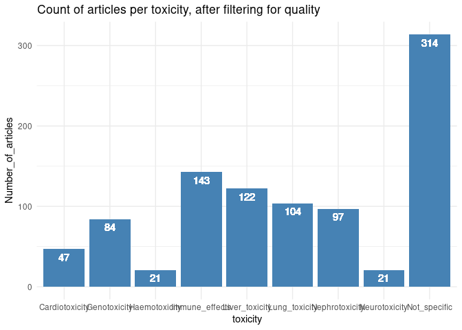<!-- -->

The data of the graph are exported in the following sheet :

``` r
data_excel<-results_df_filtered %>% select(names(ontology_classification)) %>% mutate_all(funs(sum), na.rm = TRUE) %>% gather(key=toxicity, value=Number_of_articles) %>% unique()

write.xlsx(data_excel, file = "data.xlsx", sheetName = "Barplot1", append = TRUE)
```

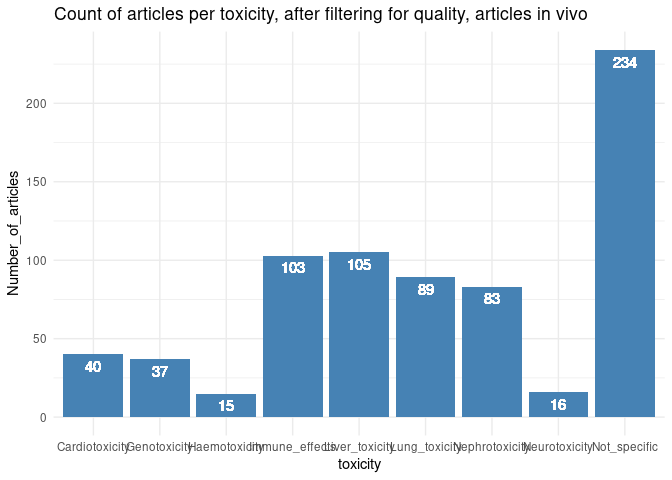<!-- -->

The data of the graph are exported in the following sheet :

``` r
data_excel<-results_df_filtered %>% select(names(ontology_classification)) %>% mutate_all(funs(sum), na.rm = TRUE) %>% gather(key=toxicity, value=Number_of_articles) %>% unique()
write.xlsx(data_excel, file = "data.xlsx", sheetName = "Barplot2", append = TRUE)
```

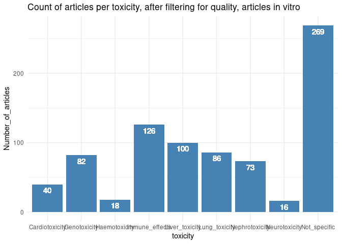<!-- -->

The data of the graph are exported in the following sheet :

``` r
data_excel<-results_df_filtered %>% select(names(ontology_classification)) %>% mutate_all(funs(sum), na.rm = TRUE) %>% gather(key=toxicity, value=Number_of_articles) %>% unique()
write.xlsx(data_excel, file = "data.xlsx", sheetName = "Barplot 3", append = TRUE)
```

### Double barplot

<!-- -->

The data of the graph are exported in the following sheet :

``` r
write.xlsx(result_vivo_vs_vitro, file = "data.xlsx",sheetName = "double_barplot", append = TRUE)
```

## Graph point 2

### Function to made the plot

Filtering of the results for high quality paper :

After filtering of papers about liver toxicity into result\_df2,
plotting using the function defined above :

    ## [1] "data exported to Liver toxicity point 2"

    ## Warning: Removed 9 rows containing missing values (position_stack).
    
    ## Warning: Removed 9 rows containing missing values (position_stack).

    ## Warning: Removed 9 rows containing missing values (geom_text).
    
    ## Warning: Removed 9 rows containing missing values (geom_text).

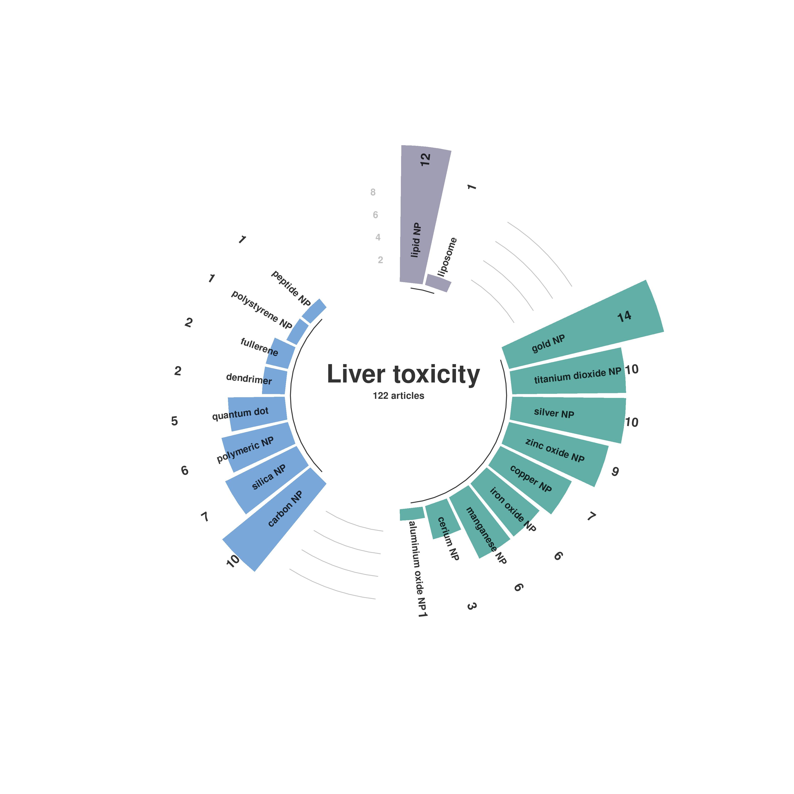<!-- -->

    ## [1] "data exported to Immune effects point 2"

    ## Warning: Removed 9 rows containing missing values (position_stack).
    
    ## Warning: Removed 9 rows containing missing values (position_stack).

    ## Warning: Removed 9 rows containing missing values (geom_text).
    
    ## Warning: Removed 9 rows containing missing values (geom_text).

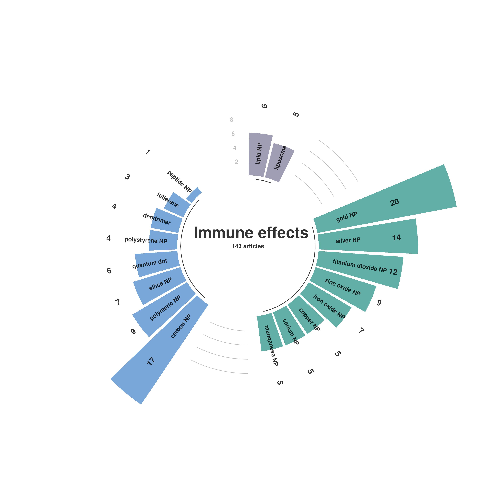<!-- -->

## Graph point 3

Recreation of result\_df2 :

Function to merge synonyms of the not\_specific ontology :

### Plot

    ## [1] "data exported to graph point 3"

    ## Warning: Removed 24 rows containing missing values (position_stack).
    
    ## Warning: Removed 24 rows containing missing values (position_stack).

    ## Warning: Removed 24 rows containing missing values (geom_text).

    ## Warning: Removed 25 rows containing missing values (geom_text).

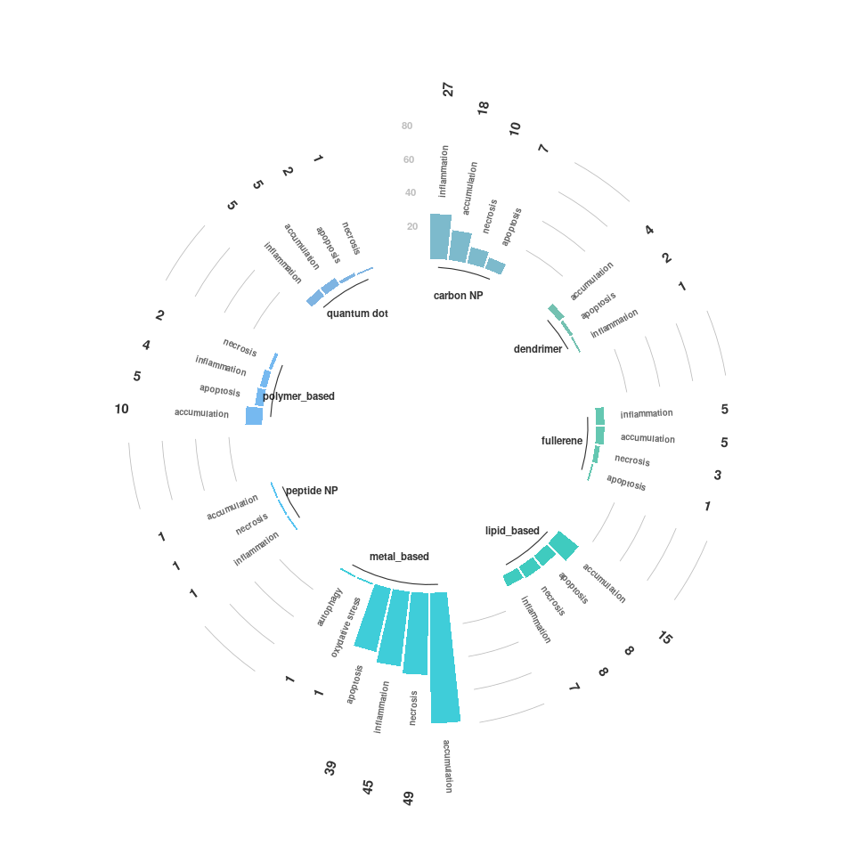<!-- -->

### Rules mining :

    ##     items                       transactionID
    ## [1] {carbon NP,necrosis}        1            
    ## [2] {accumulation,inflammation} 2            
    ## [3] {accumulation}              3            
    ##  [1]  7  8  9 10 11 12 13 14 15 16 17 18 19 20 21 22
    ##  [1] "carbon NP"           "peptide NP"          "copper NP"          
    ##  [4] "zinc oxide NP"       "titanium dioxide NP" "iron oxide NP"      
    ##  [7] "gold NP"             "silver NP"           "aluminium oxide NP" 
    ## [10] "cerium NP"           "manganese NP"        "quantum dot"        
    ## [13] "dendrimer"           "fullerene"           "polymer_based"      
    ## [16] "lipid_based"        
    ## Apriori
    ## 
    ## Parameter specification:
    ##  confidence minval smax arem  aval originalSupport maxtime support minlen
    ##        0.75    0.1    1 none FALSE            TRUE       5   0.001      1
    ##  maxlen target   ext
    ##      10  rules FALSE
    ## 
    ## Algorithmic control:
    ##  filter tree heap memopt load sort verbose
    ##     0.1 TRUE TRUE  FALSE TRUE    2    TRUE
    ## 
    ## Absolute minimum support count: 0 
    ## 
    ## set item appearances ...[16 item(s)] done [0.00s].
    ## set transactions ...[22 item(s), 414 transaction(s)] done [0.00s].
    ## sorting and recoding items ... [22 item(s)] done [0.00s].
    ## creating transaction tree ... done [0.00s].
    ## checking subsets of size 1 2 3 4 5 6 7 8 9 done [0.00s].
    ## writing ... [670 rule(s)] done [0.00s].
    ## creating S4 object  ... done [0.00s].
    ##      lhs                      rhs                support confidence     lift count
    ## [1]  {lipid_based,                                                                
    ##       polymer_based}       => {accumulation} 0.009661836       1.00 2.202128     4
    ## [2]  {iron oxide NP,                                                              
    ##       titanium dioxide NP} => {accumulation} 0.007246377       0.75 1.651596     3
    ## [3]  {iron oxide NP,                                                              
    ##       zinc oxide NP}       => {apoptosis}    0.004830918       1.00 4.600000     2
    ## [4]  {iron oxide NP,                                                              
    ##       silver NP,                                                                  
    ##       zinc oxide NP}       => {apoptosis}    0.004830918       1.00 4.600000     2
    ## [5]  {carbon NP,                                                                  
    ##       silver NP,                                                                  
    ##       zinc oxide NP}       => {necrosis}     0.004830918       1.00 4.758621     2
    ## [6]  {carbon NP,                                                                  
    ##       silver NP,                                                                  
    ##       titanium dioxide NP} => {necrosis}     0.004830918       1.00 4.758621     2
    ## [7]  {carbon NP,                                                                  
    ##       silver NP,                                                                  
    ##       titanium dioxide NP,                                                        
    ##       zinc oxide NP}       => {necrosis}     0.004830918       1.00 4.758621     2
    ## [8]  {aluminium oxide NP}  => {accumulation} 0.002415459       1.00 2.202128     1
    ## [9]  {gold NP,                                                                    
    ##       peptide NP}          => {necrosis}     0.002415459       1.00 4.758621     1
    ## [10] {gold NP,                                                                    
    ##       peptide NP}          => {inflammation} 0.002415459       1.00 3.136364     1
    ## [11] {gold NP,                                                                    
    ##       peptide NP}          => {accumulation} 0.002415459       1.00 2.202128     1
    ## [12] {copper NP,                                                                  
    ##       dendrimer}           => {accumulation} 0.002415459       1.00 2.202128     1
    ## [13] {dendrimer,                                                                  
    ##       iron oxide NP}       => {apoptosis}    0.002415459       1.00 4.600000     1
    ## [14] {dendrimer,                                                                  
    ##       gold NP}             => {accumulation} 0.002415459       1.00 2.202128     1
    ## [15] {dendrimer,                                                                  
    ##       titanium dioxide NP} => {accumulation} 0.002415459       1.00 2.202128     1
    ## [1] "\n\n\n"
    ##      lhs                                         rhs        support    
    ## [1]  {gold NP,peptide NP}                     => {necrosis} 0.002415459
    ## [2]  {cerium NP,lipid_based}                  => {necrosis} 0.002415459
    ## [3]  {fullerene,gold NP}                      => {necrosis} 0.002415459
    ## [4]  {iron oxide NP,quantum dot}              => {necrosis} 0.002415459
    ## [5]  {carbon NP,quantum dot}                  => {necrosis} 0.002415459
    ## [6]  {gold NP,manganese NP}                   => {necrosis} 0.002415459
    ## [7]  {carbon NP,manganese NP}                 => {necrosis} 0.002415459
    ## [8]  {copper NP,silver NP}                    => {necrosis} 0.002415459
    ## [9]  {fullerene,gold NP,lipid_based}          => {necrosis} 0.002415459
    ## [10] {carbon NP,fullerene,gold NP}            => {necrosis} 0.002415459
    ## [11] {iron oxide NP,manganese NP,quantum dot} => {necrosis} 0.002415459
    ## [12] {manganese NP,quantum dot,zinc oxide NP} => {necrosis} 0.002415459
    ## [13] {gold NP,manganese NP,quantum dot}       => {necrosis} 0.002415459
    ## [14] {carbon NP,manganese NP,quantum dot}     => {necrosis} 0.002415459
    ## [15] {manganese NP,quantum dot,silver NP}     => {necrosis} 0.002415459
    ##      confidence lift     count
    ## [1]  1          4.758621 1    
    ## [2]  1          4.758621 1    
    ## [3]  1          4.758621 1    
    ## [4]  1          4.758621 1    
    ## [5]  1          4.758621 1    
    ## [6]  1          4.758621 1    
    ## [7]  1          4.758621 1    
    ## [8]  1          4.758621 1    
    ## [9]  1          4.758621 1    
    ## [10] 1          4.758621 1    
    ## [11] 1          4.758621 1    
    ## [12] 1          4.758621 1    
    ## [13] 1          4.758621 1    
    ## [14] 1          4.758621 1    
    ## [15] 1          4.758621 1

    ##     items                       transactionID
    ## [1] {carbon NP,necrosis}        1            
    ## [2] {accumulation,inflammation} 2            
    ## [3] {accumulation}              3            
    ## [1]  7  8  9 10 11 12 13 14
    ## [1] "carbon NP"     "peptide NP"    "quantum dot"   "dendrimer"    
    ## [5] "fullerene"     "polymer_based" "metal_based"   "lipid_based"  
    ## Apriori
    ## 
    ## Parameter specification:
    ##  confidence minval smax arem  aval originalSupport maxtime support minlen
    ##        0.75    0.1    1 none FALSE            TRUE       5   0.001      1
    ##  maxlen target   ext
    ##      10  rules FALSE
    ## 
    ## Algorithmic control:
    ##  filter tree heap memopt load sort verbose
    ##     0.1 TRUE TRUE  FALSE TRUE    2    TRUE
    ## 
    ## Absolute minimum support count: 0 
    ## 
    ## set item appearances ...[8 item(s)] done [0.00s].
    ## set transactions ...[14 item(s), 414 transaction(s)] done [0.00s].
    ## sorting and recoding items ... [14 item(s)] done [0.00s].
    ## creating transaction tree ... done [0.00s].
    ## checking subsets of size 1 2 3 4 5 done [0.00s].
    ## writing ... [23 rule(s)] done [0.00s].
    ## creating S4 object  ... done [0.00s].
    ##      lhs                                    rhs            support    
    ## [1]  {lipid_based,polymer_based}         => {accumulation} 0.009661836
    ## [2]  {metal_based,peptide NP}            => {necrosis}     0.002415459
    ## [3]  {metal_based,peptide NP}            => {inflammation} 0.002415459
    ## [4]  {metal_based,peptide NP}            => {accumulation} 0.002415459
    ## [5]  {carbon NP,quantum dot}             => {apoptosis}    0.002415459
    ## [6]  {carbon NP,quantum dot}             => {necrosis}     0.002415459
    ## [7]  {carbon NP,quantum dot}             => {inflammation} 0.002415459
    ## [8]  {fullerene,metal_based}             => {necrosis}     0.002415459
    ## [9]  {fullerene,metal_based}             => {inflammation} 0.002415459
    ## [10] {carbon NP,dendrimer,metal_based}   => {accumulation} 0.002415459
    ## [11] {carbon NP,metal_based,quantum dot} => {apoptosis}    0.002415459
    ## [12] {carbon NP,metal_based,quantum dot} => {necrosis}     0.002415459
    ## [13] {carbon NP,metal_based,quantum dot} => {inflammation} 0.002415459
    ## [14] {fullerene,lipid_based,metal_based} => {necrosis}     0.002415459
    ## [15] {fullerene,lipid_based,metal_based} => {inflammation} 0.002415459
    ##      confidence lift     count
    ## [1]  1          2.202128 4    
    ## [2]  1          4.758621 1    
    ## [3]  1          3.136364 1    
    ## [4]  1          2.202128 1    
    ## [5]  1          4.600000 1    
    ## [6]  1          4.758621 1    
    ## [7]  1          3.136364 1    
    ## [8]  1          4.758621 1    
    ## [9]  1          3.136364 1    
    ## [10] 1          2.202128 1    
    ## [11] 1          4.600000 1    
    ## [12] 1          4.758621 1    
    ## [13] 1          3.136364 1    
    ## [14] 1          4.758621 1    
    ## [15] 1          3.136364 1    
    ## [1] "\n\n\n"
    ##      lhs              rhs                support confidence     lift count
    ## [1]  {metal_based,                                                        
    ##       peptide NP}  => {necrosis}     0.002415459          1 4.758621     1
    ## [2]  {carbon NP,                                                          
    ##       quantum dot} => {necrosis}     0.002415459          1 4.758621     1
    ## [3]  {fullerene,                                                          
    ##       metal_based} => {necrosis}     0.002415459          1 4.758621     1
    ## [4]  {carbon NP,                                                          
    ##       metal_based,                                                        
    ##       quantum dot} => {necrosis}     0.002415459          1 4.758621     1
    ## [5]  {fullerene,                                                          
    ##       lipid_based,                                                        
    ##       metal_based} => {necrosis}     0.002415459          1 4.758621     1
    ## [6]  {carbon NP,                                                          
    ##       fullerene,                                                          
    ##       metal_based} => {necrosis}     0.002415459          1 4.758621     1
    ## [7]  {carbon NP,                                                          
    ##       lipid_based,                                                        
    ##       metal_based} => {necrosis}     0.002415459          1 4.758621     1
    ## [8]  {carbon NP,                                                          
    ##       fullerene,                                                          
    ##       lipid_based,                                                        
    ##       metal_based} => {necrosis}     0.002415459          1 4.758621     1
    ## [9]  {carbon NP,                                                          
    ##       quantum dot} => {apoptosis}    0.002415459          1 4.600000     1
    ## [10] {carbon NP,                                                          
    ##       metal_based,                                                        
    ##       quantum dot} => {apoptosis}    0.002415459          1 4.600000     1
    ## [11] {metal_based,                                                        
    ##       peptide NP}  => {inflammation} 0.002415459          1 3.136364     1
    ## [12] {carbon NP,                                                          
    ##       quantum dot} => {inflammation} 0.002415459          1 3.136364     1
    ## [13] {fullerene,                                                          
    ##       metal_based} => {inflammation} 0.002415459          1 3.136364     1
    ## [14] {carbon NP,                                                          
    ##       metal_based,                                                        
    ##       quantum dot} => {inflammation} 0.002415459          1 3.136364     1
    ## [15] {fullerene,                                                          
    ##       lipid_based,                                                        
    ##       metal_based} => {inflammation} 0.002415459          1 3.136364     1

## Graph point 4

#### Ontology of specifics terms :

``` r
capitalize_first_letter <- function(section) {
  #https://rstudio-pubs-static.s3.amazonaws.com/408658_512da947714740b99253228f084a08a9.html
  #"MAterIAls"->"Materials" 
  #use to correct strange behavior of tabulapdf for section title
  #must be used on x$token !
  section<-paste0(toupper(substring(section, 1,1)), tolower(substring(section, 2)))
  return(section)
}


ontology_classification <- list(Immune_effects = c("complement activation", "CARPA", "hypersensitivity",
                                                   "anaphylaxis", "immunosuppression",
                                                   "cytokine induction", "cytokine storm", "pyrogenicity", 
                                                   "inflammasome activation", "MPS uptake",
                                                   "macrophage activation", "macrophage uptake", 
                                                   "antigenicity", "accelerated blood clearance", "allergy", 
                                                   "ABC", "spleen accumulation", "spleen toxicity"),
                                
Liver_toxicity = c("hepatitis", "liver inflammation", "cholestasis", "steatosis", "acute liver failure",  
                   "glutamic pyruvic transaminase level", "GPT", "alkaline phosphatase level", "ALP",
                   "hepatic cell injury", "liver accumulation", "cirrhosis", "liver cancer", "liver fibrosis"),

Genotoxicity = c("mutagenicity", "mutation", "DNA damage", "DNA strand breaks", "carcinogenicity", 
  "chromosome aberrations", "clastogenic", "aneugenic effects", "micronucleus formation", "epigenetic changes", 
  "nucleus accumulation"),

Nephrotoxicity = c("interstitial nephritis", "glomerulonephritis", "glomerular lesion", "glomerular damage", 
"creatinine clearance", "creatinine level", "urea level", " swelling of the proximal tubule", 
"swelling of the tubular epithelium", "tubular necrosis", "kidney metallothionein", "kidney accumulation", 
"nephrogenic systemic fibrosis"),

Lung_toxicity = c("airway remodelling", "asthma", "allergic responses", "thickening of alveolar walls",
"granuloma formation", "lung accumulation ", "pulmonary fibrosis"))

ontology_nanoparticles <- list(polymeric_NP = c("polymeric NP", "polymer NP"), 
                               Lipid_NPs = c("lipid NP"),
                               Polystyrene_NPs = c("polystyrene NP"),
                               Nanotubes = c("carbon NP", "peptide NP"),
                               Metal_NPs = c("copper NP", "zinc oxide NP", "titanium dioxide NP", "iron oxide NP", 
                                             "gold NP",
                                             "silver NP", "aluminium oxide NP", "cerium NP", "manganese NP"),
                               Quantum_Dots = c("quantum dot"),
                               Dendrimers = c("dendrimer"),
                               Fullerene = c("fullerene"),
                               Liposomes = c("liposome"),
                               Silica_NPs = c("silica NP", "silicon dioxide", "SiO")
)


rds_list<-list.files(path="~/Results/", pattern = "\\.rds$", recursive=TRUE)

result_df<-create_result_df(ontology_classification, ontology_nanoparticles)

i<-0
count_article_without_folder<-0
for (rds in rds_list) { 
  i<-i+1
  x<-readRDS(file = paste0("~/Results/", rds))
  if(i>1){
    result_df<-rbind(result_df, c(0))
  }
  
  pdf_name<-strsplit(rds, "/")[[1]][2]
  pdf_name<-str_replace_all(pdf_name, ".rds", "")
  folder_name<-strsplit(rds, "/")[[1]][1]
  
  result_df[i,]$Article_name<-pdf_name
  result_df[i,]$Original_folder<-folder_name
  result_df[is.na(result_df)] = 0
  for (folder_name in names(ontology_classification)) {
    for (word in ontology_classification[[folder_name]]) {
      result_df<-sentence_result_screening(x, i, result_df, word)
    } 
    #if one of the word of the ontology for the toxicity has been assigned in the previous loop :
    if (sum(result_df[i, ontology_classification[[folder_name]]]) > 0) { 
      #print(folder_name)
      result_df[i,folder_name]<-1
    }
  }
  for (nano_particules in names(ontology_nanoparticles)) {
    if (nano_particules=="Metal_NPs") {
      next
    }
    for (word in ontology_nanoparticles[[nano_particules]]) {
      result_df<-sentence_result_screening(x, i, result_df, word)
    }
  }
  for (word in ontology_nanoparticles[["Metal_NPs"]]) {
    result_df<-sentence_result_screening(x, i, result_df, word)
    result_df<-sentence_result_screening_for_metal(x, i, result_df, word)
  }
  
  if (sum(result_df[i , names(ontology_classification)]) == 0 ) {
    count_article_without_folder<-count_article_without_folder+1
    #print(pdf_name)
  }
}  


#following lines filter for quality
folder<-"Biodistribution"
result_df2<-filter_results(quality_evaluation_df, result_df, folder) 
for (folder in unique(result_df$Original_folder)) {
  if (folder=="Biodistribution") {
    next()
  }
  result_df2<-rbind(result_df2, filter_results(quality_evaluation_df, result_df, folder))
}

post_process_immune_effects<- function(result_df2) {
  
  df<-result_df2

  df$`complement activation`<-as.integer(df$CARPA | df$`complement activation`)
  df$CARPA<-NULL
  df$hypersensitivity<-as.integer(df$hypersensitivity | df$anaphylaxis)
  df$anaphylaxis<-NULL
  #2)immunosuppression/
  df$`cytokine induction` <-as.integer(df$`cytokine induction` | df$`cytokine storm`)
  df$`cytokine storm`<-NULL
  #4)pyrogenicity/
  #5)inflammasome activation/
  df$`macrophage activation`<- as.integer(df$`macrophage activation` | df$`MPS uptake` | df$`macrophage uptake`)
  df$`MPS uptake` <- NULL
  df$`macrophage uptake` <-NULL
  #7) antigenicity/
  df$`accelerated blood clearance` <- as.integer(df$`accelerated blood clearance` | df$ABC)
  #9)allergy/ 
  #10)spleen accumulation/
  #11)spleen toxicity

  return(df)
}

post_process_liver_toxicity <- function(result_df2) {
  
  df<-result_df2
  
  # df$`complement activation`<-as.integer(df$CARPA | df$`complement activation`)
  # df$CARPA<-NULL
  
  df$hepatitis<-as.integer(df$hepatitis | df$`liver inflammation`)
  df$`liver inflammation`<-NULL
  #cholestasis/
  #steatosis/
  #acute liver failure/
  #glutamic pyruvic transaminase (GPT) level/
  df$`alkaline phosphatase level`<-as.integer(df$ALP |df$`alkaline phosphatase level`)
  df$ALP<-NULL
  #hepatic cell injury/ 
  #liver accumulation/
  #cirrhosis/
  #liver cancer/
  #liver fibrosis
  return(df)
}

post_process_lung_toxicity <- function(result_df2) {
  
  df<-result_df2
  
  # df$`complement activation`<-as.integer(df$CARPA | df$`complement activation`)
  # df$CARPA<-NULL
  
#   1)airway remodelling/ 
#   2)asthma
#   3)allergic responses/
#   4)thickening of alveolar walls
#   5)granuloma formation/ 
#   6)lung accumulation /
#   7)pulmonary fibrosis

  
  
  return(df)
}

post_process_genotoxicity <- function(result_df2) {
  
  df<-result_df2
  
  # df$`complement activation`<-as.integer(df$CARPA | df$`complement activation`)
  # df$CARPA<-NULL
  
  df$mutagenicity<-as.integer(df$mutagenicity | df$mutation)
  df$mutation<-NULL
  #DNA damage/
  #DNA strand breaks/ 
  # carcinogenicity/ 
  # chromosome aberrations/
  df$clastogenic<-as.integer(df$clastogeni | df$`aneugenic effects`)
  df$`aneugenic effects`<-NULL
  # micronucleus formation/
  # epigenetic changes/
  # nucleus accumulation

  return(df)
}

post_process_nephrotoxicity <- function(result_df2) {
  
  df<-result_df2
  
  # df$`complement activation`<-as.integer(df$CARPA | df$`complement activation`)
  # df$CARPA<-NULL
  # Interstitial nephritis/
  # glomerulonephritis/
  # Glomerular lesion/ glomerular damage/
  df$`creatinine clearance`<-as.integer(df$`creatinine clearance`|df$`creatinine level`)
  df$`creatinine level`<-NULL
  # urea level/ 
  # Swelling of the proximal tubule/
  # Swelling of the tubular epithelium/
  # tubular necrosis/
  # kidney metallothionein/ 
  # kidney accumulation/
  # Nephrogenic systemic fibrosis

  return(df)
}

result_df2<-post_process_immune_effects(result_df2)

vector_effect_immuno<-c("complement activation", "hypersensitivity", "immunosuppression", 
                        "cytokine induction", "pyrogenicity", "inflammasome activation", "macrophage activation",
                        "antigenicity", "accelerated blood clearance", "allergy", "spleen accumulation", 
                        "spleen toxicity")


data<-result_df2
```

### Lipid based NP

### Metal NP and polymeric

### Graph

    ## [1] "data exported to Graph point 4"

    ## Warning: Removed 27 rows containing missing values (position_stack).
    
    ## Warning: Removed 27 rows containing missing values (position_stack).

    ## Warning: Removed 27 rows containing missing values (geom_text).
    
    ## Warning: Removed 27 rows containing missing values (geom_text).

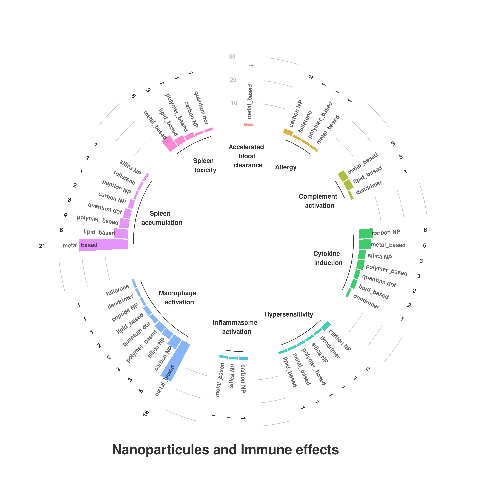<!-- -->

    ## Warning: Removed 27 rows containing missing values (position_stack).
    
    ## Warning: Removed 27 rows containing missing values (position_stack).

    ## Warning: Removed 27 rows containing missing values (geom_text).
    
    ## Warning: Removed 27 rows containing missing values (geom_text).

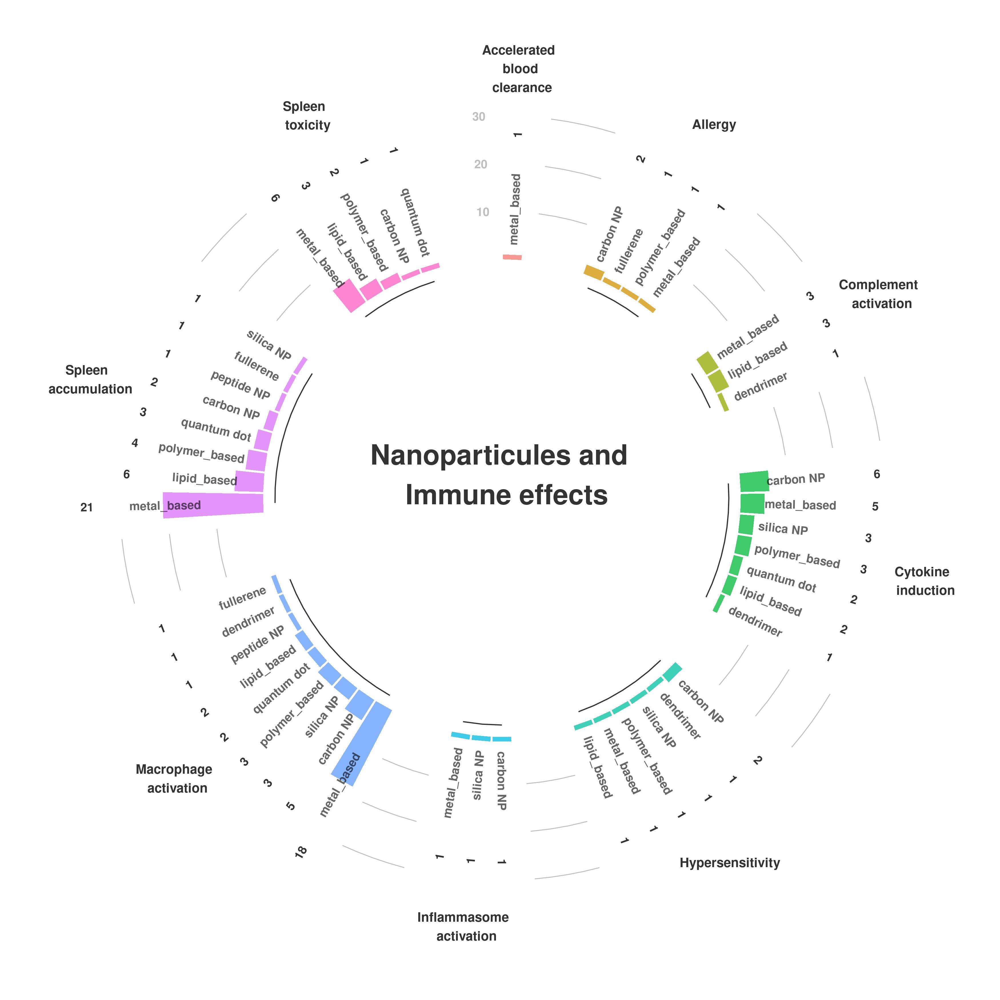<!-- -->

### Graphs put in function

Nano particules are also regrouped has for point 4.

``` r
vector_effect_liver_toxicity<-c("hepatitis", "cholestasis", "steatosis", "acute liver failure",  
"glutamic pyruvic transaminase level", "GPT", "alkaline phosphatase level", "hepatic cell injury", 
"liver accumulation", "cirrhosis", "liver cancer", "liver fibrosis")
vector_effect_lung_toxicity<-c("airway remodelling", "asthma", "allergic responses",
                                "thickening of alveolar walls",
                                "granuloma formation", "lung accumulation ", "pulmonary fibrosis")
vector_effect_genotoxicity<-c("mutagenicity", "DNA damage", "DNA strand breaks", "carcinogenicity", 
                            "chromosome aberrations", "clastogenic", "micronucleus formation", 
                            "epigenetic changes", 
                            "nucleus accumulation")
vector_effect_nephrotoxicity <- c("interstitial nephritis", "glomerulonephritis", "glomerular lesion", "glomerular damage", 
"creatinine clearance",  "urea level", " swelling of the proximal tubule", 
"swelling of the tubular epithelium", "tubular necrosis", "kidney metallothionein", "kidney accumulation", 
"nephrogenic systemic fibrosis")
```

    ## [1] "data exported to Liver toxicity Graph point 4"

    ## Warning: Removed 33 rows containing missing values (position_stack).
    
    ## Warning: Removed 33 rows containing missing values (position_stack).

    ## Warning: Removed 33 rows containing missing values (geom_text).
    
    ## Warning: Removed 33 rows containing missing values (geom_text).

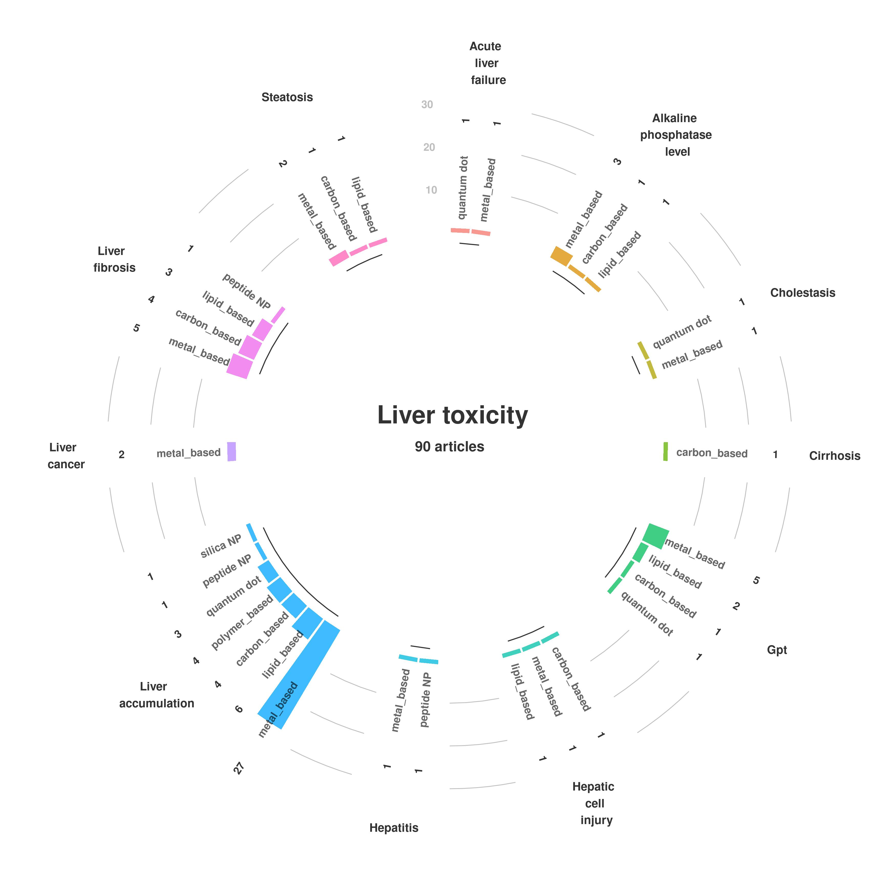<!-- -->

    ## [1] "data exported to Genotoxicy Graph point 4"

    ## Warning: Removed 27 rows containing missing values (position_stack).
    
    ## Warning: Removed 27 rows containing missing values (position_stack).

    ## Warning: Removed 27 rows containing missing values (geom_text).

    ## Warning: Removed 28 rows containing missing values (geom_text).

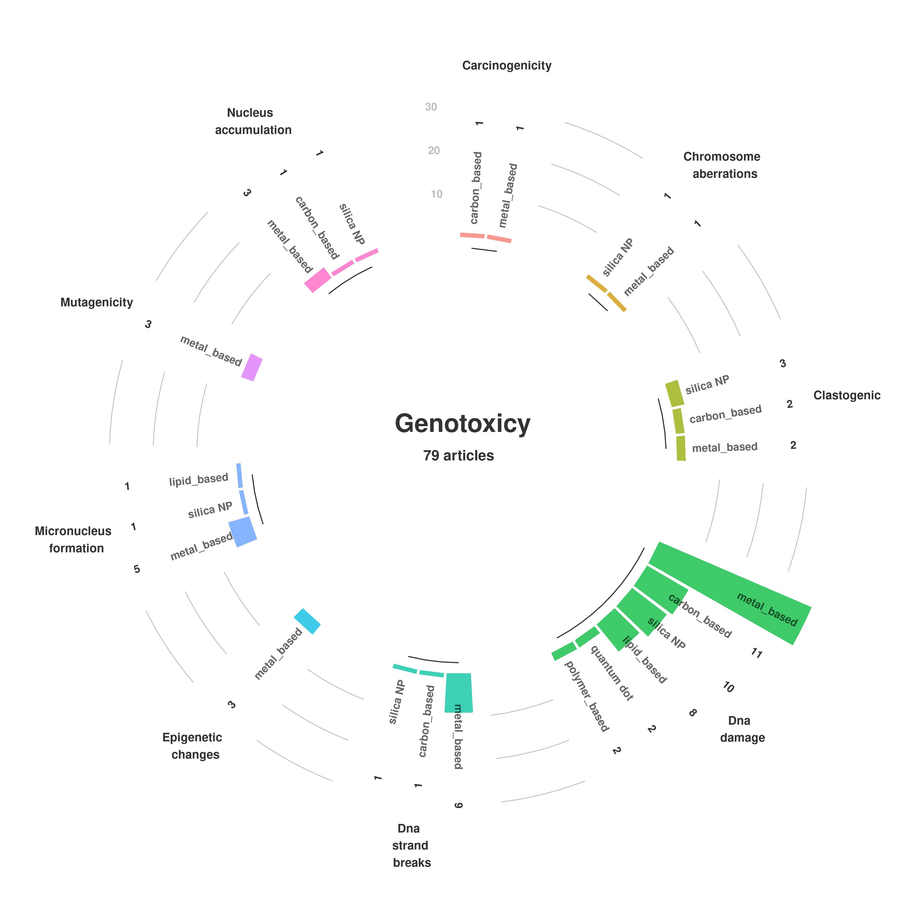<!-- -->

    ## [1] "data exported to Immune Effects Graph point 4"

    ## Warning: Removed 27 rows containing missing values (position_stack).
    
    ## Warning: Removed 27 rows containing missing values (position_stack).

    ## Warning: Removed 27 rows containing missing values (geom_text).
    
    ## Warning: Removed 27 rows containing missing values (geom_text).

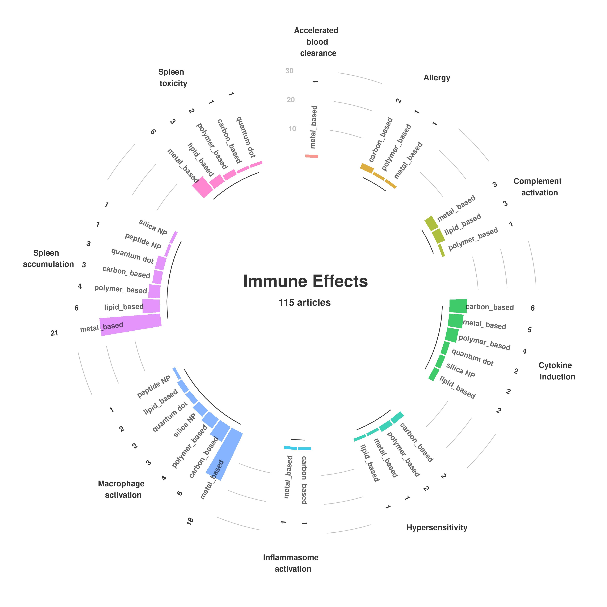<!-- -->

    ## [1] "data exported to Lung toxicity Graph point 4"

    ## Warning: Removed 12 rows containing missing values (position_stack).
    
    ## Warning: Removed 12 rows containing missing values (position_stack).

    ## Warning: Removed 12 rows containing missing values (geom_text).
    
    ## Warning: Removed 12 rows containing missing values (geom_text).

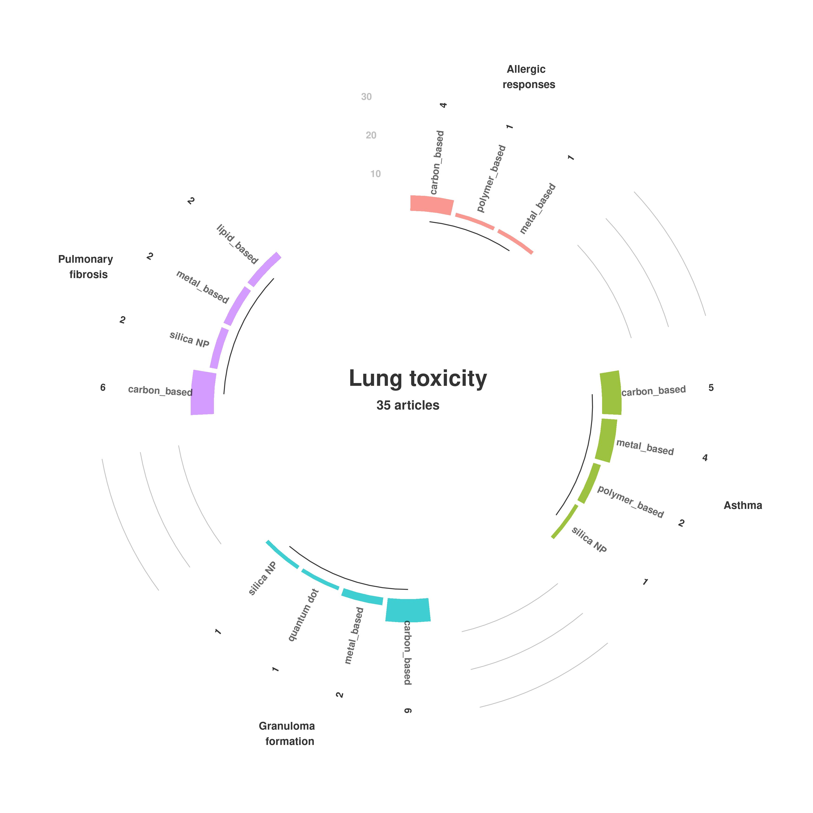<!-- -->

    ## [1] "data exported to Nephrotoxicity Graph point 4"

    ## Warning: Removed 15 rows containing missing values (position_stack).
    
    ## Warning: Removed 15 rows containing missing values (position_stack).

    ## Warning: Removed 15 rows containing missing values (geom_text).
    
    ## Warning: Removed 15 rows containing missing values (geom_text).

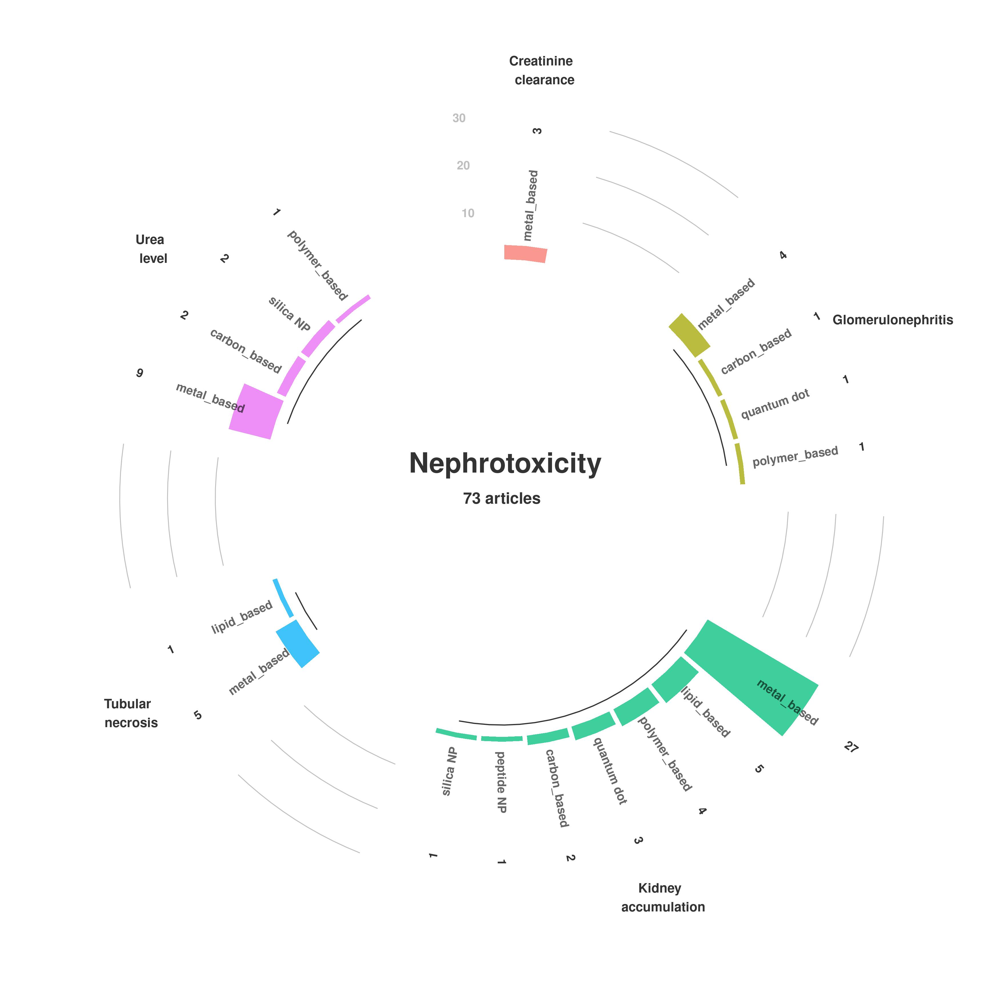<!-- -->

## Rules approach for immune effects

    ##     items                   transactionID
    ## [1] {carbon_based}          1            
    ## [2] {macrophage activation} 2            
    ## [3] {spleen toxicity}       3            
    ## [1] 12
    ## [1] "quantum dot"
    ## Apriori
    ## 
    ## Parameter specification:
    ##  confidence minval smax arem  aval originalSupport maxtime support minlen
    ##        0.75    0.1    1 none FALSE            TRUE       5   0.001      1
    ##  maxlen target   ext
    ##      10  rules FALSE
    ## 
    ## Algorithmic control:
    ##  filter tree heap memopt load sort verbose
    ##     0.1 TRUE TRUE  FALSE TRUE    2    TRUE
    ## 
    ## Absolute minimum support count: 0 
    ## 
    ## set item appearances ...[1 item(s)] done [0.00s].
    ## set transactions ...[17 item(s), 335 transaction(s)] done [0.00s].
    ## sorting and recoding items ... [17 item(s)] done [0.00s].
    ## creating transaction tree ... done [0.00s].
    ## checking subsets of size 1 2 done [0.00s].
    ## writing ... [0 rule(s)] done [0.00s].
    ## creating S4 object  ... done [0.00s].
    ## [1] "\n\n\n"

    ##     items                   transactionID
    ## [1] {carbon_based}          1            
    ## [2] {macrophage activation} 2            
    ## [3] {spleen toxicity}       3            
    ##  [1] 11 12 13 14 15 16 17 18 19 20 21 22 23 24 25
    ##  [1] "peptide NP"          "copper NP"           "zinc oxide NP"      
    ##  [4] "titanium dioxide NP" "iron oxide NP"       "gold NP"            
    ##  [7] "silver NP"           "aluminium oxide NP"  "cerium NP"          
    ## [10] "manganese NP"        "quantum dot"         "silica NP"          
    ## [13] "polymer_based"       "lipid_based"         "carbon_based"       
    ## Apriori
    ## 
    ## Parameter specification:
    ##  confidence minval smax arem  aval originalSupport maxtime support minlen
    ##        0.75    0.1    1 none FALSE            TRUE       5   0.001      1
    ##  maxlen target   ext
    ##      10  rules FALSE
    ## 
    ## Algorithmic control:
    ##  filter tree heap memopt load sort verbose
    ##     0.1 TRUE TRUE  FALSE TRUE    2    TRUE
    ## 
    ## Absolute minimum support count: 0 
    ## 
    ## set item appearances ...[15 item(s)] done [0.00s].
    ## set transactions ...[25 item(s), 335 transaction(s)] done [0.00s].
    ## sorting and recoding items ... [25 item(s)] done [0.00s].
    ## creating transaction tree ... done [0.00s].
    ## checking subsets of size 1 2 3 4 5 6 7 8 9 10 done [0.00s].
    ## writing ... [445 rule(s)] done [0.00s].
    ## creating S4 object  ... done [0.00s].
    ##      lhs                      rhs                           support confidence       lift count
    ## [1]  {gold NP,                                                                                 
    ##       peptide NP}          => {macrophage activation}   0.002985075          1   9.054054     1
    ## [2]  {gold NP,                                                                                 
    ##       peptide NP}          => {spleen accumulation}     0.002985075          1   6.836735     1
    ## [3]  {cerium NP,                                                                               
    ##       titanium dioxide NP} => {inflammasome activation} 0.002985075          1  83.750000     1
    ## [4]  {manganese NP,                                                                            
    ##       polymer_based}       => {allergy}                 0.002985075          1 111.666667     1
    ## [5]  {cerium NP,                                                                               
    ##       lipid_based}         => {spleen accumulation}     0.002985075          1   6.836735     1
    ## [6]  {iron oxide NP,                                                                           
    ##       quantum dot}         => {cytokine induction}      0.002985075          1  19.705882     1
    ## [7]  {quantum dot,                                                                             
    ##       silica NP}           => {cytokine induction}      0.002985075          1  19.705882     1
    ## [8]  {carbon_based,                                                                            
    ##       quantum dot}         => {cytokine induction}      0.002985075          1  19.705882     1
    ## [9]  {gold NP,                                                                                 
    ##       manganese NP}        => {cytokine induction}      0.002985075          1  19.705882     1
    ## [10] {carbon_based,                                                                            
    ##       manganese NP}        => {cytokine induction}      0.002985075          1  19.705882     1
    ## [11] {copper NP,                                                                               
    ##       silver NP}           => {spleen accumulation}     0.002985075          1   6.836735     1
    ## [12] {copper NP,                                                                               
    ##       manganese NP,                                                                            
    ##       polymer_based}       => {allergy}                 0.002985075          1 111.666667     1
    ## [13] {copper NP,                                                                               
    ##       manganese NP,                                                                            
    ##       titanium dioxide NP} => {allergy}                 0.002985075          1 111.666667     1
    ## [14] {manganese NP,                                                                            
    ##       polymer_based,                                                                           
    ##       titanium dioxide NP} => {allergy}                 0.002985075          1 111.666667     1
    ## [15] {carbon_based,                                                                            
    ##       lipid_based,                                                                             
    ##       polymer_based}       => {hypersensitivity}        0.002985075          1  47.857143     1
    ## [1] "\n\n\n"
    ##      lhs                      rhs                           support confidence      lift count
    ## [1]  {manganese NP,                                                                           
    ##       polymer_based}       => {allergy}                 0.002985075          1 111.66667     1
    ## [2]  {copper NP,                                                                              
    ##       manganese NP,                                                                           
    ##       polymer_based}       => {allergy}                 0.002985075          1 111.66667     1
    ## [3]  {copper NP,                                                                              
    ##       manganese NP,                                                                           
    ##       titanium dioxide NP} => {allergy}                 0.002985075          1 111.66667     1
    ## [4]  {manganese NP,                                                                           
    ##       polymer_based,                                                                          
    ##       titanium dioxide NP} => {allergy}                 0.002985075          1 111.66667     1
    ## [5]  {copper NP,                                                                              
    ##       manganese NP,                                                                           
    ##       polymer_based,                                                                          
    ##       titanium dioxide NP} => {allergy}                 0.002985075          1 111.66667     1
    ## [6]  {cerium NP,                                                                              
    ##       titanium dioxide NP} => {inflammasome activation} 0.002985075          1  83.75000     1
    ## [7]  {carbon_based,                                                                           
    ##       lipid_based,                                                                            
    ##       polymer_based}       => {hypersensitivity}        0.002985075          1  47.85714     1
    ## [8]  {iron oxide NP,                                                                          
    ##       quantum dot}         => {cytokine induction}      0.002985075          1  19.70588     1
    ## [9]  {quantum dot,                                                                            
    ##       silica NP}           => {cytokine induction}      0.002985075          1  19.70588     1
    ## [10] {carbon_based,                                                                           
    ##       quantum dot}         => {cytokine induction}      0.002985075          1  19.70588     1
    ## [11] {gold NP,                                                                                
    ##       manganese NP}        => {cytokine induction}      0.002985075          1  19.70588     1
    ## [12] {carbon_based,                                                                           
    ##       manganese NP}        => {cytokine induction}      0.002985075          1  19.70588     1
    ## [13] {iron oxide NP,                                                                          
    ##       manganese NP,                                                                           
    ##       quantum dot}         => {cytokine induction}      0.002985075          1  19.70588     1
    ## [14] {manganese NP,                                                                           
    ##       quantum dot,                                                                            
    ##       zinc oxide NP}       => {cytokine induction}      0.002985075          1  19.70588     1
    ## [15] {manganese NP,                                                                           
    ##       quantum dot,                                                                            
    ##       silica NP}           => {cytokine induction}      0.002985075          1  19.70588     1

## Graph for Susanne’s presentation

350 dpi, jpeg :

    ## [1] "data exported to Graph for susanne's presentation 4"

    ## Warning: Removed 15 rows containing missing values (position_stack).
    
    ## Warning: Removed 15 rows containing missing values (position_stack).

    ## Warning: Removed 15 rows containing missing values (geom_text).
    
    ## Warning: Removed 15 rows containing missing values (geom_text).

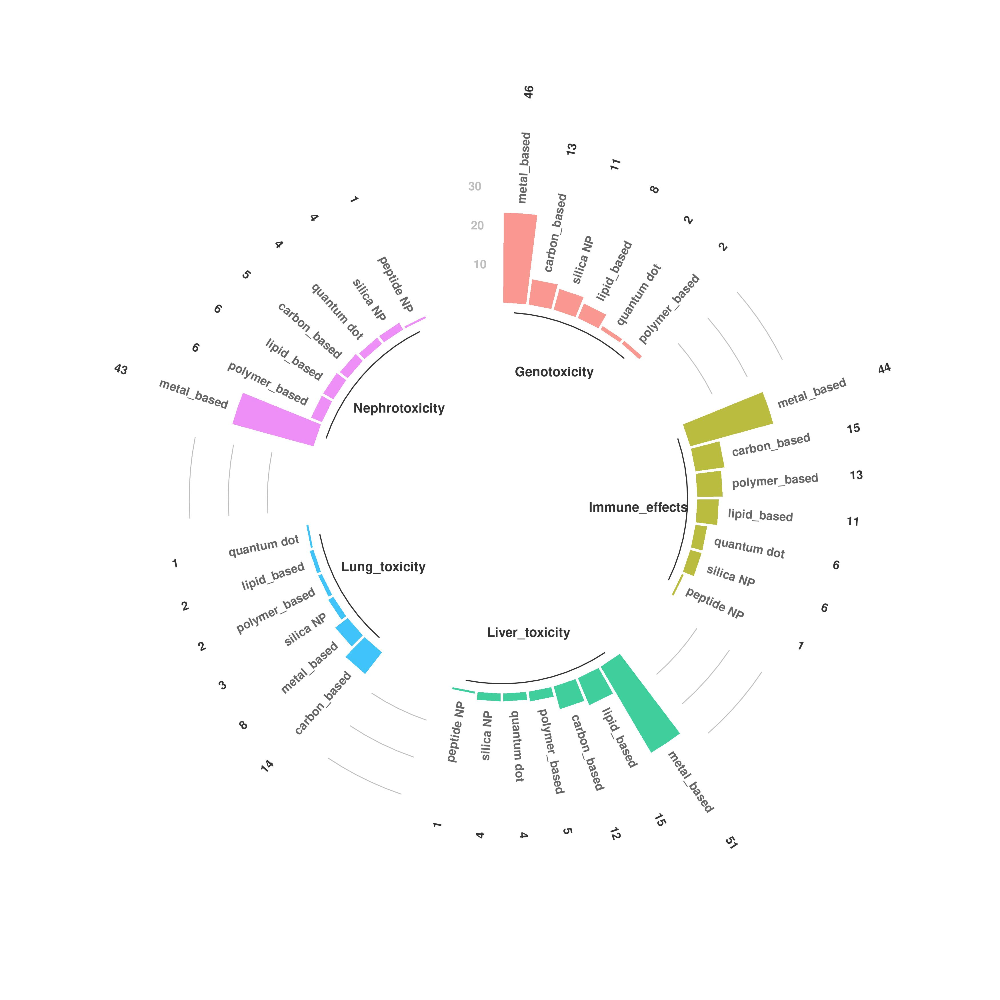<!-- -->
