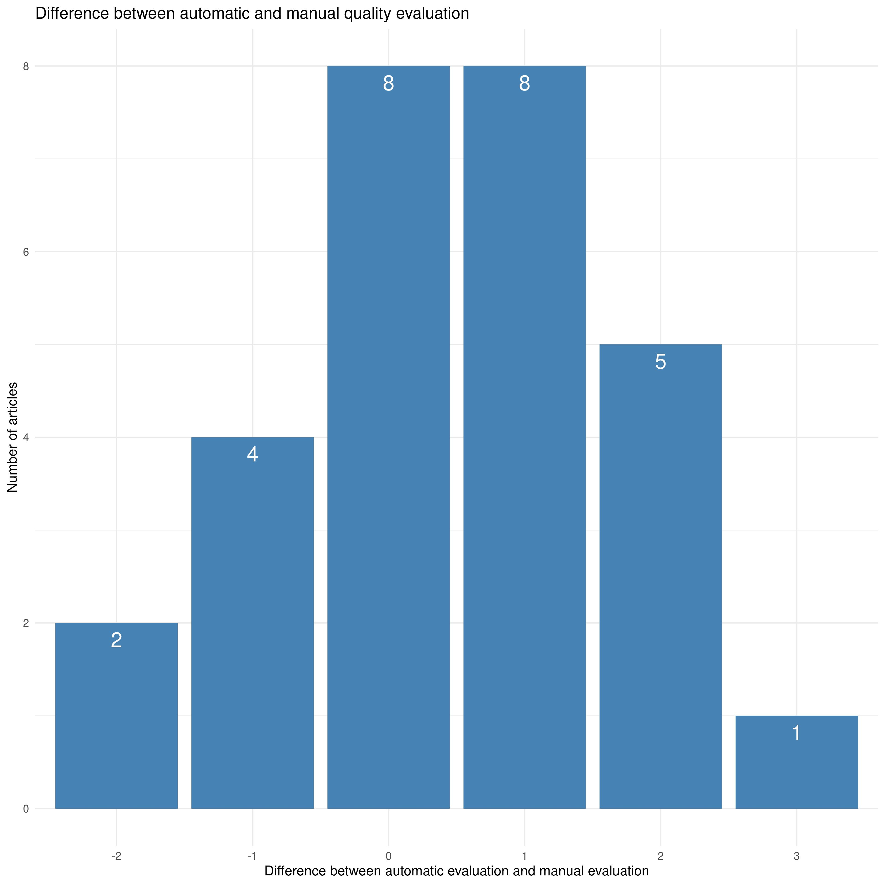
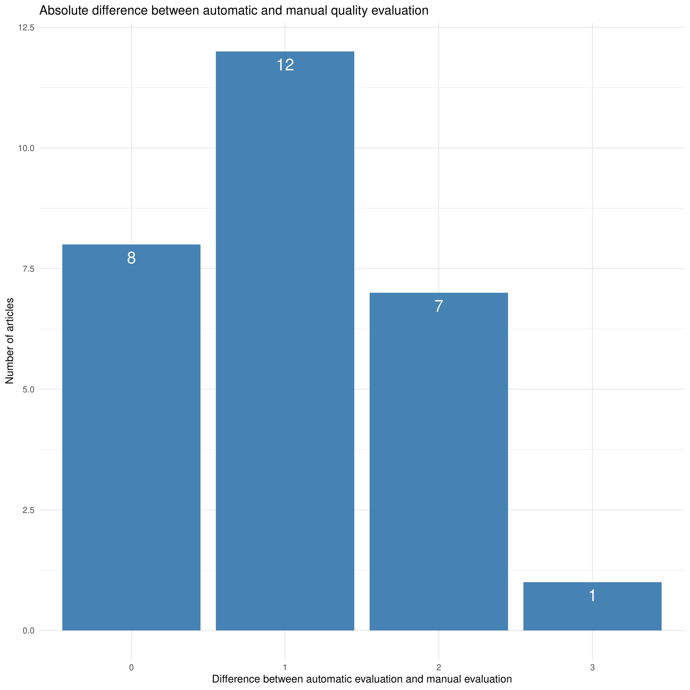

Validation\_round2
================

-   [Validation of the quality
    evaluation](#validation-of-the-quality-evaluation)
-   [Comparison manual vs automatic
    tool](#comparison-manual-vs-automatic-tool)
-   [Barplot of the difference between automatic and manual quality
    evaluation](#barplot-of-the-difference-between-automatic-and-manual-quality-evaluation)
-   [Some correlations](#some-correlations)

## Validation of the quality evaluation

This rmarkdown document compare the automatic and manual quality
evaluation performed on 28 articles of the folder validation. This
comparison was reported previously in the double boxplot plot. This
rmarkdown document introduce others analysis using different statistical
approaches to make the differences between the two ranking methods more
easy to apprehend.

## Comparison manual vs automatic tool

``` r
ranking_manual <- c(4, 3, 3, 3, 3, 3, 2, 2, 2 , 2, 2, 2, 2, 2, 2, 2, 1, 1, 1, 1, 0, 0, 0, 0, 0, 0, 0, 0)

ranking_auto <- c(3, 3, 3, 3, 3, 2, 4, 4, 3, 3, 2, 2, 1, 1, 0, 0, 2, 2, 2, 2, 3, 2, 2, 2, 1, 1, 0, 0)
```

Difference between automatic and manual ranking :

``` r
difference <- ranking_auto-ranking_manual
difference
```

    ##  [1] -1  0  0  0  0 -1  2  2  1  1  0  0 -1 -1 -2 -2  1  1  1  1  3  2  2  2  1
    ## [26]  1  0  0

``` r
difference_absolue <- abs(difference)
difference_absolue
```

    ##  [1] 1 0 0 0 0 1 2 2 1 1 0 0 1 1 2 2 1 1 1 1 3 2 2 2 1 1 0 0

``` r
summary(difference)
```

    ##    Min. 1st Qu.  Median    Mean 3rd Qu.    Max. 
    ## -2.0000  0.0000  0.5000  0.4643  1.0000  3.0000

``` r
summary(difference_absolue)
```

    ##    Min. 1st Qu.  Median    Mean 3rd Qu.    Max. 
    ##   0.000   0.000   1.000   1.036   2.000   3.000

``` r
table(difference)
```

    ## difference
    ## -2 -1  0  1  2  3 
    ##  2  4  8  8  5  1

``` r
table(difference_absolue)
```

    ## difference_absolue
    ##  0  1  2  3 
    ##  8 12  7  1

``` r
diff_to_plot <- as.data.frame(table(difference))
abs_diff_to_plot <- as.data.frame(table(difference_absolue))
```

## Barplot of the difference between automatic and manual quality evaluation

``` r
p<-ggplot(data=diff_to_plot, aes(x=difference, y=Freq)) +
  geom_bar(stat="identity", fill="steelblue")+
  geom_text(aes(label=Freq), vjust=1.6, color="white", size=6)+
  theme_minimal()

p + ggtitle("Difference between automatic and manual quality evaluation") + xlab("Difference between automatic evaluation and manual evaluation") + ylab("Number of articles")
```

<!-- -->
\#\# Barplot of the absolute difference between automatic and manual
quality evaluation

``` r
p<-ggplot(data=abs_diff_to_plot, aes(x=difference_absolue, y=Freq)) +
  geom_bar(stat="identity", fill="steelblue")+
  geom_text(aes(label=Freq), vjust=1.6, color="white", size=6)+
  theme_minimal()

p + ggtitle("Absolute difference between automatic and manual quality evaluation") + xlab("Difference between automatic evaluation and manual evaluation") + ylab("Number of articles")
```

<!-- -->

## Some correlations

``` r
library(Hmisc)
```

    ## Loading required package: lattice

    ## Loading required package: survival

    ## Loading required package: Formula

    ## 
    ## Attaching package: 'Hmisc'

    ## The following objects are masked from 'package:base':
    ## 
    ##     format.pval, units

``` r
df<-data.frame("auto"=ranking_auto, "manual"=ranking_manual)

cor(df)
```

    ##             auto    manual
    ## auto   1.0000000 0.4272041
    ## manual 0.4272041 1.0000000

``` r
cor(df, method = "spearman")
```

    ##             auto    manual
    ## auto   1.0000000 0.4731473
    ## manual 0.4731473 1.0000000

``` r
rcorr(as.matrix(df))
```

    ##        auto manual
    ## auto   1.00   0.43
    ## manual 0.43   1.00
    ## 
    ## n= 28 
    ## 
    ## 
    ## P
    ##        auto   manual
    ## auto          0.0234
    ## manual 0.0234
