Radar plot, Circular Plot
================
Etienne Rolland
21/01/2020

  - [Content of this Rmarkdown
    document](#content-of-this-rmarkdown-document)
  - [Radar plots](#radar-plots)
      - [Radar plot, for all the articles
        :](#radar-plot-for-all-the-articles)
      - [Radar plot, for the articles with a ranking of 1
        :](#radar-plot-for-the-articles-with-a-ranking-of-1)
      - [Radar plot, for the articles with a ranking of 2
        :](#radar-plot-for-the-articles-with-a-ranking-of-2)
      - [Radar plot, for the articles with a minimum ranking of 2
        :](#radar-plot-for-the-articles-with-a-minimum-ranking-of-2)
      - [Radar plot, all the articles, in vitro
        :](#radar-plot-all-the-articles-in-vitro)
      - [Radar plot, all the articles, in vivo
        :](#radar-plot-all-the-articles-in-vivo)
      - [Radar Plot for each subtype of articles, with a minumum score
        of 2
        :](#radar-plot-for-each-subtype-of-articles-with-a-minumum-score-of-2)
  - [Circular barplots](#circular-barplots)
      - [Circularbar plot, for the article with a Ranking of 1
        only](#circularbar-plot-for-the-article-with-a-ranking-of-1-only)
      - [Circular barplot, for the article with a Ranking of 2
        only](#circular-barplot-for-the-article-with-a-ranking-of-2-only)
      - [Circular barplot, for all the articles, stratified by
        folder](#circular-barplot-for-all-the-articles-stratified-by-folder)
      - [Circular barplot, for all the articles, organized by
        characteristic](#circular-barplot-for-all-the-articles-organized-by-characteristic)
      - [Circular barplot, for all the articles, stratified by folder,
        of articles, with a minumum score of 2
        :](#circular-barplot-for-all-the-articles-stratified-by-folder-of-articles-with-a-minumum-score-of-2)
      - [Circular barplot, for all the articles, stratified by material
        characteristic, of articles, with a minumum score of 2
        :](#circular-barplot-for-all-the-articles-stratified-by-material-characteristic-of-articles-with-a-minumum-score-of-2)

# Content of this Rmarkdown document

This document present different graphs used to visualized how the
different aspects of the material characterisation are present in the
“material and method” sections. Two visualization technics are used :

  - the radar plot : a two-dimensional chart type designed to plot one
    or more series of values over multiple quantitative variables. The
    variable here are the percentage of article with the
    characterisation.

  - the circular barploy : a barplot, with each bar displayed along a
    circle instead of a line.

# Radar plots

## Radar plot, for all the articles :

The following radar plot display the percentage of articles that have
the aspects of the material characterisation shown in axis, for all the
articles for which the extraction was successufull.

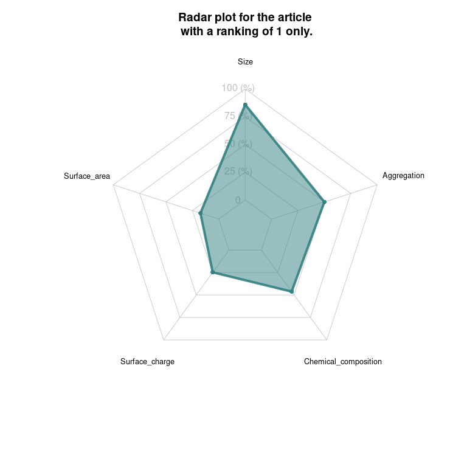<!-- -->

## Radar plot, for the articles with a ranking of 1 :

The following radar plot display the percentage of articles that have
the aspects of the material characterisation shown in axis, uniquely for
the article with a ranking of 1.

<!-- -->

## Radar plot, for the articles with a ranking of 2 :

The following radar plot display the percentage of articles that have
the aspects of the material characterisation shown in axis, uniquely for
the article with a ranking of 2.

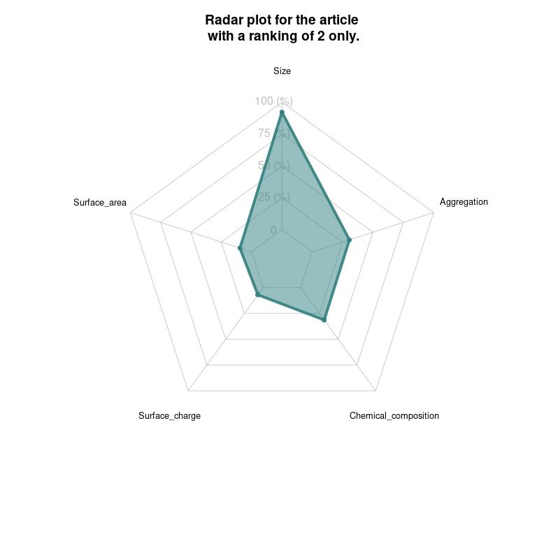<!-- -->

## Radar plot, for the articles with a minimum ranking of 2 :

The following radar plot display the percentage of articles that have
the aspects of the material characterisation shown in axis, uniquely for
the article with a minimum ranking of 2.

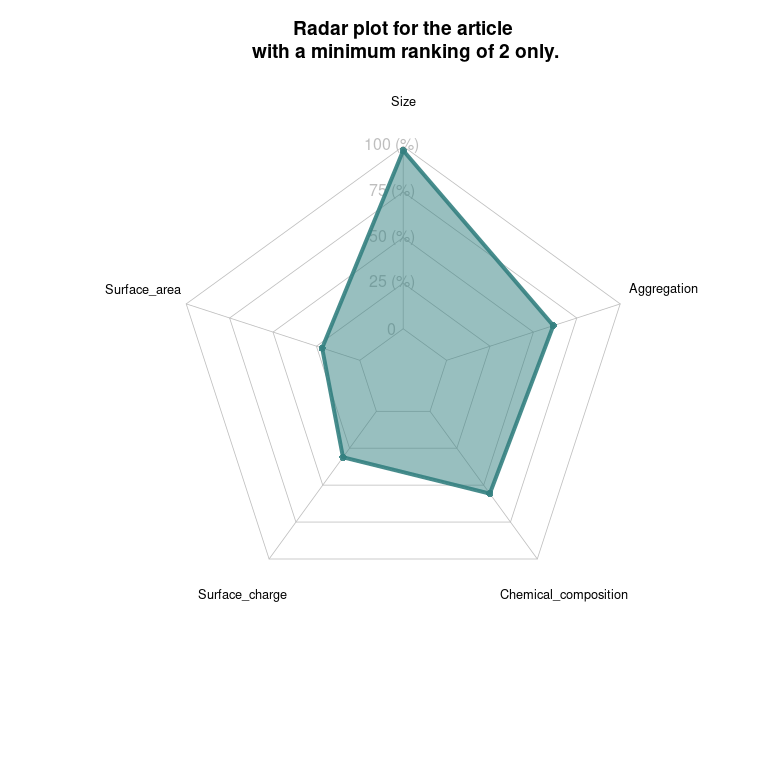<!-- -->

## Radar plot, all the articles, in vitro :

The following radar plot display the percentage of articles that have
the aspects of the material characterisation shown in axis, uniquely for
the article that are categorized has “In vitro”.

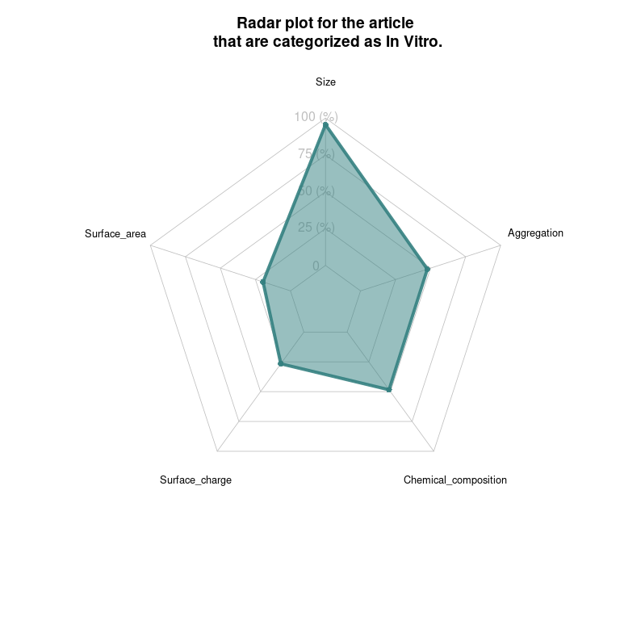<!-- -->

## Radar plot, all the articles, in vivo :

The following radar plot display the percentage of articles that have
the aspects of the material characterisation shown in axis, uniquely for
the article that are categorized has “In vivo”.

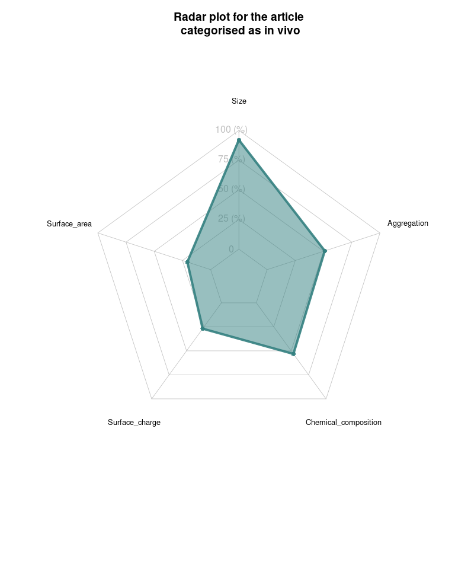<!-- -->

## Radar Plot for each subtype of articles, with a minumum score of 2 :

The following radar plots display the percentage of articles that have
the aspects of the material characterisation shown in axis, uniquely for
the article that have a minimum ranking of 2.

<!-- -->

# Circular barplots

## Circularbar plot, for the article with a Ranking of 1 only

Similar to the radar plot in a previous section,this circular plot
display the percentage of articles that have the specified aspects of
the material characterisation, uniquely for the article with a quality
of 1.

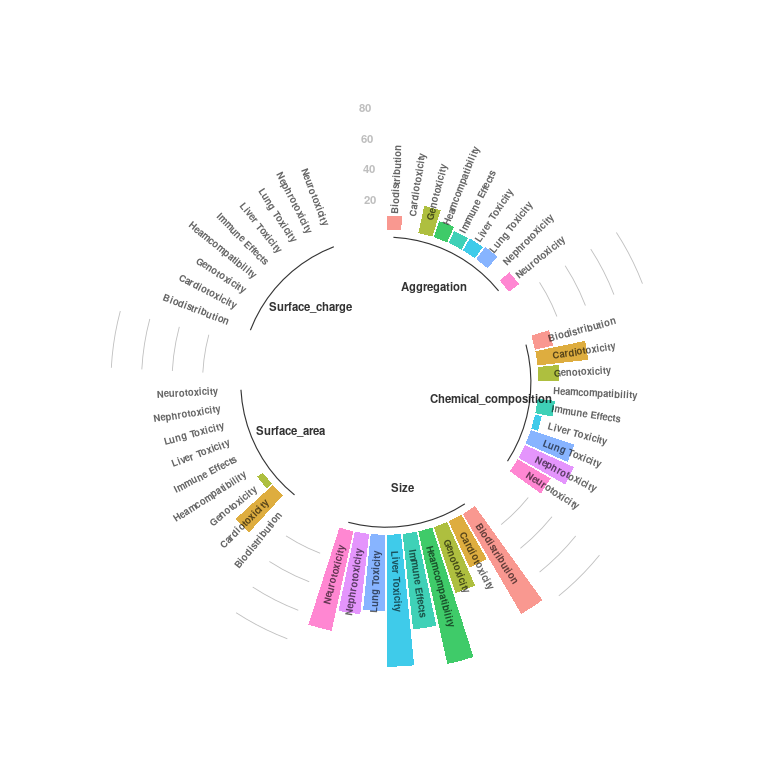<!-- -->

## Circular barplot, for the article with a Ranking of 2 only

Similar to the radar plot above, this circular plot display the
percentage of articles that have the specified aspects of the material
characterisation, uniquely for the article with a quality of 2.

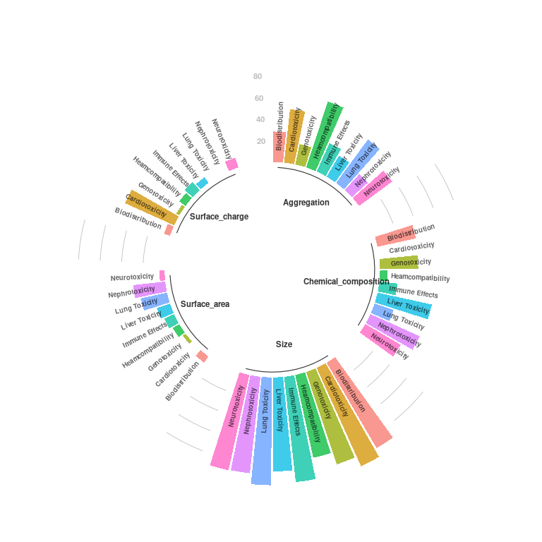<!-- -->

## Circular barplot, for all the articles, stratified by folder

This circular plot display the percentage of articles that have the
specified aspects of the material characterisation, for all the
articles:

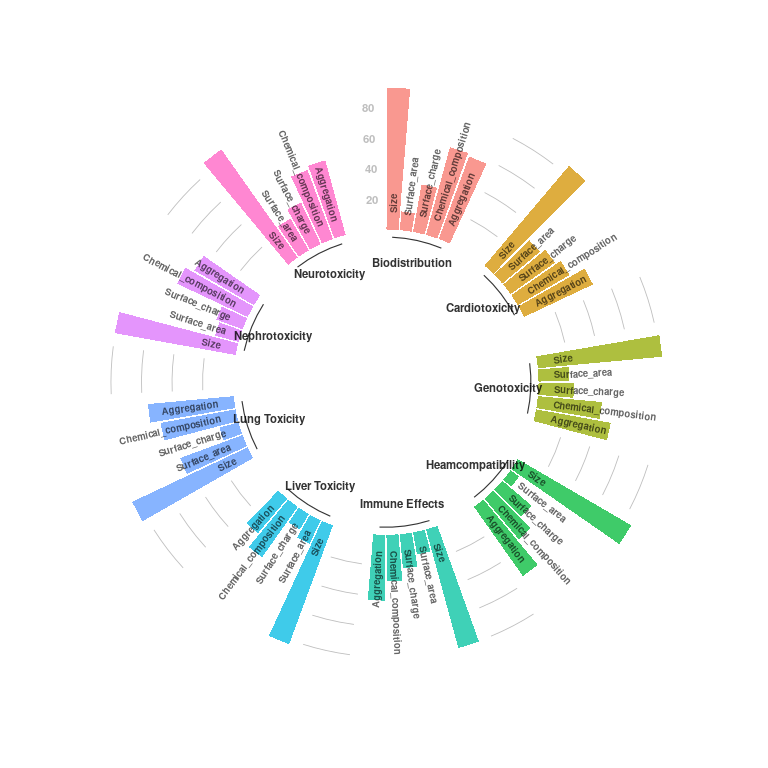<!-- -->

## Circular barplot, for all the articles, organized by characteristic

This circular plot display the percentage of articles that have the
specified aspects of the material characterisation, for all the
articles:

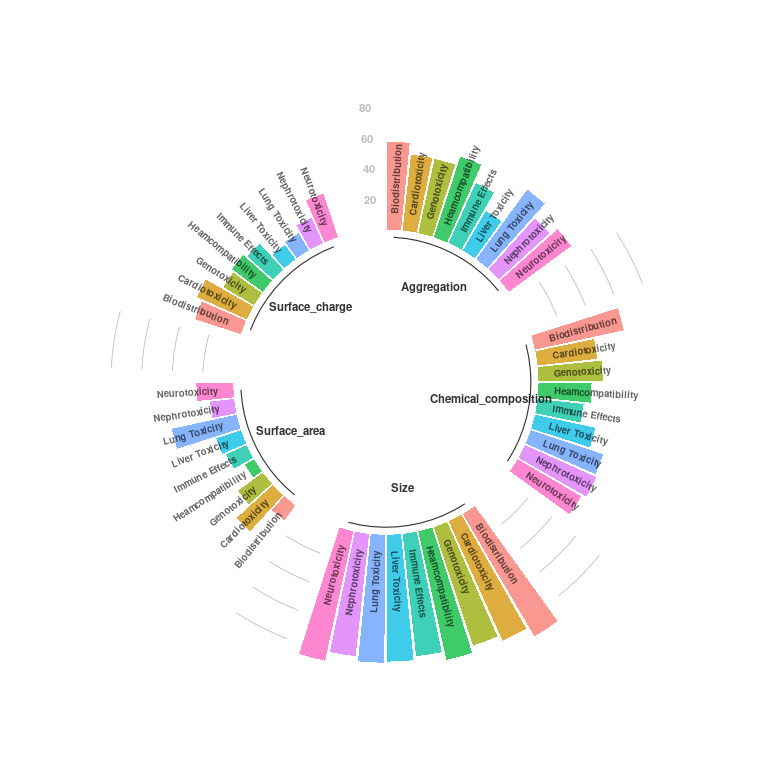<!-- -->

## Circular barplot, for all the articles, stratified by folder, of articles, with a minumum score of 2 :

This circular plot display the percentage of articles that have the
specified aspects of the material characterisation, for all the articles
with a minimum score of two :

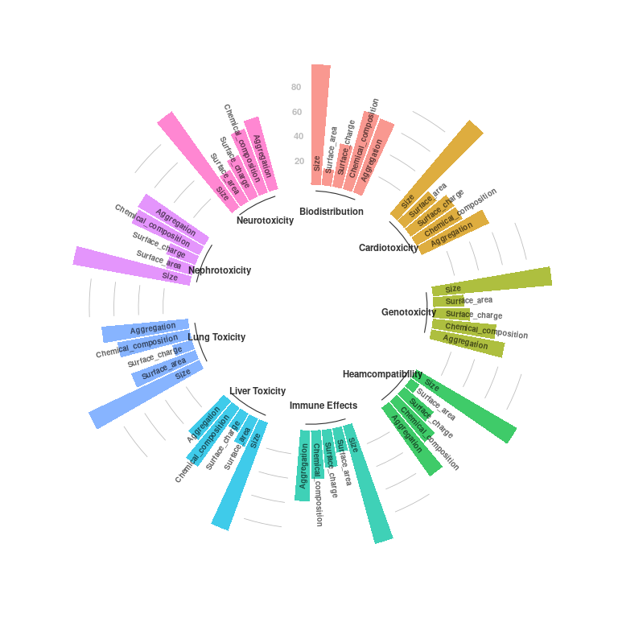<!-- -->

## Circular barplot, for all the articles, stratified by material characteristic, of articles, with a minumum score of 2 :

This circular plot display the percentage of articles that have the
specified aspects of the material characterisation, with a minimum score
of two :

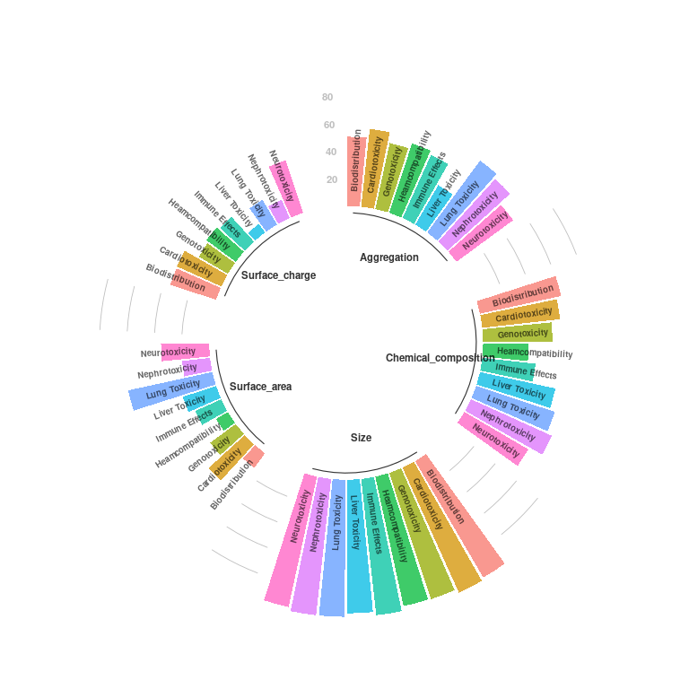<!-- -->
