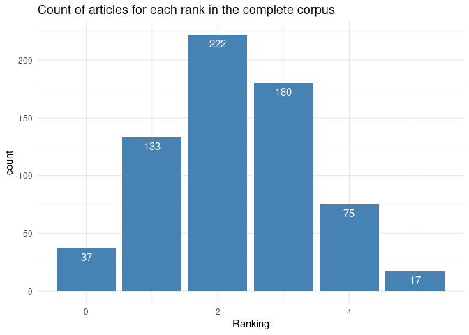
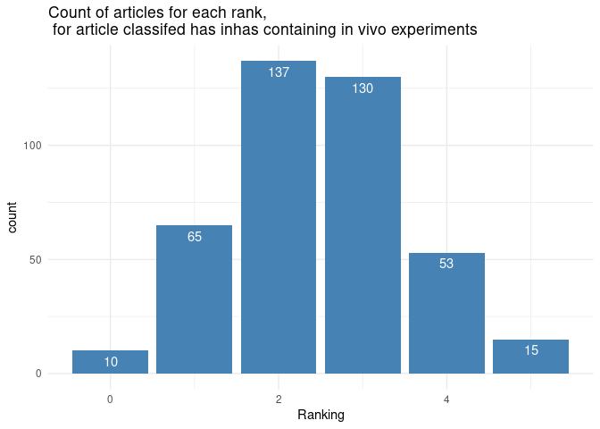
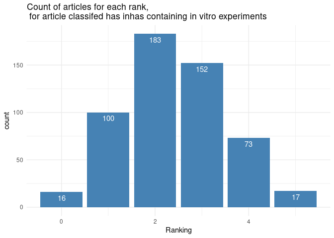
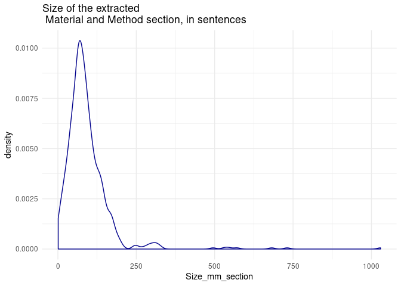

Ranking of articles
================
Etienne Rolland
20/01/2020

  - [Ranking of the material and method
    section](#ranking-of-the-material-and-method-section)
  - [Visualization of the Ranking :](#visualization-of-the-ranking)

## Ranking of the material and method section

Note that the R code used to create the automatic ranking his hidded to
make it more easily readable. A version with the code visible is
available on the Github repository.

``` r
create_quality_df <- function(material_characterisation) {
  #this function create the dataframe quality_evaluation that store the informations
  #of the quality evalution assessment
  
  #nb_technical_aspect<-length(material_characterisation)
  technical_aspect<-names(material_characterisation)
  names_columns<-c("Article_name", technical_aspect)
  
  
  quality_evaluation_df<-as.data.frame(matrix(ncol=length(names_columns), 
                                              byrow=TRUE))
  
  colnames(quality_evaluation_df)<-names_columns
  
  return(quality_evaluation_df)
}

init_quality_df <- function(quality_evaluation_df, pdf_name) {
  #create empty dataframe is such a pain in R
  #initiate the quality_df dataframe, i.e., add zero everywhere and the pdf name,
  #for the first iteration of the loop
  quality_evaluation_df[["Article_name"]]<-pdf_name
  quality_evaluation_df[is.na(quality_evaluation_df)] = 0
  
  return(quality_evaluation_df)
}

is_double_space <- function(word) {
  res<-str_split(word, "\\s")[[1]]
  if (length(res)==3) {
    return(TRUE)
  }
  return(FALSE)
}

is_space <- function(word) {
  res<-str_split(word, "\\s")[[1]]
  if (length(res)==2) {
    return(TRUE)
  }
  return(FALSE)
}

is_not_space <- function(word) {
  res<-str_split(word, "\\s")[[1]]
  if (length(res)==1) {
    return(TRUE)
  }
  return(FALSE)
}

cut_word <- function(word) {
  res<-str_split(word, "\\s")[[1]]
  return(res)
}

attribute_ranking_split_word <- function(x, i, quality_evaluation_df, technical_aspect, word) {
  res<-cut_word(word)
  first_word<-res[1]
  second_word<-res[2]
  idx<-which(x$lemma==first_word) #firstword
  
  if (length(idx)>0) { #if the word is present as lemma
    for (id in idx) {   #if several times the word, simply
      if (x[(id+1),]$lemma==second_word) {
        quality_evaluation_df[i,][[technical_aspect]]<-1
      }
    }
  }
  
  return(quality_evaluation_df)
}

attribute_ranking <- function(x, i, quality_evaluation_df, technical_aspect, word) {
  idx<-which(x$lemma==word)
  if (length(idx)>0) { #if the word is present as lemma
    for (id in idx){
      sentence<-x[id,]$sentence
    }
    quality_evaluation_df[i,][[technical_aspect]]<-1
    # if (word=="size") {
    #   print(x[idx,]$sentence)
    # }
  }
  return(quality_evaluation_df)
}

quality_assessment <- function(x, i, pdf_name, quality_evaluation_df, ontology_material_characterisation) {
  if (first_iteration(i)) {
    quality_evaluation_df<-init_quality_df(quality_evaluation_df, pdf_name)
  } else {
    quality_evaluation_df<-rbind(quality_evaluation_df, c(0))
    quality_evaluation_df[i,]$Article_name<-pdf_name
  }
  for (technical_aspect in names(ontology_material_characterisation)) { #Size, surface area, etc
    for (word in ontology_material_characterisation[[technical_aspect]]) { #Diameter
      if (is_space(word)) {
        quality_evaluation_df<-attribute_ranking_split_word(x, i, quality_evaluation_df, technical_aspect, word)
      }
      else {
        quality_evaluation_df<-attribute_ranking(x, i, quality_evaluation_df, technical_aspect, word)
      }
    }
  }
  
  return(quality_evaluation_df)
}

first_iteration <- function(i) {
  if (i==1) {
    return(TRUE)
  }
  return(FALSE)
}

biological_condition <- function(x, i, quality_evaluation_df, condition, word) {
  idx<-which(x$lemma==word | x$token==word) #firstword
  if (length(idx)>0) { #if the word is present as lemma
    quality_evaluation_df[i,][[condition]]<-"Yes"
    # if (word=="size") {
    #   print(x[idx,]$sentence)
    # }
  }
  return(quality_evaluation_df)
}

biological_condition_split_word <- function(x, i, quality_evaluation_df, condition, word) {
  res<-cut_word(word)
  first_word<-res[1]
  second_word<-res[2]
  idx<-which(x$lemma==first_word | x$token==first_word) #firstword
  
  if (length(idx)>0) { #if the word is present as lemma
    for (id in idx) {   #if several times the word in the article
      if (x[(id+1),]$lemma==second_word | x[(id+1),]$token==second_word) {
        quality_evaluation_df[i,][[condition]]<-"Yes"
      }
    }
  }
  
  return(quality_evaluation_df)
}

biological_condition_double_space_word <- function(x, i, quality_evaluation_df, condition, word) {
  res<-cut_word(word)
  first_word<-res[1]
  second_word<-res[2]
  third_word<-res[3]
  idx<-which(x$lemma==first_word | x$token==first_word) #firstword
  
  if (length(idx)>0) { #if the word is present as lemma
    for (id in idx) {   #if several times the word in the article
      if (x[(id+1),]$lemma==second_word | x[(id+1),]$token==second_word) {
        if (x[(id+2),]$lemma==third_word | x[(id+2),]$token==third_word) {
          quality_evaluation_df[i,][[condition]]<-"Yes"
        }
      }
    }
  }
  
  return(quality_evaluation_df)
}

biological_condition_assessment <- function(x, i, pdf_name, quality_evaluation_df, ontology_in_vitro_in_vivo) {
  if (first_iteration(i)) {
    quality_evaluation_df$In_vitro<-"No"
    quality_evaluation_df$In_vivo<-"No"
  } else {
    quality_evaluation_df[i,]$In_vitro<-"No"
    quality_evaluation_df[i,]$In_vivo<-"No"
  }
  
  for (condition in names(ontology_in_vitro_in_vivo)) { 
    for (word in ontology_in_vitro_in_vivo[[condition]]) { 
      if (is_double_space(word)){
        quality_evaluation_df<-biological_condition_double_space_word(x, i, quality_evaluation_df, condition, word)
      }
      else if (is_space(word)) {
        quality_evaluation_df<-biological_condition_split_word(x, i, quality_evaluation_df, condition, word)
      }
      else if (is_not_space(word)){
        quality_evaluation_df<-biological_condition(x, i, quality_evaluation_df, condition, word)
      }
    }
  }
  
  return(quality_evaluation_df)
}
```

``` r
run_assesment <- function(rds_list, ontology_material_characterisation, ontology_in_vitro_in_vivo) {
  i<-0
  quality_evaluation_df<-create_quality_df(ontology_material_characterisation)
  for (rds in rds_list) {
    i<-i+1
    x<-readRDS(file = paste0("~/Dev_pdf_poppler_output/", rds))
    pdf_name<-strsplit(rds, "/")[[1]][3]
    pdf_name<-str_replace_all(pdf_name, ".rds", "")
    quality_evaluation_df<-quality_assessment(x, i, pdf_name, quality_evaluation_df, ontology_material_characterisation)
    quality_evaluation_df<-biological_condition_assessment(x, i, pdf_name, quality_evaluation_df, ontology_in_vitro_in_vivo) 
    if (first_iteration(i)) {
      quality_evaluation_df$Size_mm_section<-0 #size material and methods
    }
    quality_evaluation_df[i,]$Size_mm_section<-length(unique(x$sentence))
    }
  #compute the score
  quality_evaluation_df$Ranking<-rowSums(quality_evaluation_df[, names(ontology_material_characterisation)])
  return(quality_evaluation_df)
}
```

Below are the ontologies of terms used to rank the articles for the
differents categories.

``` r
#ontology of terms
ontology_material_characterisation <- list( Size = c("diameter", "size", "dimension", "radius", "nm"), 
                                   Surface_area = c("surface area"), 
                                   Surface_charge = c("zeta potential", "surface charge", "mv"),
                                   Chemical_composition = c("chemical composition", "coating", "core",
                                                            "shell", "content", "configuration", 
                                                            "molecular ratio"),
                                   # Concentration = c("final concentration", "dilution", "diluted", "mM"),
                                   Aggregation = c("aggregation", "aggregate", "polydisperse", "monodisperse",
                                                   "stability", "agglomeration", "stable", "agglomerate") #,
                                   # Wavelenght = c("wavelenght", "excitation wavelenght", "excitation", "emission",
                                   #                "emission wavelenght")
                                   )


ontology_in_vitro_in_vivo <- list( In_vitro = c("incubation temperature", "incubator", "incubated", "viability",
                                                "cells/ml", "cells/mL",  "cells/well", "cells per well", 
                                                "cultured", "culture", "medium", "media", "penicillin", "% of CO",
                                                "streptomycin", "well plates", "well plate", "cell line", "cells"), 
                                   
                                  In_vivo = c("age", "year old", "month old", "year-old", "month-old", 
                                              "cage", "holding rooms", "housed", "facility", "diet", "ad libitum",
                                              "dark cycle", "light cycle", "euthanized", "acclimate",
                                              "acclimatized", "body weight", "administration route", 
                                              "dose in mg/kg"))
```

``` r
rds_list<-list.files(path="~/Dev_pdf_poppler_output/", pattern = "\\.rds$", recursive=TRUE)

quality_evaluation_df<-create_quality_df(ontology_material_characterisation)

quality_evaluation_df<-run_assesment(rds_list, ontology_material_characterisation, ontology_in_vitro_in_vivo)
```

## Visualization of the Ranking :

This section shows the results of the automated ranking of the articles.
The following plot show the number of articles for each ranking number :

``` r
df <- quality_evaluation_df

df = within(df, {
  condition = ifelse((In_vitro == "Yes" & In_vivo == "Yes"), "Mixed", "Not_mixed")
})

p <- ggplot(df, aes(x=Ranking)) + geom_bar(fill="steelblue") +  geom_text(stat='count', aes(label=..count..), vjust=1.6, color="white") + theme_minimal() + ggtitle("Count of articles for each rank in the complete corpus") 
p
```

<!-- -->

The following plot shows the ranking for the articles that has been
automatically classified has containing in vivo experiments :

``` r
p <- df %>% filter(In_vivo=="Yes") %>% ggplot(aes(x=Ranking)) + geom_bar(fill="steelblue") +
  geom_text(stat='count', aes(label=..count..), vjust=1.6, color="white") +
  theme_minimal() + ggtitle("Count of articles for each rank, \n for article classifed has inhas containing in vivo experiments") 
p
```

<!-- -->

The following plot shows the ranking for the articles that has been
automatically classified has containing in vitro experiments :

``` r
p <- df %>% filter(In_vitro=="Yes") %>% ggplot(aes(x=Ranking)) + geom_bar(fill="steelblue") +
    geom_text(stat='count', aes(label=..count..), vjust=1.6, color="white") +
    theme_minimal() + ggtitle("Count of articles for each rank, \n for article classifed has inhas containing in vitro experiments") 
p
```

<!-- -->

Finally, the following plot provide an estimation of the overall sizes
of the material and methods section extracted. The unit is the number of
sentences.

``` r
p <- df  %>% ggplot(aes(x=Size_mm_section)) + geom_density(color="darkblue") + theme_minimal() + ggtitle("Size of the extracted \n Material and Method section, in sentences") 
p
```

<!-- -->

Finally, here is a sample of best ranked articles :

``` r
head(df[order(df$Ranking, decreasing = TRUE),], 30)
```

    ##                             Article_name Size Surface_area Surface_charge
    ## 24           Chinde S, Chinde S 2017.pdf    1            1              1
    ## 69               Kim, Y R et al 2014.pdf    1            1              1
    ## 99       Mangalampalli, B et al 2017.pdf    1            1              1
    ## 114         Oliveira, L T et al 2017.pdf    1            1              1
    ## 149           Singh S P, et al 2013b.pdf    1            1              1
    ## 242              Cowie, H et al 2015.pdf    1            1              1
    ## 273                 Lu, X et al 2016.pdf    1            1              1
    ## 296            Singh, S P et al 2013.pdf    1            1              1
    ## 298           Stoccoro, A et al 2016.pdf    1            1              1
    ## 306            Wills, J W et al 2016.pdf    1            1              1
    ## 534              Cho, W S et al 2011.pdf    1            1              1
    ## 537                Gosens et al 2016.pdf    1            1              1
    ## 539 Götz AA, Vidal-Puig A et al 2011.pdf    1            1              1
    ## 540             Götz, A A et al 2011.pdf    1            1              1
    ## 567                Schreiber, N 2016.pdf    1            1              1
    ## 638                Liu, Y et al 2012.pdf    1            1              1
    ## 654               Wang, Y et al 2011.pdf    1            1              1
    ## 13               Bellusci et al 2014.pdf    1            1              0
    ## 18                Chen, L et al 2017.pdf    1            0              1
    ## 25              Chinde, S et al 2017.pdf    1            0              1
    ## 27             Chung, E J et al 2015.pdf    1            0              1
    ## 30                 Dam DH et al 2015.pdf    1            0              1
    ## 33             Dekkers, S et al 2017.pdf    1            0              1
    ## 52                  Hak S et al 2015.pdf    1            0              1
    ## 53   Harivardhan Reddy, L et al 2005.pdf    1            0              1
    ## 63             Hureaux, J et al 2017.pdf    1            1              1
    ## 66            Jensen, A I et al 2017.pdf    1            0              1
    ## 67                Kaur, A et al 2017.pdf    1            0              1
    ## 72              Kumari, M et al 2014.pdf    1            0              1
    ## 76               Lee, I C et al 2016.pdf    1            1              1
    ##     Chemical_composition Aggregation In_vitro In_vivo Size_mm_section
    ## 24                     1           1      Yes     Yes             167
    ## 69                     1           1      Yes     Yes             142
    ## 99                     1           1      Yes     Yes             163
    ## 114                    1           1      Yes     Yes             190
    ## 149                    1           1      Yes     Yes             142
    ## 242                    1           1      Yes     Yes             108
    ## 273                    1           1      Yes      No              45
    ## 296                    1           1      Yes     Yes              93
    ## 298                    1           1      Yes     Yes             145
    ## 306                    1           1      Yes     Yes             684
    ## 534                    1           1      Yes     Yes             153
    ## 537                    1           1      Yes     Yes             164
    ## 539                    1           1      Yes     Yes              45
    ## 540                    1           1      Yes     Yes              70
    ## 567                    1           1      Yes      No             274
    ## 638                    1           1       No     Yes             126
    ## 654                    1           1      Yes     Yes             129
    ## 13                     1           1      Yes     Yes             111
    ## 18                     1           1      Yes     Yes              38
    ## 25                     1           1      Yes     Yes             170
    ## 27                     1           1      Yes     Yes              69
    ## 30                     1           1      Yes     Yes              62
    ## 33                     1           1      Yes     Yes             169
    ## 52                     1           1      Yes     Yes             105
    ## 53                     1           1      Yes      No             100
    ## 63                     1           0      Yes     Yes             129
    ## 66                     1           1      Yes     Yes             313
    ## 67                     1           1      Yes     Yes              88
    ## 72                     1           1      Yes     Yes             169
    ## 76                     0           1      Yes     Yes              92
    ##     Ranking condition
    ## 24        5     Mixed
    ## 69        5     Mixed
    ## 99        5     Mixed
    ## 114       5     Mixed
    ## 149       5     Mixed
    ## 242       5     Mixed
    ## 273       5 Not_mixed
    ## 296       5     Mixed
    ## 298       5     Mixed
    ## 306       5     Mixed
    ## 534       5     Mixed
    ## 537       5     Mixed
    ## 539       5     Mixed
    ## 540       5     Mixed
    ## 567       5 Not_mixed
    ## 638       5 Not_mixed
    ## 654       5     Mixed
    ## 13        4     Mixed
    ## 18        4     Mixed
    ## 25        4     Mixed
    ## 27        4     Mixed
    ## 30        4     Mixed
    ## 33        4     Mixed
    ## 52        4     Mixed
    ## 53        4 Not_mixed
    ## 63        4     Mixed
    ## 66        4     Mixed
    ## 67        4     Mixed
    ## 72        4     Mixed
    ## 76        4     Mixed
